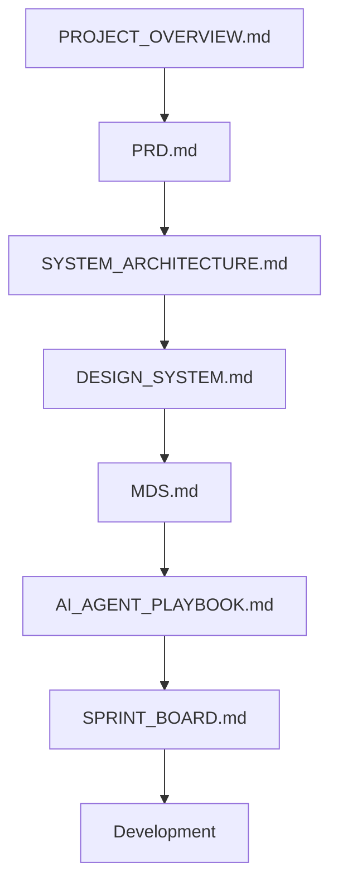

# RecoverAI

> **AI-Powered Stolen Device Recovery & Prevention Ecosystem**


---

# Project Overview

RecoverAI is an AI-powered web application designed to simplify and accelerate the smartphone recovery process after a theft.

Instead of forcing users to navigate multiple portals, collect scattered documents, and understand complex recovery procedures on their own, RecoverAI provides one centralized platform that intelligently guides users through every recovery step.

The platform combines Artificial Intelligence, OCR, secure document management, recovery workflows, and an intuitive dashboard to reduce confusion, save time, and improve the overall recovery experience.

RecoverAI is being developed as a production-quality Minimum Viable Product (MVP) for the **ChatGPT Codex India Hackathon 2026**.

---

# Vision

Our vision is to build a trusted AI-powered recovery ecosystem that helps smartphone users respond quickly after device theft by providing clear guidance, organized documentation, and intelligent recovery assistance.

Rather than attempting impossible features such as tracking powered-off devices, RecoverAI focuses on solving real problems that users face immediately after a theft and creates a scalable foundation for future integrations with official services and partner ecosystems.

---

> **Current Development Phase**
>
> Planning & Documentation ✔️---

# Problem Statement

Smartphone theft is one of the most common digital crimes, yet the recovery process remains fragmented and confusing.

After a device is stolen, users often struggle to determine the correct sequence of actions. Important information such as IMEI numbers, purchase invoices, FIR drafts, SIM blocking, and official reporting procedures are scattered across multiple platforms.

As a result, valuable time is lost during the initial hours after a theft, reducing the chances of successful recovery.

---

# Why RecoverAI?

RecoverAI was created to provide a single intelligent platform that guides users through the complete recovery journey.

Instead of replacing existing government systems, RecoverAI works alongside them by simplifying documentation, organizing recovery information, and providing AI-powered assistance at every stage.

The platform focuses on improving the user's recovery experience rather than making unrealistic claims such as tracking powered-off devices.

---

# Solution

RecoverAI combines Artificial Intelligence, OCR, secure document management, and structured recovery workflows into one unified platform.

Users can securely register a stolen device, organize recovery-related information, generate AI-assisted FIR drafts, extract IMEI details from invoices, monitor recovery progress, and receive personalized recovery guidance through an AI assistant.

The platform is designed around realistic workflows that users can immediately follow after a theft.

---

# Core Features

## AI Recovery Assistant

Provides step-by-step recovery guidance based on the user's situation.

---

## Smart Theft Reporting

Allows users to securely register stolen devices and maintain complete case records.

---

## OCR Invoice Scanner

Extracts IMEI numbers, device information, and purchase details from uploaded invoices.

---

## AI FIR Generator

Generates professionally formatted FIR drafts using the information provided by the user.

---

## Recovery Dashboard

Displays case status, recovery timeline, uploaded documents, and recommended next actions.

---

## Notifications

Reminds users about pending recovery steps and important actions.

---

## Analytics Dashboard

Visualizes theft trends, recovery statistics, and hotspot analysis using demonstration data.

------

# Target Users

RecoverAI is designed for users who need a simple, guided, and organized smartphone recovery process.

### Primary Users

- Smartphone Users
- Students
- Working Professionals
- Senior Citizens

### Secondary Users

- NGOs
- Police Support Volunteers
- Digital Safety Communities

---

# Technology Stack

RecoverAI uses a modern, scalable, and AI-friendly technology stack optimized for rapid development and long-term maintainability.

| Category | Technology |
|----------|------------|
| Frontend | Next.js 15 (App Router) |
| Language | TypeScript |
| Styling | Tailwind CSS |
| UI Components | shadcn/ui |
| Icons | Lucide React |
| Animation | Framer Motion |
| Backend | Firebase |
| Database | Firestore |
| Authentication | Firebase Authentication |
| AI | OpenAI API |
| OCR | Tesseract.js |
| Charts | Recharts |
| Maps | Google Maps Platform |
| Deployment | Vercel |

---

# Project Structure

```
RecoverAI/
│
├── docs/
├── src/
├── public/
├── assets/
├── package.json
├── README.md
└── .env.local
```

---

# Documentation Structure

The project follows a modular documentation architecture.

| Document | Purpose |
|----------|---------|
| PROJECT_OVERVIEW.md | Introduction and project navigation |
| PRD.md | Product Requirements Document |
| SYSTEM_ARCHITECTURE.md | Complete system architecture |
| DESIGN_SYSTEM.md | UI/UX standards and visual language |
| MDS.md | Master Development Specification |
| AI_AGENT_PLAYBOOK.md | Rules and workflow for AI agents |
| SPRINT_BOARD.md | Sprint planning and execution roadmap |
| CHANGELOG.md | Project version history |

---

# Documentation Flow

```text
PROJECT_OVERVIEW
        ↓
PRD
        ↓
SYSTEM_ARCHITECTURE
        ↓
DESIGN_SYSTEM
        ↓
MDS
        ↓
AI_AGENT_PLAYBOOK
        ↓
SPRINT_BOARD
        ↓
Development
```

---

# Development Principles

RecoverAI follows a documentation-first development approach.

Every implementation must follow this sequence:

1. Understand the documentation.
2. Follow the architecture.
3. Build according to the sprint.
4. Review the implementation.
5. Refactor if required.
6. Commit changes with meaningful messages.

No feature should be implemented without following the documentation hierarchy.

------

# Development Workflow

RecoverAI follows a structured software engineering workflow to ensure quality, maintainability, and consistency throughout development.

Every feature must pass through the following lifecycle before being considered complete.


---

# MVP Scope

The first release of RecoverAI focuses only on features that are technically feasible within the hackathon timeline.

## Included Features

- User Authentication
- Stolen Device Reporting
- Device Case Management
- OCR Invoice Scanner
- AI Recovery Assistant
- AI FIR Generator
- Recovery Dashboard
- Notifications
- Analytics Dashboard (Demo Data)

---

# Out of Scope

The following features will **not** be implemented in the MVP.

- Powered-off phone tracking
- Live GPS tracking through IMEI
- Telecom operator integration
- Official CEIR API integration
- Police backend integration
- Insurance company integration

These features require official partnerships, APIs, or infrastructure beyond the scope of a hackathon project.

---

# Future Roadmap

RecoverAI is designed with scalability in mind.

Future versions may include:

- Official CEIR Integration
- Telecom Network Integration
- Manufacturer Partnerships
- Insurance Claim Automation
- Community Recovery Network
- AI Theft Prediction
- Smart Recovery Notifications
- Law Enforcement Dashboard

---

# Definition of Success

The MVP will be considered successful if a user can:

1. Create an account.
2. Report a stolen smartphone.
3. Upload an invoice.
4. Extract IMEI using OCR.
5. Generate an AI-assisted FIR draft.
6. Manage recovery progress from a dashboard.
7. Receive intelligent recovery guidance.

---

# Guiding Principles

RecoverAI is built around five engineering principles:

- Build realistic solutions.
- Avoid unsupported claims.
- Prioritize user experience.
- Keep the architecture modular.
- Design for future scalability.

------

# Contribution Guidelines

RecoverAI follows a documentation-first and sprint-based development workflow.

All contributors should follow these principles:

- Read all project documentation before writing code.
- Follow the Design System and Master Development Specification.
- Build features only within the approved MVP scope.
- Reuse existing components whenever possible.
- Submit meaningful Git commits.
- Review and test every completed sprint before moving forward.

---

# Documentation Navigation

Use the following reading order to understand the project.



---

# References

The project follows industry-standard software engineering practices and modern web development principles.

Primary technologies:

- Next.js
- React
- TypeScript
- Tailwind CSS
- shadcn/ui
- Firebase
- OpenAI API
- Tesseract.js
- Recharts
- Vercel

---

# Version History

| Version | Date | Description |
|----------|------------|------------------------------|
| 1.0 | 2026-08-01 | Initial project documentation created |

---

# Document Approval

| Property | Value |
|----------|-------|
| Document | PROJECT_OVERVIEW.md |
| Version | 1.0 |
| Status | Approved |
| Project | RecoverAI |
| Owner | Rishabh Poddar |
| Reviewed By | Project Owner |
| Last Updated | 2026-08-01 |

---

# Next Document

After completing this overview, continue with:

> **PRD.md**

The PRD defines the complete business requirements, functional requirements, user stories, constraints, and acceptance criteria for RecoverAI.

---

> **"Well-documented software is easier to build, easier to review, and easier to maintain."**
