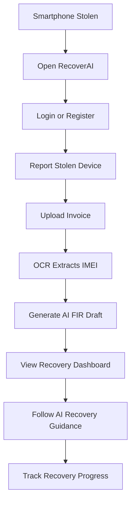
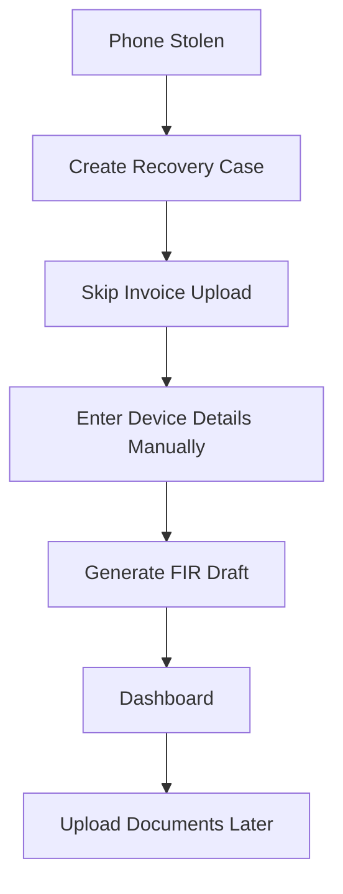
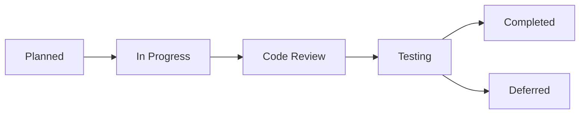

# Product Requirements Document (PRD)

## RecoverAI

> **AI-Powered Stolen Device Recovery & Prevention Ecosystem**

---

# Executive Summary

RecoverAI is an AI-powered web platform that simplifies the recovery process for stolen smartphones through guided workflows, intelligent document processing, and AI-assisted decision support.

The platform addresses the fragmented and time-consuming experience users face after device theft by bringing essential recovery tools into one secure and easy-to-use application.

Rather than replacing existing government services, RecoverAI complements them by helping users prepare recovery documents, organize case information, extract device details using OCR, generate AI-assisted FIR drafts, and receive personalized recovery guidance.

The project is being developed as a production-ready Minimum Viable Product (MVP) for the **ChatGPT Codex India Hackathon 2026**, with a strong focus on technical feasibility, modular architecture, and future scalability.

---

# Purpose

The purpose of RecoverAI is to reduce confusion, save time, and improve the user's ability to respond effectively after smartphone theft through a centralized AI-powered recovery platform.

The system aims to provide a structured recovery workflow while maintaining realistic expectations regarding available technologies and official integrations.

---

# Objectives

The primary objectives of RecoverAI are:

- Simplify the smartphone recovery process.
- Centralize recovery-related information.
- Reduce user confusion after theft.
- Automate repetitive documentation tasks.
- Improve recovery preparedness through AI assistance.
- Build a scalable platform for future government and telecom integrations.

---

# Success Criteria

The MVP will be considered successful if users are able to:

- Register a stolen smartphone.
- Upload supporting documents.
- Extract IMEI information using OCR.
- Generate an AI-assisted FIR draft.
- Track recovery progress through a dashboard.
- Receive contextual recovery guidance from the AI assistant.

------

# Business Problem

Smartphone theft is one of the most common crimes affecting digital users today. Although official recovery mechanisms exist, the overall recovery journey remains fragmented, time-consuming, and difficult for the average user to navigate.

Victims are often required to interact with multiple independent systems for SIM blocking, FIR registration, document collection, IMEI identification, and official reporting. These activities are rarely connected through a single workflow, resulting in confusion during the most critical hours after a theft.

RecoverAI addresses this gap by providing a unified platform that organizes the recovery process and assists users with AI-powered guidance.

---

# Existing Challenges

Users commonly face the following challenges after a smartphone is stolen.

## Information Fragmentation

Recovery-related information is distributed across different platforms and services, making it difficult for users to understand the complete recovery process.

---

## Documentation Difficulties

Many users do not have immediate access to:

- IMEI numbers
- Purchase invoices
- Device information
- Recovery documents

This delays the reporting process.

---

## Limited User Guidance

Most existing systems explain *where* users should report an incident but provide very little guidance on *how* to complete the recovery process correctly.

---

## Time-Critical Decision Making

The first few hours after a theft are often the most important.

Many users lose valuable time because they are unsure which actions should be performed first.

---

## Lack of Centralized Case Management

Recovery documents, FIR drafts, invoices, IMEI details, and recovery progress are generally managed manually across different platforms instead of one organized dashboard.

---

# Why Current Solutions Are Insufficient

Current recovery systems primarily focus on individual tasks rather than the complete recovery journey.

Examples include:

- Reporting a theft
- Blocking a SIM
- Registering a complaint
- Managing device information

While these services solve specific problems, users still need to manually coordinate the overall recovery process.

RecoverAI does not attempt to replace existing official services. Instead, it complements them by acting as an intelligent recovery companion that simplifies documentation, organizes recovery information, and guides users through each recovery step.

---

# Opportunity Statement

There is an opportunity to build an AI-powered recovery platform that connects fragmented recovery activities into one guided workflow.

RecoverAI aims to improve user confidence, reduce confusion, and save valuable time by providing:

- Structured recovery guidance
- Intelligent document management
- AI-assisted FIR generation
- OCR-based IMEI extraction
- Centralized recovery tracking
- Personalized recovery recommendations

The long-term vision is to create a scalable recovery ecosystem capable of integrating with official services and trusted partners as such integrations become available.

------

# Business Goals

RecoverAI aims to simplify and streamline the smartphone recovery process through a centralized AI-powered platform.

The business goals of the project are:

- Reduce confusion after smartphone theft.
- Minimize the time required to begin the recovery process.
- Centralize recovery-related information and documents.
- Improve user confidence through guided workflows.
- Build a scalable platform ready for future government and ecosystem integrations.

---

# Product Goals

The RecoverAI MVP is designed to achieve the following objectives:

- Provide a secure user authentication system.
- Allow users to report stolen devices.
- Organize recovery cases in one dashboard.
- Extract IMEI and device details using OCR.
- Generate AI-assisted FIR drafts.
- Provide personalized recovery guidance using AI.
- Maintain a complete recovery timeline.
- Display analytics using demonstration data.

---

# Success Metrics (KPIs)

The MVP will be considered successful if it satisfies the following measurable outcomes.

| KPI | Success Criteria |
|------|------------------|
| Authentication | Users can successfully register and log in. |
| Device Reporting | Users can create and manage a recovery case. |
| OCR Accuracy | Device information is extracted from supported invoices. |
| FIR Generation | AI generates a structured FIR draft. |
| Dashboard | Users can monitor recovery progress from one place. |
| AI Assistant | Users receive relevant recovery guidance. |
| Responsiveness | Application works on desktop, tablet, and mobile devices. |
| Deployment | Production build is successfully deployed on Vercel. |

---

# Project Scope

The MVP includes the following modules.

## User Module

- User Registration
- Login
- Profile

---

## Recovery Module

- Report Stolen Device
- Device Information
- Recovery Case Management

---

## AI Module

- AI Recovery Assistant
- Recovery Recommendations
- FIR Generation

---

## Document Module

- Invoice Upload
- OCR Processing
- Document Storage

---

## Dashboard Module

- Recovery Progress
- Timeline
- Case Overview

---

## Analytics Module

- Theft Statistics
- Charts
- Demonstration Heatmap

---

# Out of Scope

The following features are intentionally excluded from the MVP.

- Powered-off phone tracking
- IMEI-based live location tracking
- Telecom operator integration
- Official CEIR API integration
- Police database integration
- Insurance claim processing
- Real-time device recovery infrastructure

These capabilities require external partnerships, regulatory approvals, or infrastructure that are beyond the scope of this hackathon.

---

# Scope Management

All future features must remain outside the MVP unless they are officially approved during project planning.

The development team should prioritize stability, usability, and completion of the defined MVP over adding new features.

------

# Product Principles

RecoverAI is designed around a set of core product principles that guide every design, engineering, and product decision throughout development.

These principles ensure that the platform remains useful, realistic, scalable, and trustworthy.

---

## 1. Solve Real User Problems

Every feature must address a genuine challenge faced by smartphone theft victims.

No feature should be added solely because it is technically interesting or visually impressive.

---

## 2. Trust Before Features

User trust is the highest priority.

RecoverAI must never make unrealistic promises such as tracking powered-off devices or claiming access to systems that are not publicly available.

Every capability presented by the platform should be technically feasible and transparent.

---

## 3. Simplicity Over Complexity

The recovery process is already stressful.

The product should reduce cognitive load by providing clear navigation, guided workflows, and easy-to-understand interfaces.

Every interaction should help users complete the next recovery step with confidence.

---

## 4. AI as an Assistant, Not a Decision Maker

Artificial Intelligence should assist users by organizing information, generating documents, and recommending recovery actions.

Final decisions and official submissions always remain under the user's control.

---

## 5. Documentation First

Development begins with documentation.

Every feature must be clearly defined before implementation.

Architecture, user experience, and engineering decisions should follow the approved documentation hierarchy.

---

## 6. Modular by Design

Each feature should be developed as an independent module.

Modules must be reusable, maintainable, and loosely coupled to simplify testing, debugging, and future expansion.

---

## 7. Security by Default

Security is not an optional feature.

The application should protect user information through secure authentication, validated inputs, controlled file uploads, and responsible handling of sensitive data.

---

## 8. Design for Scalability

The MVP focuses only on achievable features.

However, the overall architecture should support future integration with official services, partner ecosystems, and additional recovery capabilities without requiring major redesign.

---

## 9. Accessibility for Everyone

RecoverAI should be usable by people with different levels of technical knowledge.

Interfaces should remain simple, readable, responsive, and accessible across devices.

---

## 10. Quality Over Quantity

A smaller number of well-designed, fully functional features is more valuable than a large collection of incomplete functionality.

Every implemented feature should meet production-quality standards before new functionality is introduced.

------

# Design Constraints

RecoverAI follows a minimal, government-inspired design language focused on trust, clarity, and accessibility. The following constraints must be respected throughout development.

## User Interface

- Use a clean and minimal interface.
- Follow the approved Design System.
- Maintain consistent spacing, typography, and color palette.
- Use reusable UI components only.
- Avoid unnecessary visual complexity.

---

## Theme

The platform should reflect a modern government digital service.

The interface should feel:

- Professional
- Secure
- Calm
- Trustworthy
- Easy to navigate

Do not use gaming-style, futuristic, or flashy UI elements.

---

## Layout Constraints

- Maximum of six primary application pages in the MVP.
- Responsive on desktop, tablet, and mobile devices.
- Mobile-first development approach.
- Consistent navigation across all pages.
- Clear recovery workflow with minimal user confusion.

---

## Animation Guidelines

Animations should improve usability rather than attract attention.

Allowed:

- Fade
- Slide
- Smooth transitions
- Loading animations

Avoid:

- Bounce effects
- Flashing elements
- Complex motion graphics
- Unnecessary page animations

---

# Technical Constraints

RecoverAI is designed as a realistic MVP.

The following technical constraints must always be respected.

---

## API Constraints

Do not assume access to private or restricted APIs.

Examples:

- Official CEIR APIs
- Telecom operator APIs
- Police information systems
- Insurance company APIs

Future integrations should remain architectural placeholders only.

---

## Recovery Constraints

RecoverAI must never claim capabilities that are technically unsupported.

The platform must not claim:

- Powered-off phone tracking
- Live IMEI-based location tracking
- Unauthorized access to telecom networks
- Unauthorized access to government databases

Instead, guide users through realistic recovery workflows.

---

## Security Constraints

Always:

- Store secrets in environment variables.
- Validate user inputs.
- Protect authenticated routes.
- Restrict database access using Firestore Security Rules.
- Validate uploaded files before processing.

Never:

- Hardcode API keys.
- Expose sensitive configuration.
- Store confidential data in client-side code.

---

## Development Constraints

- Use TypeScript across the project.
- Reuse components whenever possible.
- Keep modules independent.
- Avoid unnecessary third-party libraries.
- Follow the approved folder structure.
- Keep business logic separate from UI components.

---

## Performance Constraints

The application should remain lightweight and responsive.

Guidelines:

- Lazy load heavy modules.
- Optimize images.
- Reduce unnecessary API calls.
- Prevent unnecessary component re-renders.
- Maintain fast page load times.

---

## Documentation Constraints

Every feature implemented during development must:

- Be defined in the PRD.
- Follow the System Architecture.
- Respect the Design System.
- Follow the Master Development Specification.
- Comply with the AI Agent Playbook.

No undocumented feature should be implemented without updating the documentation first.

---

## Definition of Compliance

A feature is considered compliant only if it:

- Solves a defined user problem.
- Matches the approved design language.
- Meets technical constraints.
- Passes review and testing.
- Fits within the MVP scope.
- Supports future scalability without requiring architectural redesign.

------

# User Personas

RecoverAI is designed for users who require a fast, guided, and organized recovery process after smartphone theft.

The following personas represent the primary target audience.

---

## Persona 1 — College Student

### Profile

- Age: 18–25 years
- Frequent smartphone usage
- Limited technical knowledge of recovery procedures

### Goals

- Report the theft quickly.
- Recover important academic data.
- Understand the correct recovery process.
- Save time during stressful situations.

### Pain Points

- Doesn't know the IMEI number.
- Doesn't know what to do after theft.
- Confused by multiple government portals.
- Fear of losing personal information.

### Expectations

- Simple interface
- Step-by-step guidance
- Fast document generation
- Clear recovery timeline

---

## Persona 2 — Working Professional

### Profile

- Age: 22–45 years
- Uses smartphone for work and banking
- Limited time for lengthy recovery procedures

### Goals

- Report the theft immediately.
- Protect personal and financial information.
- Complete recovery-related tasks quickly.
- Organize all recovery documents in one place.

### Pain Points

- Busy schedule
- Multiple recovery websites
- Manual document preparation
- Difficult recovery tracking

### Expectations

- Fast workflow
- Secure platform
- AI-powered assistance
- Centralized dashboard

---

## Persona 3 — Senior Citizen

### Profile

- Age: 55+
- Limited digital literacy
- Requires clear guidance and simple interfaces

### Goals

- Understand what actions to take.
- Receive step-by-step assistance.
- Avoid complicated digital processes.

### Pain Points

- Difficult government websites
- Complex recovery terminology
- Fear of making mistakes
- Lack of technical knowledge

### Expectations

- Large readable interface
- Simple language
- Guided recovery process
- Minimal number of steps

---

# Primary User Journey

The following diagram represents the standard recovery journey for a user whose smartphone has been stolen.

---

# Alternative User Journey

If the user does not have an invoice:

---

# User Experience Goals

RecoverAI should ensure that every user can:

- Understand the next action immediately.
- Complete reporting within a few minutes.
- Avoid navigating multiple independent platforms.
- Keep all recovery information organized.
- Receive AI assistance throughout the recovery process.

---

# User Journey Success Criteria

A user journey is considered successful when the user can:

- Create a recovery case.
- Upload available documents.
- Generate a valid FIR draft.
- View recovery progress.
- Understand the recommended next steps without external assistance.

------

# Functional Requirements Matrix

This section defines all functional requirements for the RecoverAI MVP.

Each requirement has a unique identifier to simplify implementation, sprint planning, testing, and future maintenance.

Priority Levels:

- High → Core MVP functionality
- Medium → Important but non-critical
- Low → Future enhancement

---

## Authentication Module

| ID | Requirement | Priority | Sprint |
|----|-------------|----------|---------|
| FR-001 | User Registration using Email & Password | High | Sprint 2 |
| FR-002 | Secure User Login | High | Sprint 2 |
| FR-003 | Google Authentication | High | Sprint 2 |
| FR-004 | User Logout | High | Sprint 2 |
| FR-005 | Protected Routes | High | Sprint 2 |

---

## Recovery Case Module

| ID | Requirement | Priority | Sprint |
|----|-------------|----------|---------|
| FR-006 | Create Recovery Case | High | Sprint 5 |
| FR-007 | Store Device Information | High | Sprint 5 |
| FR-008 | Validate IMEI Numbers | High | Sprint 5 |
| FR-009 | Edit Recovery Case | Medium | Sprint 9 |
| FR-010 | Delete Recovery Case | Medium | Sprint 9 |

---

## Document Management

| ID | Requirement | Priority | Sprint |
|----|-------------|----------|---------|
| FR-011 | Upload Purchase Invoice | High | Sprint 5 |
| FR-012 | Upload Device Box Image | Medium | Sprint 5 |
| FR-013 | Secure Document Storage | High | Sprint 5 |

---

## OCR Module

| ID | Requirement | Priority | Sprint |
|----|-------------|----------|---------|
| FR-014 | Extract IMEI from Invoice | High | Sprint 6 |
| FR-015 | Extract Device Information | High | Sprint 6 |
| FR-016 | Display Extracted Information | High | Sprint 6 |
| FR-017 | Manual Data Correction | Medium | Sprint 6 |

---

## AI Assistant

| ID | Requirement | Priority | Sprint |
|----|-------------|----------|---------|
| FR-018 | AI Recovery Chat | High | Sprint 7 |
| FR-019 | Recovery Recommendations | High | Sprint 7 |
| FR-020 | Context-Aware Guidance | High | Sprint 7 |
| FR-021 | Suggested Next Actions | High | Sprint 7 |

---

## FIR Generator

| ID | Requirement | Priority | Sprint |
|----|-------------|----------|---------|
| FR-022 | Generate FIR Draft | High | Sprint 8 |
| FR-023 | Preview FIR | High | Sprint 8 |
| FR-024 | Download FIR as PDF | High | Sprint 8 |

---

## Dashboard

| ID | Requirement | Priority | Sprint |
|----|-------------|----------|---------|
| FR-025 | Recovery Dashboard | High | Sprint 9 |
| FR-026 | Recovery Timeline | High | Sprint 9 |
| FR-027 | Case Status | High | Sprint 9 |
| FR-028 | Recent Activity | Medium | Sprint 9 |

---

## Notifications

| ID | Requirement | Priority | Sprint |
|----|-------------|----------|---------|
| FR-029 | Reminder Notifications | Medium | Sprint 10 |
| FR-030 | Success & Error Toasts | High | Sprint 10 |

---

## Analytics

| ID | Requirement | Priority | Sprint |
|----|-------------|----------|---------|
| FR-031 | Analytics Dashboard | Medium | Sprint 10 |
| FR-032 | Theft Statistics | Medium | Sprint 10 |
| FR-033 | Charts & Insights | Medium | Sprint 10 |
| FR-034 | Demonstration Heatmap | Low | Sprint 10 |

---

# Requirement Traceability

Every functional requirement must:

- Be linked to exactly one sprint.
- Be testable.
- Be documented.
- Be reviewed before completion.
- Be implemented only within the approved MVP scope.

No functional requirement should be considered complete until it satisfies the acceptance criteria defined in this PRD.

------

# Requirement Tracking & Implementation Status

RecoverAI follows a traceable requirement management approach.

Every functional requirement is assigned a unique identifier, mapped to a sprint, and tracked throughout the development lifecycle.

This allows developers, reviewers, and judges to monitor implementation progress and verify feature completion.

---

## Requirement Status Definitions

| Status | Meaning |
|---------|---------|
| ⏳ Planned | Requirement is approved but development has not started. |
| 🚧 In Progress | Development is currently ongoing. |
| 👀 Under Review | Feature is implemented and waiting for review/testing. |
| ✅ Completed | Feature has passed review and is production-ready. |
| ❌ Deferred | Requirement has been postponed to a future version. |

---

# Requirement Tracking Matrix

| ID | Requirement | Priority | Sprint | Status |
|----|-------------|----------|---------|--------|
| FR-001 | User Registration | High | Sprint 2 | ⏳ Planned |
| FR-002 | User Login | High | Sprint 2 | ⏳ Planned |
| FR-003 | Google Authentication | High | Sprint 2 | ⏳ Planned |
| FR-004 | Protected Routes | High | Sprint 2 | ⏳ Planned |
| FR-005 | Create Recovery Case | High | Sprint 5 | ⏳ Planned |
| FR-006 | Upload Invoice | High | Sprint 5 | ⏳ Planned |
| FR-007 | OCR IMEI Extraction | High | Sprint 6 | ⏳ Planned |
| FR-008 | AI Recovery Assistant | High | Sprint 7 | ⏳ Planned |
| FR-009 | AI FIR Generator | High | Sprint 8 | ⏳ Planned |
| FR-010 | Recovery Dashboard | High | Sprint 9 | ⏳ Planned |
| FR-011 | Analytics Dashboard | Medium | Sprint 10 | ⏳ Planned |
| FR-012 | Notifications | Medium | Sprint 10 | ⏳ Planned |

---

# Requirement Lifecycle

Every requirement follows the same engineering lifecycle.

---

# Requirement Completion Criteria

A requirement can only be marked as **Completed** if it satisfies all of the following conditions:

- Functional implementation is complete.
- Matches the approved PRD.
- Follows the Design System.
- Complies with the System Architecture.
- Passes TypeScript compilation.
- Passes lint checks.
- Works on desktop and mobile.
- Has no critical bugs.
- Is reviewed and approved.

---

# Traceability Rules

Every requirement must have:

- A unique Requirement ID.
- An assigned sprint.
- A defined priority.
- A measurable completion status.
- Clear acceptance criteria.
- Corresponding implementation in the codebase.

This traceability ensures that every feature can be tracked from planning through deployment.

------

# Non-Functional Requirements (NFR)

This section defines the quality standards that RecoverAI must satisfy beyond its functional capabilities.

Every feature implemented during development must comply with these requirements to ensure reliability, performance, security, and maintainability.

---

# Performance Requirements

| ID | Requirement | Priority |
|----|-------------|----------|
| NFR-001 | Initial page load should complete within 3 seconds under normal network conditions. | High |
| NFR-002 | Page transitions should feel smooth and responsive. | Medium |
| NFR-003 | Optimize images and static assets for faster loading. | High |
| NFR-004 | Lazy load non-critical modules where appropriate. | Medium |

---

# Security Requirements

| ID | Requirement | Priority |
|----|-------------|----------|
| NFR-005 | All authentication must use Firebase Authentication. | High |
| NFR-006 | Never expose API keys or secrets in client-side code. | High |
| NFR-007 | Store sensitive configuration using environment variables. | High |
| NFR-008 | Validate all user inputs before processing. | High |
| NFR-009 | Restrict Firestore access using Security Rules. | High |
| NFR-010 | Validate uploaded files before OCR processing. | High |

---

# Usability Requirements

| ID | Requirement | Priority |
|----|-------------|----------|
| NFR-011 | Interface should remain simple and easy to understand. | High |
| NFR-012 | Navigation should be consistent across all pages. | High |
| NFR-013 | Every important action should provide user feedback. | High |
| NFR-014 | Error messages should clearly explain the issue. | Medium |
| NFR-015 | Forms should include validation and helpful guidance. | High |

---

# Accessibility Requirements

| ID | Requirement | Priority |
|----|-------------|----------|
| NFR-016 | Support keyboard navigation. | Medium |
| NFR-017 | Maintain sufficient color contrast. | High |
| NFR-018 | Use semantic HTML wherever possible. | High |
| NFR-019 | Provide descriptive labels for form controls. | High |
| NFR-020 | Ensure responsive layouts across common screen sizes. | High |

---

# Maintainability Requirements

| ID | Requirement | Priority |
|----|-------------|----------|
| NFR-021 | Use TypeScript throughout the project. | High |
| NFR-022 | Build reusable UI components. | High |
| NFR-023 | Keep business logic separate from presentation logic. | High |
| NFR-024 | Follow the approved folder structure. | High |
| NFR-025 | Use meaningful naming conventions. | High |

---

# Reliability Requirements

| ID | Requirement | Priority |
|----|-------------|----------|
| NFR-026 | Handle API failures gracefully. | High |
| NFR-027 | Prevent application crashes caused by invalid input. | High |
| NFR-028 | Display loading states during asynchronous operations. | High |
| NFR-029 | Provide retry or recovery guidance where appropriate. | Medium |

---

# Scalability Requirements

| ID | Requirement | Priority |
|----|-------------|----------|
| NFR-030 | Architecture should support future integrations without major redesign. | High |
| NFR-031 | Modules should remain independent and loosely coupled. | High |
| NFR-032 | Future services should be integrated through modular service layers. | Medium |

---

# Code Quality Standards

Every module must:

- Pass TypeScript compilation.
- Pass ESLint validation.
- Avoid duplicate code.
- Avoid unnecessary dependencies.
- Use reusable components.
- Follow the approved Design System.
- Match the Master Development Specification.

---

# Definition of Quality

RecoverAI is considered production-ready only if it satisfies both:

- Functional Requirements (FR)
- Non-Functional Requirements (NFR)

A feature that works correctly but fails to meet quality standards is **not considered complete**.

------

# Acceptance Criteria (BDD Style)

This section defines the expected behavior of RecoverAI using the **Behavior-Driven Development (BDD)** approach.

Each feature is considered complete only when all acceptance criteria are satisfied.

The scenarios below use the standard **Given – When – Then** format.

---

# AC-001 User Registration

### Given

A new user visits RecoverAI.

### When

The user submits valid registration details.

### Then

- A new account is created.
- User information is securely stored.
- The user is redirected to the dashboard.
- A success message is displayed.

---

# AC-002 User Login

### Given

A registered user exists.

### When

The user enters valid credentials.

### Then

- Authentication succeeds.
- The user is redirected to the dashboard.
- Protected routes become accessible.

---

# AC-003 Report Stolen Device

### Given

The user is logged in.

### When

The user submits the stolen device report with all required information.

### Then

- A new recovery case is created.
- Device information is stored securely.
- The dashboard displays the new recovery case.

---

# AC-004 Upload Invoice

### Given

A recovery case already exists.

### When

The user uploads a valid invoice.

### Then

- The document is stored successfully.
- OCR processing becomes available.
- The uploaded file appears in the case details.

---

# AC-005 OCR Processing

### Given

A valid invoice has been uploaded.

### When

OCR processing starts.

### Then

- Device details are extracted where possible.
- Extracted values are displayed for user verification.
- Users can manually edit incorrect values before saving.

---

# AC-006 AI Recovery Assistant

### Given

The user opens the AI Assistant.

### When

The user asks a recovery-related question.

### Then

- AI provides recovery guidance.
- Responses remain within the supported MVP scope.
- Unsupported capabilities are clearly identified as unavailable.

---

# AC-007 AI FIR Generator

### Given

The recovery case contains sufficient information.

### When

The user requests an FIR draft.

### Then

- A structured FIR draft is generated.
- The draft is available for review.
- The user can export the document as a PDF.

---

# AC-008 Recovery Dashboard

### Given

The user has one or more recovery cases.

### When

The dashboard loads.

### Then

- Recovery cases are displayed.
- Current status is visible.
- Recovery timeline is shown.
- Recent activity is displayed.

---

# AC-009 Notifications

### Given

A recovery case exists.

### When

A user completes or updates an important action.

### Then

- Appropriate success or reminder notifications are displayed.
- Notifications are relevant to the current recovery workflow.

---

# AC-010 Analytics Dashboard

### Given

The analytics page is opened.

### When

The dashboard loads.

### Then

- Charts render successfully.
- Demonstration data is displayed correctly.
- Dashboard remains responsive across devices.

---

# Global Acceptance Criteria

The RecoverAI MVP is considered complete only if:

- All Functional Requirements are implemented.
- All Non-Functional Requirements are satisfied.
- Every acceptance criterion passes manual verification.
- No critical defects remain.
- The application is responsive across desktop, tablet, and mobile devices.
- Authentication and security rules function correctly.
- The production build deploys successfully.
- The application follows the approved Design System and System Architecture.

---

# Definition of Done

A feature is considered **Done** only when:

- Implementation is complete.
- Code review has been completed.
- Manual testing has passed.
- TypeScript compilation succeeds.
- ESLint reports no critical issues.
- UI follows the Design System.
- Documentation is updated.
- Sprint review is approved.---

# Appendix A

This appendix provides supporting information for developers, reviewers, AI agents, and future contributors.

---

# Glossary

| Term | Definition |
|------|------------|
| AI | Artificial Intelligence used to provide recovery guidance and document assistance. |
| IMEI | International Mobile Equipment Identity, a unique identifier assigned to every mobile device. |
| OCR | Optical Character Recognition used to extract text and device details from uploaded invoices. |
| FIR | First Information Report. RecoverAI generates a draft that users can review and use where appropriate; it does not submit reports to authorities. |
| MVP | Minimum Viable Product, the first functional version delivered during the hackathon. |
| CEIR | Central Equipment Identity Register, an official government system for reporting and blocking lost or stolen mobile devices. RecoverAI is designed to complement such services rather than replace them. |
| Firebase | Backend platform used for authentication, database, and storage services. |
| Firestore | NoSQL cloud database used to store application data. |
| Dashboard | The central interface where users manage recovery cases, documents, and progress. |

---

# Assumptions

The project is developed with the following assumptions:

- Users provide accurate device information.
- Internet connectivity is available while using the application.
- OCR accuracy depends on the quality of uploaded documents.
- AI responses are intended to assist users and should not be treated as legal advice.
- Official government services continue to operate independently of RecoverAI.
- Future integrations depend on the availability of official APIs and required permissions.

---

# Risks

| Risk | Impact | Mitigation |
|------|--------|------------|
| Poor quality invoice images | OCR may extract incomplete or incorrect information | Allow users to review and manually edit extracted fields |
| AI-generated text may require correction | Users may need to modify the generated FIR draft | Provide editable FIR preview before export |
| External service limitations | Certain integrations are unavailable during the MVP | Clearly define these features as future scope |
| Hackathon time constraints | Some lower-priority features may not be completed | Focus development on approved MVP scope |

---

# Dependencies

RecoverAI depends on the following technologies and services:

- Next.js
- TypeScript
- Tailwind CSS
- shadcn/ui
- Firebase Authentication
- Firestore Database
- Firebase Storage
- OpenAI API
- Tesseract.js
- Recharts
- Google Maps Platform
- Vercel

---

# Open Questions

The following topics remain outside the MVP and may be explored in future versions:

- Should RecoverAI support multiple languages?
- Should recovery reminders support email notifications in addition to in-app alerts?
- What official integrations become possible if public APIs are released?
- Should AI provide recovery plans tailored to different theft scenarios?
- Can trusted partners such as insurance providers be integrated in future versions?

---

# Document Status

| Property | Value |
|----------|-------|
| Document | PRD.md |
| Version | 1.0 |
| Status | Approved |
| Owner | Rishabh Poddar |
| Last Updated | 2026-08-01 |

---

> **End of Product Requirements Document**