# System Architecture Document (SAD)

## RecoverAI

> **AI-Powered Stolen Device Recovery & Prevention Ecosystem**

---

# Purpose

This document defines the overall software architecture of RecoverAI.

It explains how the application is structured, how individual modules communicate, how data flows throughout the system, and how the platform is designed for maintainability, scalability, and future integrations.

This document acts as the architectural blueprint for developers, AI agents, reviewers, and future contributors.

---

# Architecture Goals

RecoverAI has been designed with the following goals:

- Modular Architecture
- Clean Separation of Concerns
- High Maintainability
- Scalability
- Security by Default
- Reusable Components
- AI-Friendly Development
- Documentation-Driven Engineering

---

# Architecture Principles

The system follows these architectural principles throughout development.

## 1. Modular Design

Every major feature is implemented as an independent module.

Examples include:

- Authentication
- Dashboard
- OCR
- AI Assistant
- FIR Generator
- Analytics

Modules should remain loosely coupled and communicate through well-defined services.

---

## 2. Separation of Concerns

Each layer of the application has a single responsibility.

- UI handles presentation.
- Services handle business logic.
- Firebase handles persistence.
- AI services handle intelligent responses.

Business logic should never be embedded directly inside UI components.

---

## 3. Reusability

Reusable components should always be preferred over duplicated implementations.

Examples:

- Buttons
- Cards
- Forms
- Dialogs
- Toasts
- Layouts

---

## 4. Scalability

The MVP architecture must allow future integration with:

- Official CEIR APIs
- Telecom Operators
- Insurance Providers
- Device Manufacturers
- Government Services

without requiring major architectural redesign.

---

## 5. Security

RecoverAI follows a security-first approach.

Security principles include:

- Secure Authentication
- Firestore Security Rules
- Environment Variables
- Input Validation
- File Validation
- Protected Routes

---

# High-Level Architecture Overview

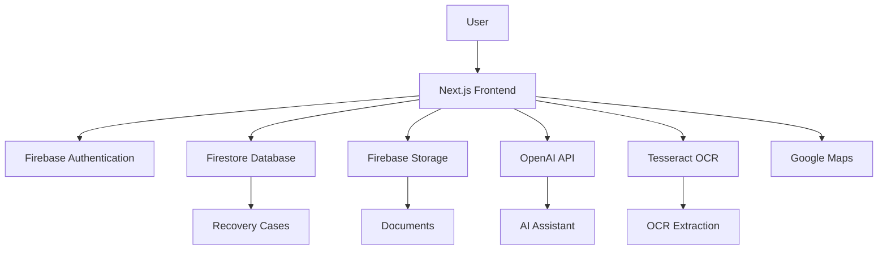

---

# Architecture Summary

RecoverAI follows a client-centric architecture where the Next.js frontend orchestrates communication between Firebase services, AI services, OCR processing, and supporting infrastructure.

Every external service is isolated behind dedicated service layers to simplify maintenance, testing, and future replacement.

------

# System Context

The System Context Diagram provides a high-level view of RecoverAI and its interactions with external users and supporting services.

RecoverAI acts as the central platform that coordinates authentication, recovery case management, document processing, AI assistance, and analytics while relying on trusted external services where appropriate.

The MVP does **not** integrate directly with restricted government or telecom systems. Instead, the architecture is designed so these integrations can be added in future versions without changing the overall system structure.

---

# Primary Actors

## User

The primary user of RecoverAI.

Responsibilities:

- Register and authenticate.
- Report a stolen device.
- Upload recovery documents.
- Interact with the AI Assistant.
- Monitor recovery progress.

---

## RecoverAI Platform

The core application responsible for:

- Authentication
- Recovery Case Management
- OCR Processing
- AI Recovery Guidance
- FIR Draft Generation
- Notifications
- Analytics

---

# External Services

## Firebase

Provides:

- Authentication
- Firestore Database
- Storage
- Security Rules

---

## OpenAI API

Provides:

- Recovery guidance
- FIR draft generation
- AI-powered recommendations

---

## Tesseract OCR

Processes uploaded invoices to extract:

- IMEI Number
- Device Model
- Purchase Details

---

## Google Maps Platform

Supports:

- Theft location selection
- Case location visualization (where applicable)

---

# Future Integrations

The architecture is intentionally designed to support future integrations without requiring major redesign.

Potential integrations include:

- Official CEIR services
- Telecom operator services
- Device manufacturers
- Insurance providers
- Law enforcement systems

These integrations are architectural placeholders only and are **not part of the MVP**.

---

# System Context Diagram

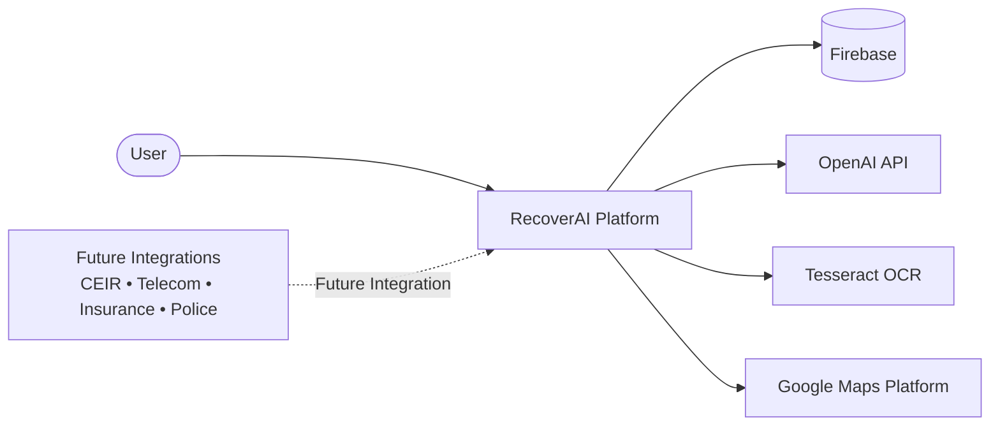

---

# Interaction Summary

| Actor / Service | Purpose |
|-----------------|---------|
| User | Uses RecoverAI to manage the recovery process. |
| Firebase | Authentication, database, and storage. |
| OpenAI API | Recovery guidance and FIR generation. |
| Tesseract OCR | Invoice text extraction. |
| Google Maps Platform | Location selection and visualization. |
| Future Integrations | Reserved for future versions of the platform. |

---

# Architectural Boundary

RecoverAI owns and manages the complete recovery workflow inside the application.

Official government systems, telecom infrastructure, and partner services remain external to the MVP and are represented only as future integration points.

This architectural boundary ensures that the MVP remains realistic, achievable, and compliant with the project scope defined in the PRD.

------

# Container Architecture

The RecoverAI platform is organized into multiple logical containers.

Each container has a clearly defined responsibility and communicates through well-defined interfaces.

This architecture improves scalability, maintainability, and future extensibility.

---

# Architecture Overview

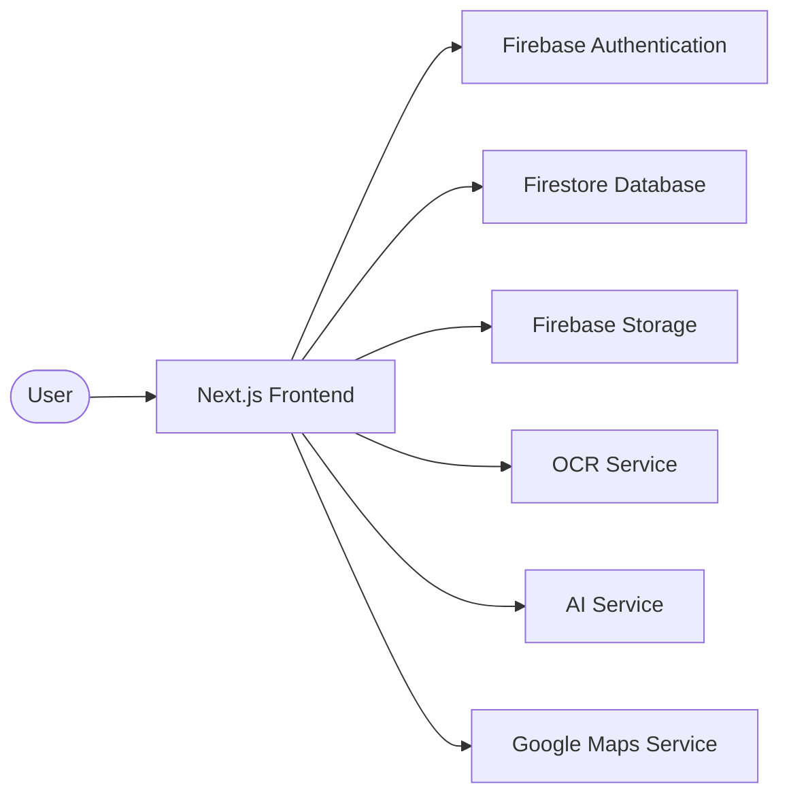

---

# Container Descriptions

## 1. Next.js Frontend

**Technology**

- Next.js 15
- React
- TypeScript
- Tailwind CSS
- shadcn/ui

### Responsibilities

- Render user interface
- Handle routing
- Manage application state
- Validate user input
- Display recovery cases
- Connect with backend services

---

## 2. Firebase Authentication

### Responsibilities

- User Registration
- User Login
- Session Management
- Protected Routes

Authentication is the entry point for all protected features.

---

## 3. Firestore Database

### Responsibilities

- User Profiles
- Recovery Cases
- Recovery Timeline
- Notifications
- Analytics Data

Firestore acts as the primary application database.

---

## 4. Firebase Storage

### Responsibilities

- Store invoices
- Store uploaded images
- Store generated PDFs
- Store recovery documents

Only authenticated users may access their own files.

---

## 5. OCR Service

Technology:

- Tesseract.js

Responsibilities:

- Process uploaded invoices
- Extract IMEI
- Extract Device Model
- Extract Purchase Details
- Return structured data to the frontend

---

## 6. AI Service

Technology:

- OpenAI API

Responsibilities:

- Generate recovery guidance
- Generate FIR drafts
- Suggest next recovery actions
- Explain recovery procedures

The AI Service never modifies user data directly.

It only returns structured responses.

---

## 7. Google Maps Service

Responsibilities:

- Display theft location
- Select incident location
- Visualize recovery case locations

Location services are optional within the MVP.

---

# Communication Rules

Containers communicate only through approved interfaces.

Examples:

Frontend → Firebase Authentication

Frontend → Firestore

Frontend → OCR Service

Frontend → AI Service

Direct communication between independent services is avoided whenever possible.

---

# Container Responsibilities Matrix

| Container | Primary Responsibility |
|------------|------------------------|
| Next.js Frontend | Presentation Layer |
| Firebase Authentication | Identity Management |
| Firestore | Data Persistence |
| Firebase Storage | File Storage |
| OCR Service | Document Processing |
| AI Service | Intelligent Assistance |
| Google Maps | Location Services |

---

# Container Interaction Flow

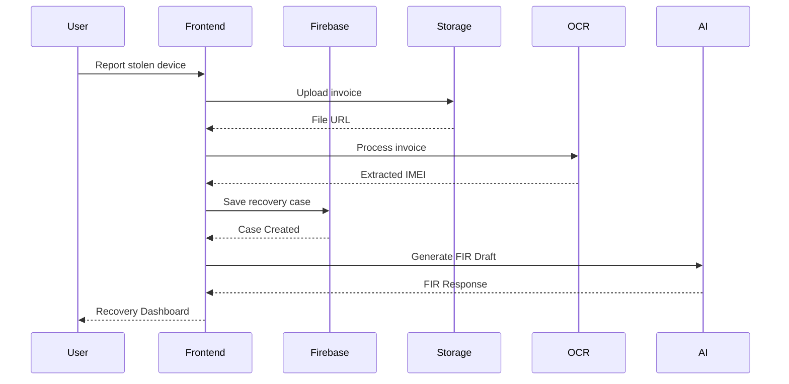

---

# Architectural Decisions

The container architecture follows these principles:

- Client-centric application design.
- Backend services remain independent.
- Business logic is separated from presentation logic.
- External services are isolated behind service layers.
- Every container has a single responsibility.

---

# Benefits

This architecture provides:

- High maintainability
- Easy debugging
- Modular development
- Independent service replacement
- Better scalability
- Cleaner testing strategy

------

# Component Architecture

RecoverAI is organized into independent feature modules.

Each module has a single responsibility, communicates through well-defined interfaces, and can be developed, tested, and maintained independently.

This modular approach improves scalability, maintainability, and future extensibility.

---

# Component Overview

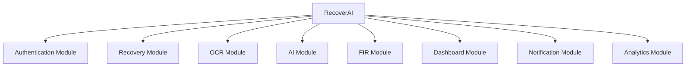

---

# 1. Authentication Module

## Responsibilities

- User Registration
- User Login
- Google Authentication
- Session Management
- Protected Routes

### Internal Components

- Login Page
- Signup Page
- Authentication Service
- Route Guard
- Session Provider

### Dependencies

- Firebase Authentication

### Output

Authenticated User Session

---

# 2. Recovery Module

## Responsibilities

- Create Recovery Case
- Manage Device Information
- Store IMEI Numbers
- Update Recovery Status
- Maintain Recovery Timeline

### Internal Components

- Recovery Form
- Case Details
- Timeline
- Device Information

### Dependencies

- Firestore
- Firebase Storage

### Output

Recovery Case

---

# 3. OCR Module

## Responsibilities

- Process Uploaded Invoice
- Extract IMEI
- Extract Device Model
- Extract Purchase Information
- Return Structured Data

### Internal Components

- OCR Service
- OCR Result Viewer
- Manual Correction Form

### Dependencies

- Tesseract.js

### Output

Structured Device Information

---

# 4. AI Module

## Responsibilities

- Recovery Guidance
- AI Chat
- Recovery Recommendations
- Context-Aware Assistance

### Internal Components

- Chat Interface
- Prompt Engine
- Response Formatter

### Dependencies

- OpenAI API

### Output

Recovery Guidance

---

# 5. FIR Generator Module

## Responsibilities

- Generate FIR Draft
- Preview FIR
- Export PDF

### Internal Components

- FIR Builder
- PDF Generator
- Preview Screen

### Dependencies

- AI Module

### Output

FIR Draft

---

# 6. Dashboard Module

## Responsibilities

- Display Recovery Cases
- Recovery Timeline
- Recent Activity
- Quick Actions

### Internal Components

- Dashboard Home
- Timeline
- Statistics Cards
- Quick Actions Panel

### Dependencies

- Firestore

### Output

Recovery Dashboard

---

# 7. Notification Module

## Responsibilities

- Success Messages
- Error Messages
- Reminder Notifications
- Recovery Alerts

### Internal Components

- Toast Manager
- Notification Center

### Dependencies

- Dashboard Module

### Output

User Notifications

---

# 8. Analytics Module

## Responsibilities

- Recovery Statistics
- Charts
- Demonstration Heatmap
- Dashboard Insights

### Internal Components

- Analytics Dashboard
- Charts
- Heatmap
- Statistics Cards

### Dependencies

- Firestore

### Output

Visual Analytics

---

# Component Dependency Diagram

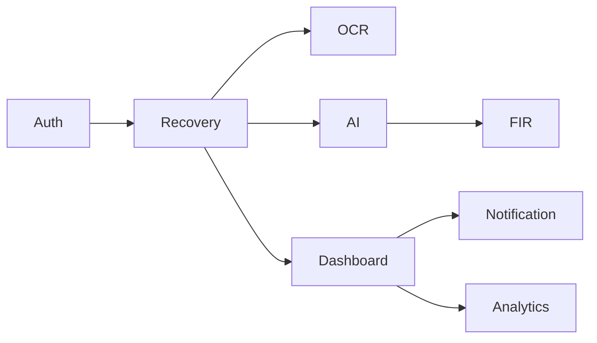

---

# Component Design Principles

Every component must:

- Have a single responsibility.
- Be reusable whenever possible.
- Be independently testable.
- Follow the approved Design System.
- Respect the project architecture.
- Avoid direct dependency on unrelated modules.

---

# Component Communication Rules

Components communicate through service layers rather than directly accessing each other's internal logic.

Examples:

- Recovery Module → OCR Service
- Recovery Module → AI Service
- Dashboard → Firestore
- FIR Generator → AI Service

Direct coupling between feature modules should be avoided.

------

# Application Data Flow Architecture

This section defines how data moves through RecoverAI during normal application usage.

The architecture follows a unidirectional flow where user actions are validated, processed by the appropriate services, stored securely, and reflected back in the user interface.

This approach improves maintainability, debugging, and scalability.

---

# High-Level Application Flow

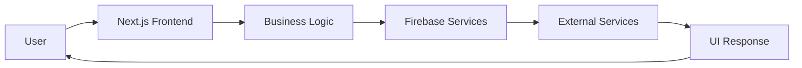

---

# User Journey Flow

The following flow represents the primary recovery journey.

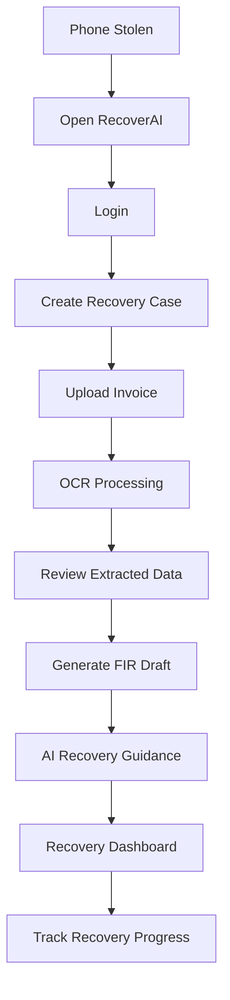

---

# Data Processing Flow

The following diagram illustrates how application data moves between services.

```mermaid
flowchart LR

User

--> Frontend

Frontend

--> Firebase Authentication

Frontend

--> Firebase Storage

Firebase Storage

--> OCR Service

OCR Service

--> Frontend

Frontend

--> Firestore

Frontend

--> AI Service

AI Service

--> Frontend

Frontend

--> Dashboard
```

---

# Request Lifecycle

Every user request follows a consistent processing pipeline.

```mermaid
flowchart LR

User Action

--> Input Validation

--> Business Logic

--> Service Layer

--> Database / External API

--> Response Processing

--> UI Update
```

---

# Recovery Case Flow

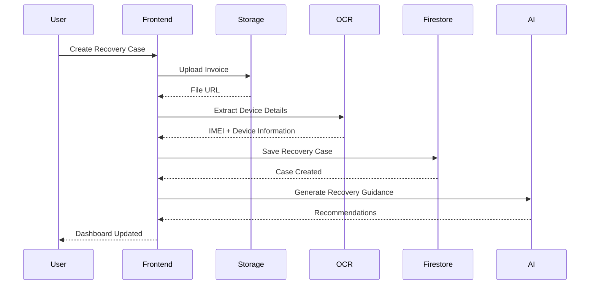

---

# State Management Flow

RecoverAI follows a predictable state transition model.

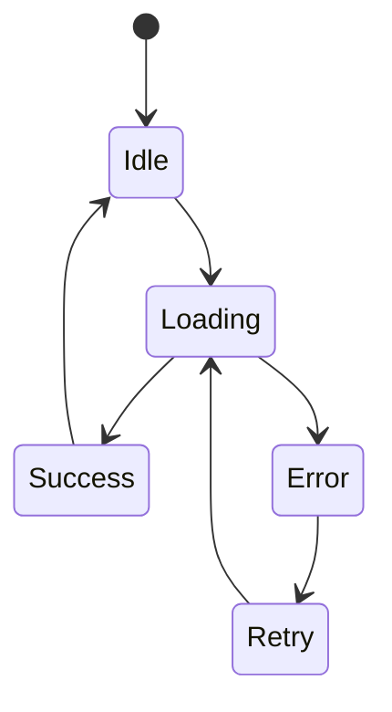

---

# Data Ownership

| Data | Owner |
|------|-------|
| User Profile | Firebase Authentication |
| Recovery Cases | Firestore |
| Uploaded Documents | Firebase Storage |
| OCR Results | OCR Service |
| AI Responses | OpenAI Service |
| Dashboard Data | Firestore |
| Analytics | Firestore |

---

# Service Communication Rules

All communication follows these principles:

- UI components never communicate directly with external APIs.
- Business logic is handled through dedicated service layers.
- Authentication is required before accessing protected resources.
- OCR processing begins only after successful document upload.
- AI services never modify database records directly.
- Firestore remains the single source of truth for application data.

---

# Error Handling Flow

Every operation must support predictable failure handling.

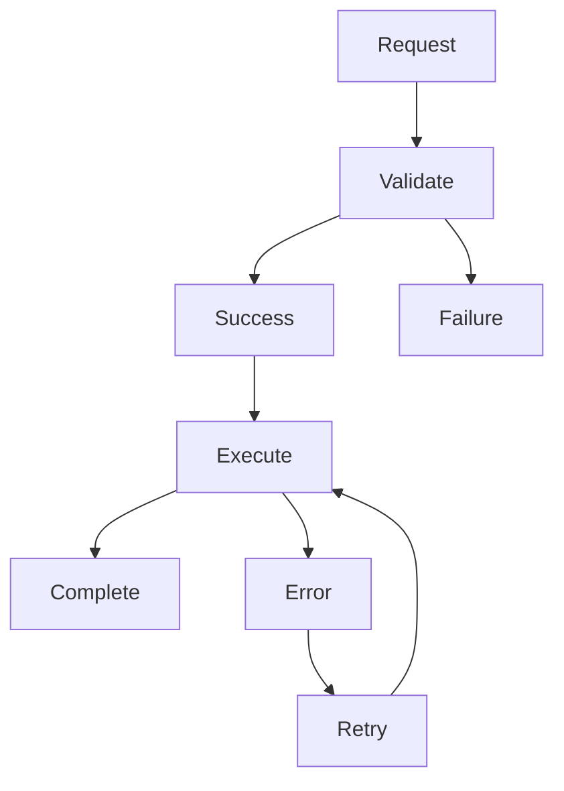

---

# Data Flow Principles

RecoverAI follows the following architectural principles:

- Validate before processing.
- Keep data immutable where practical.
- Never expose sensitive information to the client.
- Store persistent data only in approved services.
- Handle failures gracefully.
- Keep all data flows predictable and traceable.

------

# Security Architecture

RecoverAI follows a **Security by Design** approach, where security is considered during architecture and development rather than being added after implementation.

The platform is designed to protect user identities, recovery information, uploaded documents, and AI interactions through multiple security layers.

---

# Security Objectives

RecoverAI aims to:

- Protect user identity.
- Secure recovery case information.
- Prevent unauthorized data access.
- Protect uploaded documents.
- Secure API communication.
- Minimize sensitive data exposure.
- Support future security enhancements.

---

# Security Layers

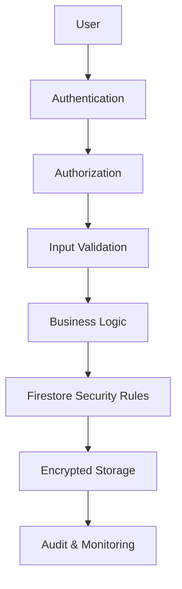

---

# Authentication Architecture

RecoverAI uses **Firebase Authentication** as the single authentication provider.

Supported methods:

- Email & Password Authentication
- Google Authentication

Authentication Responsibilities:

- User Registration
- Login
- Logout
- Session Management
- Protected Routes

Unauthenticated users cannot access protected application resources.

---

# Authorization Model

RecoverAI follows **Role-Based Access Control (RBAC)**.

Current MVP Roles:

| Role | Permissions |
|------|-------------|
| User | Manage own recovery cases and documents |
| Administrator *(Future)* | Platform monitoring and moderation |

Every authenticated user can access **only their own data**.

---

# Firestore Security Strategy

Firestore acts as the system's primary database.

Security principles:

- Users can read only their own documents.
- Users can update only their own recovery cases.
- Users cannot access another user's information.
- Server-side security rules enforce access control.

High-Level Security Flow

```mermaid
flowchart LR

User

--> Authentication

Authentication

--> Firestore Rules

Firestore Rules

--> Database
```

---

# File Upload Security

RecoverAI accepts user-uploaded recovery documents.

Security measures include:

- Authentication required before upload.
- File type validation.
- File size validation.
- Upload ownership verification.
- Secure Firebase Storage access.
- Private storage paths for each user.

Unsupported or potentially unsafe file types must be rejected.

---

# Environment Variable Strategy

Sensitive configuration must never be stored in source code.

Examples include:

- OpenAI API Key
- Firebase Configuration
- Google Maps API Key
- Future Integration Keys

Environment variables must be stored in:

```text
.env.local
```

Secrets should never be committed to Git.

---

# API Security

RecoverAI communicates with external services through dedicated service layers.

Security principles:

- Validate all requests.
- Handle API failures gracefully.
- Never expose secret keys.
- Return sanitized error messages.
- Log only non-sensitive information.

---

# Input Validation

All user input must be validated before processing.

Validation applies to:

- Forms
- IMEI Numbers
- Email Addresses
- Uploaded Files
- Recovery Details
- AI Prompt Inputs

Client-side validation improves user experience, while server-side validation remains the source of truth.

---

# AI Security Guidelines

RecoverAI treats AI as an advisory component.

Rules:

- AI never directly modifies database records.
- AI responses are treated as suggestions.
- AI-generated FIR drafts require user review before export.
- Sensitive information should not be unnecessarily included in prompts.

---

# Threat Model

The MVP considers the following high-level threats.

| Threat | Mitigation |
|---------|------------|
| Unauthorized Access | Firebase Authentication + Protected Routes |
| Data Leakage | Firestore Security Rules |
| Invalid User Input | Input Validation |
| Malicious File Upload | File Type & Size Validation |
| API Key Exposure | Environment Variables |
| Unauthorized Data Modification | Ownership Checks |

---

# Security Principles

RecoverAI follows these principles throughout development:

- Least Privilege Access
- Secure by Default
- Defense in Depth
- Input Validation First
- Principle of Single Responsibility
- Fail Securely
- Protect Sensitive Information

---

# Security Checklist

Before every release:

- Authentication verified.
- Firestore rules tested.
- Protected routes validated.
- Environment variables configured.
- Uploaded files validated.
- No secrets committed.
- AI prompts reviewed.
- Error handling verified.

Only after completing this checklist should a release be considered production-ready.

------

# Deployment Architecture

RecoverAI is designed to support a simple, reliable, and repeatable deployment workflow.

The deployment strategy prioritizes rapid iteration during the hackathon while following production-oriented engineering practices.

---

# Deployment Goals

The deployment architecture aims to:

- Enable rapid development.
- Support continuous deployment.
- Keep configuration secure.
- Separate development and production environments.
- Minimize deployment errors.
- Simplify future scaling.

---

# Deployment Overview

```mermaid
flowchart LR

Developer

--> GitHub Repository

GitHub Repository

--> Vercel

Vercel

--> RecoverAI Production

RecoverAI Production

--> Firebase

RecoverAI Production

--> OpenAI API

RecoverAI Production

--> Google Maps Platform
```

---

# Development Environment

Local development is performed using the following stack.

| Component | Technology |
|-----------|------------|
| Operating System | Windows / macOS / Linux |
| IDE | Visual Studio Code |
| Runtime | Node.js LTS |
| Package Manager | npm |
| Framework | Next.js 15 |
| Language | TypeScript |

---

# Source Control Strategy

GitHub is the single source of truth.

Recommended workflow:

```text
main
│
├── feature/auth
├── feature/recovery
├── feature/ocr
├── feature/ai
└── feature/dashboard
```

For the hackathon, development may occur directly on the `main` branch if time constraints require it.

---

# Deployment Pipeline

```mermaid
flowchart LR

Code

--> Git Commit

--> GitHub Push

--> Vercel Build

--> Build Validation

--> Production Deployment
```

Deployment should stop automatically if the build fails.

---

# Environment Configuration

Sensitive configuration must be stored using environment variables.

Example:

```text
NEXT_PUBLIC_FIREBASE_API_KEY=*****
NEXT_PUBLIC_FIREBASE_AUTH_DOMAIN=*****
NEXT_PUBLIC_FIREBASE_PROJECT_ID=*****

OPENAI_API_KEY=*****
GOOGLE_MAPS_API_KEY=*****
```

Environment files must **never** be committed to Git.

---

# Production Environment

Production deployment consists of:

- Next.js Application (Vercel)
- Firebase Authentication
- Firestore Database
- Firebase Storage
- OpenAI API
- Google Maps Platform

The frontend communicates securely with these managed services.

---

# Monitoring & Logging

Basic monitoring for the MVP includes:

- Vercel deployment logs
- Browser console (development only)
- Firebase Console
- Firestore usage metrics

Application logs must never expose sensitive user information.

---

# Backup Strategy

RecoverAI relies on managed cloud services.

Recommended practices:

- Firestore export (future enhancement)
- Source code versioning through GitHub
- Firebase project configuration backup
- Environment variable backup outside the repository

---

# Deployment Checklist

Before every production deployment:

- TypeScript compilation passes.
- ESLint reports no critical issues.
- Environment variables are configured.
- Firebase connection is verified.
- Authentication is tested.
- Firestore access is verified.
- File uploads are tested.
- AI features respond correctly.
- Responsive layout is verified.
- Production build succeeds.

---

# Deployment Principles

RecoverAI follows these deployment principles:

- Build once, deploy consistently.
- Keep environments isolated.
- Automate where practical.
- Fail fast on build errors.
- Never expose secrets.
- Maintain deployment reproducibility.

------

# Architecture Evolution Roadmap

RecoverAI is designed with a modular architecture that supports gradual expansion beyond the initial Minimum Viable Product (MVP).

Each evolution phase builds upon the previous one while preserving the existing architecture and minimizing breaking changes.

The roadmap is intended to guide future development and demonstrate long-term architectural scalability.

---

# Architecture Evolution Strategy

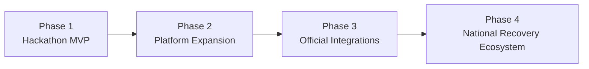

---

# Phase 1 — Hackathon MVP

### Goal

Deliver a complete and production-quality Minimum Viable Product.

### Modules

- User Authentication
- Recovery Case Management
- OCR Invoice Scanner
- AI Recovery Assistant
- AI FIR Generator
- Recovery Dashboard
- Notifications
- Analytics Dashboard

### Technology Stack

- Next.js
- TypeScript
- Firebase
- Firestore
- Firebase Storage
- OpenAI API
- Tesseract.js
- Vercel

### Success Criteria

- Stable deployment
- Complete recovery workflow
- Responsive UI
- Secure authentication
- Production-ready architecture

---

# Phase 2 — Platform Expansion

### Goal

Improve usability and user engagement.

### Planned Enhancements

- Multi-language Support
- Email Notifications
- Push Notifications
- Device Backup Information
- Recovery Progress Reminders
- Advanced Analytics
- User Settings
- Improved OCR Accuracy

### Architectural Impact

Minimal.

Existing modules remain unchanged while additional services are introduced.

---

# Phase 3 — Official Integrations

### Goal

Connect RecoverAI with trusted external ecosystems where official APIs and partnerships are available.

### Potential Integrations

- CEIR (subject to official API availability)
- Telecom Operators
- Device Manufacturers
- Insurance Providers
- Public Safety Services

### Architectural Considerations

- Integrations must use dedicated service layers.
- Existing business logic should not require major changes.
- External services must remain optional and isolated.

---

# Phase 4 — National Recovery Ecosystem

### Goal

Transform RecoverAI into a scalable recovery ecosystem.

### Vision

Potential capabilities include:

- National Device Recovery Network
- Smart Recovery Recommendations
- Community Assistance
- Predictive Theft Analytics
- Cross-Platform Case Synchronization
- Advanced Administrative Dashboards

These ideas represent long-term product direction and are **not part of the current MVP**.

---

# Architecture Evolution Principles

Future development should follow these principles:

- Preserve modularity.
- Avoid breaking existing functionality.
- Introduce new integrations through service layers.
- Maintain security-first design.
- Keep user experience simple.
- Scale incrementally rather than redesigning the platform.

---

# Evolution Timeline

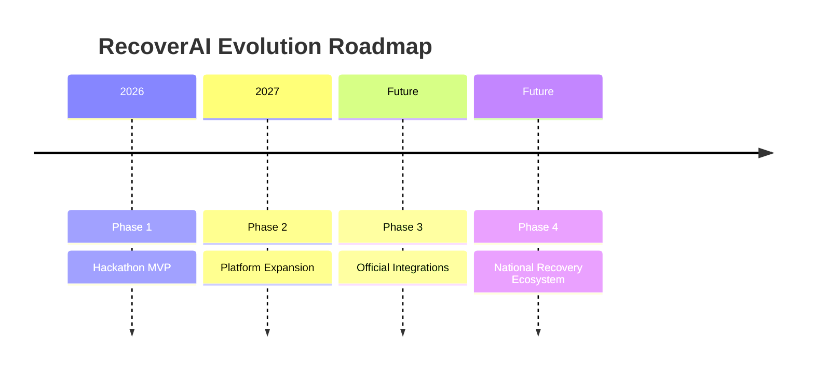

---

# Architectural Decisions

The architecture intentionally separates:

- Core Platform
- External Integrations
- AI Services
- Data Layer
- Presentation Layer

This separation allows future features to be added with minimal impact on the existing codebase.

---

# End of System Architecture Document

| Property | Value |
|----------|-------|
| Document | 02_SYSTEM_ARCHITECTURE.md |
| Version | 1.0 |
| Status | Approved |
| Owner | Rishabh Poddar |
| Last Updated | 2026-08-01 |

> **A well-designed architecture enables software to evolve without requiring complete redesigns.**
