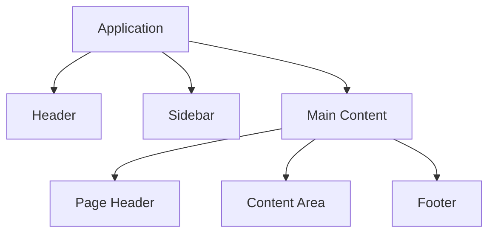
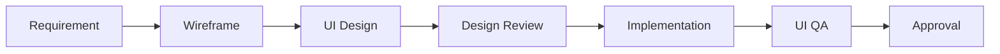

# Design System

## RecoverAI

> Government Inspired • Modern • Secure • Clean

---

# Design Vision

RecoverAI should look like a trusted national digital platform rather than a startup landing page.

The interface should immediately communicate:

- Trust
- Security
- Simplicity
- Professionalism
- Reliability

The design must reduce stress for users who have recently experienced device theft.

Every screen should guide users toward completing the next recovery step with confidence.

---

# Brand Personality

RecoverAI should feel:

- Professional
- Calm
- Reliable
- Transparent
- Helpful
- Intelligent

RecoverAI should never feel:

- Flashy
- Playful
- Gaming-oriented
- Neon themed
- Over-animated
- Cluttered

---

# Design Principles

Every interface must follow these principles.

## 1. Clarity First

Users should understand the next action within five seconds of opening any page.

---

## 2. Government-Level Trust

Visual language should resemble trusted digital public services while maintaining modern UI standards.

---

## 3. Accessibility

Every screen must remain readable and usable across desktop, tablet, and mobile devices.

---

## 4. Consistency

Spacing, typography, colors, icons, and components must remain consistent throughout the platform.

---

## 5. Simplicity

Every page should solve one primary user problem.

Avoid unnecessary widgets, animations, or decorative elements.

---

# Visual Style

RecoverAI combines the visual characteristics of:

- Government Digital Services
- Banking Applications
- Healthcare Portals
- Modern SaaS Dashboards

The final experience should feel trustworthy, lightweight, and professional.

---

# Emotional Goal

After opening RecoverAI, users should feel:

✔ My information is safe.

✔ I know what to do next.

✔ This platform will guide me.

✔ The recovery process is organized.

✔ I am not handling this alone.

------

# Brand Theme

## Theme A — Government Digital India

RecoverAI adopts a **Government Digital India** inspired design language.

The objective is to create an interface that feels trustworthy, official, modern, and accessible while avoiding the outdated appearance of traditional government portals.

The design language combines:

- DigiLocker
- UMANG
- MyGov
- CoWIN
- Modern SaaS Dashboards

The final UI should communicate:

- Trust
- Safety
- Professionalism
- Simplicity
- Reliability

---

# Brand Colors

## Primary Color

Government Blue

```css
#0F4C81
```

Purpose

- Primary Buttons
- Active Navigation
- Headings
- Links
- Important Actions

---

## Secondary Color

Royal Blue

```css
#2563EB
```

Purpose

- Secondary Buttons
- Progress Indicators
- Interactive Elements

---

## Accent Color

Success Green

```css
#16A34A
```

Purpose

- Success Messages
- Completed Status
- Verified Badge
- Positive Actions

---

## Warning Color

Amber

```css
#F59E0B
```

Purpose

- Pending Status
- OCR Review Required
- Warning Cards

---

## Error Color

Red

```css
#DC2626
```

Purpose

- Errors
- Validation Messages
- Failed Operations

---

# Neutral Palette

| Name | Color |
|-------|--------|
| Background | #F8FAFC |
| Surface | #FFFFFF |
| Border | #E2E8F0 |
| Divider | #CBD5E1 |
| Text Primary | #0F172A |
| Text Secondary | #475569 |
| Muted Text | #94A3B8 |

---

# Color Usage Rules

Government Blue should always remain the dominant brand color.

Do:

- Use blue for important actions.
- Use white backgrounds.
- Keep layouts clean.
- Use green only for successful actions.
- Use amber only for warnings.
- Use red only for errors.

Avoid:

- Neon colors
- Heavy gradients
- Bright purple
- Bright pink
- Oversaturated colors
- Rainbow color combinations

---

# Visual Style

RecoverAI should appear as:

✔ Official

✔ Modern

✔ Secure

✔ Minimal

✔ Professional

It should never resemble:

✘ Gaming Dashboard

✘ Crypto Website

✘ Futuristic Cyberpunk UI

✘ Entertainment Website

---

# Color Accessibility

The chosen palette must maintain sufficient contrast for readability.

Requirements:

- Minimum WCAG AA contrast for text.
- Never place blue text on dark blue backgrounds.
- Use dark text on light surfaces whenever possible.
- Error and success colors should always be accompanied by icons or labels, not color alone.

---

# Dark Mode

Dark Mode is intentionally excluded from the MVP.

Reason:

Maintaining one polished, accessible, and consistent light theme is a higher priority than supporting multiple themes during the hackathon.

Dark Mode may be introduced in future versions.

------

# Typography

RecoverAI uses **Inter** as the primary typeface.

## Font Family

```css
font-family:
'Inter',
system-ui,
-apple-system,
BlinkMacSystemFont,
'Segoe UI',
sans-serif;
```

Reason:

- Highly readable
- Excellent dashboard typography
- Professional appearance
- Modern SaaS standard
- Mobile friendly

---

# Typography Scale

## Display

| Style | Size | Weight | Usage |
|---------|------|---------|----------------|
| Display Large | 48px | 700 | Landing Hero |
| Display Medium | 40px | 700 | Major Sections |

---

## Headings

| Style | Size | Weight | Usage |
|---------|------|---------|----------------|
| H1 | 36px | 700 | Page Title |
| H2 | 30px | 700 | Major Section |
| H3 | 24px | 600 | Card Heading |
| H4 | 20px | 600 | Component Title |
| H5 | 18px | 600 | Small Sections |
| H6 | 16px | 600 | Labels |

---

## Body Text

| Style | Size | Weight |
|---------|------|---------|
| Large Body | 18px | 400 |
| Body | 16px | 400 |
| Small Body | 14px | 400 |
| Caption | 12px | 400 |

---

# Line Height

| Text | Line Height |
|---------|-------------|
| Headings | 120% |
| Body | 150% |
| Caption | 140% |

---

# Letter Spacing

| Usage | Value |
|--------|--------|
| Heading | -0.02em |
| Body | 0 |
| Button | 0.02em |

---

# 8px Spacing System

RecoverAI follows an **8-point spacing grid**.

## Base Unit

```text
1 Unit = 8px
```

Spacing Scale

| Token | Value |
|---------|---------|
| XS | 4px |
| SM | 8px |
| MD | 16px |
| LG | 24px |
| XL | 32px |
| 2XL | 48px |
| 3XL | 64px |

---

# Layout Spacing

## Page Padding

Desktop

```text
32px
```

Tablet

```text
24px
```

Mobile

```text
16px
```

---

## Card Padding

```text
24px
```

---

## Section Gap

```text
48px
```

---

## Component Gap

```text
16px
```

---

# Border Radius

RecoverAI uses soft rounded corners.

| Component | Radius |
|------------|---------|
| Button | 10px |
| Input | 10px |
| Card | 16px |
| Modal | 20px |
| Avatar | Full |
| Badge | Full |

Avoid sharp corners unless intentionally used for tables.

---

# Elevation & Shadows

## Level 1

Used for Cards

```css
0 1px 3px rgba(15,23,42,.08)
```

---

## Level 2

Used for Modals

```css
0 8px 24px rgba(15,23,42,.12)
```

---

## Level 3

Used for Dropdowns

```css
0 12px 32px rgba(15,23,42,.16)
```

Avoid heavy shadows.

---

# Iconography

Icon Library

**Lucide React**

Reason:

- Clean
- Modern
- Lightweight
- Consistent
- Open Source

Icon Size

| Usage | Size |
|---------|------|
| Small | 16px |
| Medium | 20px |
| Default | 24px |
| Large | 32px |

Icons should always support the interface rather than decorate it.

---

# Component Sizing

## Buttons

Height

```text
44px
```

---

## Inputs

Height

```text
44px
```

---

## Search Bars

Height

```text
48px
```

---

## Navbar

Height

```text
72px
```

---

## Sidebar

Width

```text
280px
```

---

# Responsive Breakpoints

| Device | Width |
|----------|---------|
| Mobile | <640px |
| Tablet | 640–1023px |
| Desktop | ≥1024px |

---

# Design Tokens Summary

| Category | Standard |
|-----------|----------|
| Font | Inter |
| Grid | 8px |
| Radius | Soft Rounded |
| Icons | Lucide React |
| Shadows | Minimal |
| Theme | Government Digital India |
| Layout | Mobile First |

------

# Component Library

RecoverAI follows a reusable component architecture.

Every UI element should be built once and reused throughout the application.

No duplicate components should exist unless there is a documented architectural reason.

---

# Button Component

## Purpose

Used for all user actions.

---

## Variants

- Primary
- Secondary
- Outline
- Ghost
- Danger
- Success

---

## States

- Default
- Hover
- Focus
- Active
- Disabled
- Loading

---

## Usage Rules

Use one **Primary Button** per screen for the main action.

Secondary actions should use **Secondary** or **Outline** buttons.

Danger buttons are reserved for destructive actions only.

---

## Accessibility

- Minimum height: 44px
- Keyboard accessible
- Visible focus ring
- Loading state must disable interaction

---

# Input Component

## Purpose

Collect user information.

---

## Supported Types

- Text
- Email
- Password
- Phone
- Number
- Search
- Date

---

## States

- Default
- Focus
- Filled
- Error
- Disabled

---

## Usage Rules

Every input must include:

- Label
- Placeholder
- Validation
- Error Message
- Helper Text (optional)

---

# Textarea

## Purpose

Long-form user input.

Examples:

- Theft Description
- Recovery Notes
- AI Prompt Input

---

# Select Component

## Purpose

Choose one option from predefined values.

Examples:

- Device Brand
- Device Status
- Recovery Stage

---

# Checkbox

Used for:

- Terms & Conditions
- Consent
- Multi-selection

---

# Radio Button

Used when only one option can be selected.

---

# Card Component

## Purpose

Display grouped information.

Examples:

- Recovery Case
- Statistics
- Dashboard Widgets

---

## Variants

- Default
- Information
- Success
- Warning
- Error

---

# Modal Component

## Purpose

Display important interactions.

Examples:

- Delete Confirmation
- Recovery Details
- Document Preview

---

# Dialog Component

Small confirmation windows.

Used for:

- Logout
- Delete
- Cancel Actions

---

# Toast Notifications

## Types

- Success
- Error
- Warning
- Information

---

## Position

Top Right

---

## Duration

4 seconds

---

# Badge Component

Used for:

- Status
- Priority
- Verification

---

## Badge Types

- Success
- Warning
- Error
- Neutral
- Information

---

# Navigation Bar

## Contains

- Logo
- Search
- Notifications
- Profile Menu

Height

72px

---

# Sidebar

## Contains

- Dashboard
- Recovery Cases
- Documents
- Analytics
- Settings

---

## Behaviour

Desktop

Persistent

Tablet

Collapsible

Mobile

Drawer Navigation

---

# Table Component

Used for:

- Recovery Cases
- Document Lists
- Activity Logs

---

## Features

- Pagination
- Sorting
- Search
- Responsive Layout

---

# Form Component

Forms should include:

- Progress Indicator
- Validation
- Required Field Indicator
- Submit State
- Cancel Action

---

# Empty State

Shown when no data exists.

Must include:

- Illustration
- Message
- Primary Action

---

# Loading Skeleton

Use skeleton loaders instead of spinners whenever possible.

Examples:

- Cards
- Tables
- Dashboard
- Profile

---

# Progress Indicator

Used for:

- OCR Processing
- Upload Progress
- Recovery Progress

---

# Status Components

Supported Statuses

- Pending
- In Review
- Completed
- Failed
- Processing

Each status must include:

- Color
- Icon
- Label

---

# AI Chat Components

The AI Assistant should include:

- Chat Bubble
- Suggested Prompts
- Typing Indicator
- Timestamp
- AI Badge
- User Avatar

---

# OCR Components

Include:

- Upload Area
- Progress Indicator
- Extracted Fields
- Confidence Indicator
- Manual Correction Form

---

# Accessibility Requirements

Every component must:

- Support keyboard navigation
- Include focus states
- Meet WCAG AA contrast
- Have semantic HTML
- Work on mobile devices

---

# Component Development Rules

All components must:

- Be reusable
- Be typed with TypeScript
- Follow the Design System
- Avoid duplicate implementations
- Support responsive layouts
- Be documented before modification

------

# Page Layout System

RecoverAI follows a consistent layout architecture across the application.

Every page should feel familiar to users, reducing cognitive load and improving navigation.

The layout system is responsive, modular, and optimized for desktop, tablet, and mobile devices.

---

# Global Layout Structure



---

# Global Layout Rules

## Header

Purpose:

- Brand Identity
- Global Navigation
- Notifications
- User Profile
- Logout

Height

```text
72px
```

Behavior

- Sticky
- Visible on all authenticated pages
- Responsive

---

## Sidebar

Purpose

Primary navigation.

Contains:

- Dashboard
- Recovery Cases
- AI Assistant
- Documents
- Analytics
- Settings

Width

```text
280px
```

Behavior

Desktop

- Fixed

Tablet

- Collapsible

Mobile

- Drawer Navigation

---

## Main Content

Maximum Width

```text
1280px
```

Padding

Desktop

```text
32px
```

Tablet

```text
24px
```

Mobile

```text
16px
```

---

# Landing Page Layout

Structure

```text
Navbar

↓

Hero Section

↓

Key Features

↓

How RecoverAI Works

↓

FAQ

↓

Footer
```

Purpose

- Explain the platform
- Build trust
- Encourage sign-up

---

# Authentication Layout

Pages

- Login
- Register
- Forgot Password

Structure

```text
Logo

↓

Welcome Message

↓

Authentication Form

↓

Help Links
```

Rules

- Minimal distractions
- Center aligned
- Maximum width: 420px

---

# Dashboard Layout

Structure

```text
Header

↓

Quick Statistics

↓

Recovery Cases

↓

Recent Activity

↓

Quick Actions
```

Grid

Desktop

```text
12 Columns
```

Tablet

```text
8 Columns
```

Mobile

```text
1 Column
```

---

# Recovery Case Layout

Structure

```text
Case Header

↓

Device Information

↓

Uploaded Documents

↓

Recovery Timeline

↓

AI Suggestions
```

---

# AI Assistant Layout

Structure

```text
Chat Header

↓

Conversation

↓

Suggested Prompts

↓

Input Box
```

Behavior

- Auto-scroll to latest message
- Sticky input area
- Typing indicator
- Conversation history

---

# Analytics Layout

Structure

```text
Statistics Cards

↓

Charts

↓

Heatmap

↓

Insights
```

Charts should stack vertically on mobile devices.

---

# Settings Layout

Sections

- Profile
- Security
- Notifications
- Preferences
- About

Navigation

Left-side menu on desktop.

Accordion layout on mobile.

---

# Error Pages

Supported Pages

- 404
- 500
- Offline

Every error page should include:

- Friendly illustration
- Clear explanation
- Primary action button
- Link back to Dashboard or Home

---

# Responsive Layout Rules

## Desktop

- Sidebar visible
- Multi-column layouts
- Expanded tables

---

## Tablet

- Collapsible sidebar
- Reduced spacing
- Adaptive grids

---

## Mobile

- Drawer navigation
- Single-column layout
- Touch-friendly controls
- Simplified tables

---

# Scroll Behavior

RecoverAI should support predictable scrolling.

Rules

- Sticky Header
- Independent Sidebar Scroll
- Main Content Scroll
- Preserve scroll position when appropriate

---

# Grid System

RecoverAI follows a responsive CSS Grid layout.

| Device | Grid |
|----------|------|
| Mobile | 4 Columns |
| Tablet | 8 Columns |
| Desktop | 12 Columns |

---

# Layout Principles

Every page must:

- Follow the approved grid system.
- Maintain consistent spacing.
- Use reusable layout components.
- Keep the primary action clearly visible.
- Avoid horizontal scrolling.
- Prioritize readability over visual density.

---

# Layout Consistency Checklist

Before approving any page:

- Header follows the standard layout.
- Sidebar matches navigation guidelines.
- Page width is within limits.
- Grid system is respected.
- Mobile responsiveness is verified.
- Primary action is clearly visible.
- Empty states are handled gracefully.
- Layout matches the approved Design System.

------

# Interaction & Motion System

RecoverAI uses motion to improve usability, communicate system status, and provide feedback to users.

Animations should always have a purpose.

Motion must never distract users from completing recovery-related tasks.

---

# Motion Principles

RecoverAI follows these principles:

- Motion should guide, not entertain.
- Feedback should be immediate.
- Animations should feel smooth and subtle.
- Reduce user uncertainty.
- Respect accessibility preferences.

---

# Motion Duration

| Interaction | Duration |
|-------------|----------|
| Hover | 150ms |
| Button Press | 120ms |
| Card Hover | 180ms |
| Drawer Open / Close | 250ms |
| Modal Open / Close | 250ms |
| Page Transition | 250–300ms |
| Toast Appearance | 200ms |
| Skeleton Fade | 300ms |

---

# Easing

Standard easing:

```css
ease-out
```

Use:

- Smooth opening
- Smooth closing
- Natural interactions

Avoid:

- Bounce
- Elastic
- Overshoot
- Flash animations

---

# Hover Behavior

Interactive elements should provide subtle feedback.

Supported Components:

- Buttons
- Cards
- Links
- Navigation Items
- Icons

Effects:

- Slight background color change
- Shadow elevation (cards)
- Pointer cursor
- Smooth transition

Hover should never significantly change layout.

---

# Focus States

Keyboard users must always know where focus is.

Rules:

- Visible focus ring
- High contrast outline
- Never remove focus styles
- Maintain consistent appearance across components

---

# Click Feedback

Every clickable component should acknowledge interaction.

Examples:

- Button press effect
- Ripple-free scale effect (maximum 98%)
- Loading state for asynchronous actions

Users should never wonder if an action was registered.

---

# Form Validation Feedback

Validation should occur:

- On field blur (where appropriate)
- On form submission
- After asynchronous validation

Error messages should:

- Explain the problem
- Suggest the correction
- Appear close to the affected field

Success validation may include:

- Green border
- Success icon
- Confirmation message

---

# Loading States

RecoverAI prioritizes skeleton loading over traditional spinners.

Preferred Loading UI:

- Skeleton Cards
- Skeleton Tables
- Skeleton Dashboard Widgets
- Skeleton Lists

Use spinners only for:

- Very short operations
- Full-screen blocking actions

---

# Progress Indicators

Progress indicators should be shown during:

- File uploads
- OCR processing
- AI response generation
- PDF generation

Progress should always include:

- Visual indicator
- Status label

Example:

```
Uploading Invoice...
████████░░░░ 65%
```

---

# Toast Notifications

Toast notifications communicate short-lived events.

Types:

- Success
- Information
- Warning
- Error

Position:

Top-right (desktop)

Top-center (mobile)

Duration:

4 seconds

Every toast should include:

- Icon
- Title
- Short description

---

# Modal Behavior

Modals should:

- Trap keyboard focus
- Close with ESC
- Close when clicking outside (except critical dialogs)
- Restore focus to the triggering element

Only one modal may be active at a time.

---

# Navigation Transitions

Navigation should feel instant.

Rules:

- Preserve layout where possible.
- Avoid unnecessary full-page reloads.
- Display loading indicators only when needed.

---

# Micro-Interactions

Micro-interactions improve confidence.

Examples:

- Button hover
- Successful save confirmation
- File upload completion
- AI typing indicator
- Notification badge updates
- Card elevation on hover

Micro-interactions must remain subtle.

---

# Success Feedback

Successful actions should provide immediate confirmation.

Examples:

- Green success toast
- Checkmark icon
- Status badge update
- Progress completion

---

# Error Feedback

Errors should:

- Clearly explain what happened.
- Explain how to resolve the issue.
- Avoid technical jargon.

Never display raw system errors directly to users.

---

# Empty State Interaction

When no data exists:

Display:

- Friendly illustration
- Helpful message
- Clear primary action

Example:

"No recovery cases found."

Primary Action:

"Report a Stolen Device"

---

# Reduced Motion Accessibility

RecoverAI respects user accessibility preferences.

If the operating system requests reduced motion:

- Disable non-essential animations.
- Keep transitions minimal.
- Preserve usability without relying on motion.

---

# Motion Do's

- Keep animations subtle.
- Use consistent timing.
- Prioritize usability.
- Provide immediate feedback.
- Respect accessibility settings.

---

# Motion Don'ts

Do not use:

- Bounce animations
- Flashing effects
- Infinite decorative animations
- Parallax scrolling
- Rotating UI elements
- Long transition durations (>400ms)

---

# Interaction Quality Checklist

Every interaction should:

- Provide immediate feedback.
- Maintain accessibility.
- Feel responsive.
- Avoid visual distractions.
- Follow approved motion timings.
- Preserve layout stability.
- Support keyboard navigation.

------

# Responsive Design Guidelines

RecoverAI follows a **Mobile-First Responsive Design** strategy.

Every screen, component, and interaction must provide a consistent experience across smartphones, tablets, laptops, and desktop computers.

Responsive behavior is considered a core requirement rather than an enhancement.

---

# Responsive Design Principles

The application must:

- Design for mobile first.
- Scale progressively to larger screens.
- Maintain consistent spacing and typography.
- Avoid horizontal scrolling.
- Preserve usability on touch devices.
- Keep navigation intuitive across all screen sizes.

---

# Supported Breakpoints

| Device | Width |
|----------|------------|
| Mobile | 0–639px |
| Tablet | 640–1023px |
| Laptop | 1024–1439px |
| Desktop | 1440px and above |

---

# Mobile-First Strategy

Development begins with the smallest supported viewport.

Enhancements for larger screens should be introduced progressively without changing the core user experience.

Priority order:

1. Mobile
2. Tablet
3. Laptop
4. Desktop

---

# Touch Targets

Interactive elements must be easy to tap.

| Component | Minimum Size |
|------------|--------------|
| Buttons | 44 × 44 px |
| Icon Buttons | 44 × 44 px |
| Navigation Items | 44 × 44 px |
| Checkboxes | 44 × 44 px |
| Radio Buttons | 44 × 44 px |

Spacing between adjacent touch targets should prevent accidental taps.

---

# Responsive Typography

Typography scales with screen size while maintaining hierarchy.

| Element | Mobile | Tablet | Desktop |
|----------|---------|---------|----------|
| H1 | 30px | 34px | 36px |
| H2 | 24px | 28px | 30px |
| H3 | 20px | 22px | 24px |
| Body | 16px | 16px | 16px |
| Caption | 12px | 12px | 12px |

---

# Responsive Spacing

Spacing adapts based on available screen space.

| Device | Page Padding |
|----------|--------------|
| Mobile | 16px |
| Tablet | 24px |
| Desktop | 32px |

Maintain the 8-point spacing system across all breakpoints.

---

# Navigation Behavior

## Mobile

- Drawer Navigation
- Hamburger Menu
- Bottom actions kept within thumb reach

---

## Tablet

- Collapsible Sidebar
- Sticky Header

---

## Desktop

- Persistent Sidebar
- Full Navigation
- Expanded Header

---

# Grid System

| Device | Grid |
|----------|------|
| Mobile | 4 Columns |
| Tablet | 8 Columns |
| Desktop | 12 Columns |

Cards and widgets should automatically reflow based on the active grid.

---

# Forms

Forms should adapt responsively.

### Mobile

- Single-column layout
- Full-width inputs
- Large touch targets

### Desktop

- Two-column layout where appropriate
- Group related fields
- Preserve readability

---

# Tables

Tables should remain usable on smaller screens.

### Desktop

- Full table
- Sorting
- Pagination

### Mobile

- Horizontal scroll only if unavoidable
- Prefer card-based representation
- Collapse less important columns

---

# Dashboard

Dashboard widgets should automatically rearrange.

### Desktop

```
Stats | Stats | Stats | Stats

Recovery Cases

Analytics

Recent Activity
```

### Tablet

```
Stats | Stats

Stats | Stats

Recovery Cases

Analytics
```

### Mobile

```
Stats

Stats

Stats

Stats

Recovery Cases

Analytics

Recent Activity
```

---

# AI Chat

### Mobile

- Full-screen conversation
- Sticky input field
- Bottom-aligned message composer

### Desktop

- Centered chat container
- Wider message area
- Persistent conversation history

---

# Images & Media

Rules:

- Use responsive image sizing.
- Preserve aspect ratios.
- Lazy load non-critical images.
- Avoid oversized assets.

---

# Orientation Support

Landscape orientation should remain fully usable.

Guidelines:

- Preserve navigation.
- Prevent layout overlap.
- Avoid clipped content.
- Keep actions visible.

---

# Safe Area Support

Devices with display cut-outs or rounded corners must be supported.

Respect safe area insets for:

- Header
- Footer
- Navigation Drawer
- Floating Action Buttons

---

# Responsive Performance

To maintain performance:

- Load only required assets.
- Optimize images.
- Minimize layout shifts.
- Avoid unnecessary re-renders.
- Lazy load heavy modules.

---

# Responsive Testing Checklist

Before approval, verify:

- Mobile layout
- Tablet layout
- Desktop layout
- Touch interactions
- Keyboard navigation
- Drawer behavior
- Responsive typography
- Grid alignment
- Form usability
- Table readability
- Dashboard responsiveness

---

# Responsive Design Principles

Every screen should:

- Feel natural on every device.
- Keep the primary action immediately visible.
- Preserve readability.
- Minimize scrolling effort.
- Avoid unnecessary complexity.

------

# Design Governance & Quality Assurance

RecoverAI follows a governance-first design process.

Every new screen, component, and interaction must comply with the approved Design System before implementation is considered complete.

Design governance ensures long-term consistency, usability, accessibility, and maintainability.

---

# Design Review Process

Every design follows the same lifecycle.



No design should move to implementation without completing the review stage.

---

# Design Review Checklist

Before implementation, verify that the design:

- Follows the approved color palette.
- Uses the Inter typography system.
- Respects the 8-point spacing grid.
- Uses approved component variants.
- Matches the page layout system.
- Maintains visual hierarchy.
- Supports responsive layouts.
- Includes proper empty and loading states.

---

# Accessibility Checklist

Every screen must:

- Meet WCAG AA color contrast where practical.
- Support keyboard navigation.
- Display visible focus indicators.
- Use semantic HTML elements.
- Include descriptive labels for form controls.
- Provide meaningful error messages.
- Avoid using color as the only indicator of status.

---

# Component Compliance

Every reusable component must:

- Use TypeScript.
- Support all documented states.
- Follow approved spacing.
- Follow approved typography.
- Respect responsive behavior.
- Be documented before modification.

Duplicate components are not allowed unless explicitly approved.

---

# Visual Consistency Rules

All pages should maintain:

- Consistent spacing.
- Consistent typography.
- Consistent icon sizes.
- Consistent border radius.
- Consistent shadows.
- Consistent button hierarchy.
- Consistent navigation placement.

The user should never feel like different pages belong to different applications.

---

# UX Review Process

Every user flow should be reviewed for:

- Simplicity
- Clarity
- Navigation
- Error prevention
- Feedback
- Completion time

Questions to ask:

- Is the next action obvious?
- Can the task be completed without confusion?
- Is unnecessary information removed?
- Are users informed after every important action?

---

# Definition of Design Done (DoDD)

A design is considered complete only when:

- Visual design is finalized.
- Responsive layouts are verified.
- Accessibility requirements are satisfied.
- Components match the Design System.
- Interaction states are defined.
- Empty, loading, success, and error states are designed.
- UX review has been completed.
- Design documentation is updated.

---

# Figma ↔ Code Consistency

For future iterations:

- Design tokens should match implementation.
- Colors should reference shared variables.
- Typography should use approved tokens.
- Spacing should use the 8-point grid.
- Component names should remain consistent across design and code.

This reduces inconsistencies between design files and implementation.

---

# Design Versioning

The Design System should follow semantic versioning.

| Version | Description |
|----------|-------------|
| 1.0 | Initial Design System |
| 1.1 | Minor visual improvements |
| 2.0 | Major redesign or structural changes |

All significant design updates must be documented before implementation.

---

# Change Management

Any proposed design change should answer:

- Why is the change required?
- Which components are affected?
- Does it improve usability?
- Does it maintain consistency?
- Does it impact accessibility?
- Does it require documentation updates?

Changes should be reviewed before being merged into the main design system.

---

# Design Quality Checklist

Before approving any screen:

- Typography matches standards.
- Colors use approved tokens.
- Components are reusable.
- Layout follows the grid system.
- Responsive behavior is verified.
- Accessibility is reviewed.
- Motion follows the Motion System.
- No visual inconsistencies remain.

---

# Governance Principles

RecoverAI design decisions are guided by:

- Clarity over decoration.
- Consistency over creativity.
- Accessibility by default.
- Reusability over duplication.
- Simplicity over complexity.
- Trust through thoughtful design.

---

# Design System Completion

This Design System serves as the single source of truth for all visual and interaction decisions within RecoverAI.

Any future UI changes must begin by updating this document before implementation.

---

# Document Status

| Property | Value |
|----------|-------|
| Document | 03_DESIGN_SYSTEM.md |
| Version | 1.0 |
| Status | Approved |
| Owner | Rishabh Poddar |
| Last Updated | 2026-08-01 |

> **"A consistent design system creates products that users trust, developers can maintain, and teams can scale."**

---