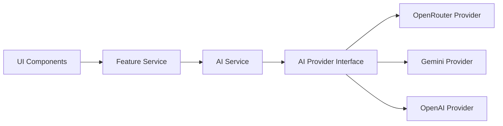
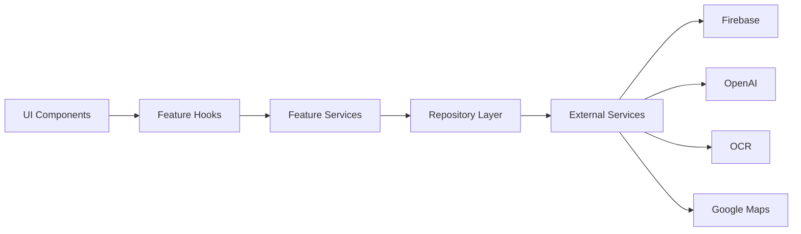
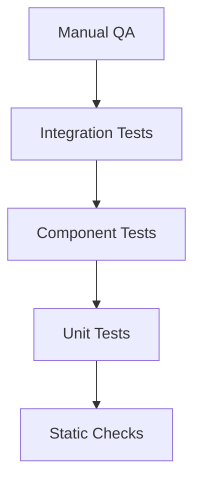

# Master Development Specification (MDS)

## RecoverAI

> **The Engineering Rulebook for RecoverAI**

---

# Purpose

The Master Development Specification (MDS) defines the engineering standards, coding conventions, architectural constraints, and implementation rules that every contributor and AI coding agent must follow.

It acts as the single source of truth for software development practices within the RecoverAI project.

No feature should be implemented without complying with this document.

---

# Scope

This specification applies to:

- Application Architecture
- Frontend Development
- Backend Integration
- Firebase Services
- AI Features
- OCR Processing
- Component Development
- Database Design
- Git Workflow
- Testing
- Deployment

---

# Development Philosophy

RecoverAI follows a **Documentation-First Development** approach.

Every implementation begins with documentation.

The development lifecycle is:


Documentation is considered part of the product and must remain synchronized with implementation.

---

# Engineering Principles

All development must follow these principles.

## 1. Single Responsibility

Each file, function, and component should have one clear responsibility.

Avoid creating files that perform multiple unrelated tasks.

---

## 2. Reusability

Before creating a new component or utility:

- Search for an existing implementation.
- Reuse shared components whenever possible.
- Avoid duplication.

---

## 3. Readability

Code should prioritize clarity over cleverness.

Every developer should understand the code without requiring extensive explanation.

Use meaningful names for variables, functions, components, and folders.

---

## 4. Consistency

The project should maintain consistent:

- Folder structure
- Naming conventions
- Formatting
- Component patterns
- Error handling
- API usage

Consistency is preferred over personal coding style.

---

## 5. Scalability

Every module should support future expansion.

Avoid tightly coupled implementations that make future integrations difficult.

---

## 6. Security First

Security is a design requirement.

Every implementation must:

- Validate user input.
- Protect sensitive information.
- Use secure authentication.
- Respect Firestore Security Rules.
- Avoid exposing secrets.

---

## 7. Simplicity

Choose the simplest solution that satisfies the requirement.

Do not introduce unnecessary abstractions or dependencies.

---

## 8. Quality Over Speed

Working software is important, but maintainable software is essential.

Features should not be marked complete until they satisfy coding, testing, documentation, and review requirements.

---

# Development Standards

Every contribution must:

- Follow the PRD.
- Respect the System Architecture.
- Follow the Design System.
- Comply with this MDS.
- Pass TypeScript compilation.
- Pass ESLint validation.
- Support responsive layouts.
- Avoid duplicate implementations.

---

# Documentation Hierarchy

Development decisions must follow this order of precedence:

1. PRD (Product Requirements)
2. System Architecture
3. Design System
4. Master Development Specification
5. Sprint Board
6. AI Agent Playbook

If two documents appear to conflict, the higher-priority document takes precedence unless an approved revision is made.

---

# Definition of Compliance

A feature is considered compliant only if it:

- Solves an approved requirement.
- Matches the defined architecture.
- Uses approved UI components.
- Follows coding standards.
- Passes testing.
- Includes documentation updates where necessary.

---

# Engineering Mindset

RecoverAI is developed as a production-quality application, not as a throwaway hackathon prototype.

Every engineering decision should favor:

- Maintainability
- Security
- Scalability
- Performance
- Simplicity
- User Trust

------

# Project Folder Structure

RecoverAI follows a **Feature-Based Modular Architecture**.

The project structure is organized around business features instead of technical layers.

Every folder has a clearly defined responsibility.

Developers and AI agents must follow this structure without exception.

---

# Root Structure

```text
recoverai/

├── app/
├── components/
├── features/
├── services/
├── hooks/
├── lib/
├── types/
├── utils/
├── constants/
├── styles/
├── public/
├── docs/
├── scripts/
├── tests/
└── config/
```

---

# Folder Overview

| Folder | Purpose |
|----------|----------|
| app | Next.js App Router pages and layouts |
| components | Reusable UI components |
| features | Business feature modules |
| services | External service integrations |
| hooks | Custom React hooks |
| lib | Shared libraries and helpers |
| types | Global TypeScript types |
| utils | Utility functions |
| constants | Static constants and configuration |
| styles | Global styles and design tokens |
| public | Static assets |
| docs | Project documentation |
| scripts | Development and maintenance scripts |
| tests | Unit and integration tests |
| config | Shared project configuration |

---

# app/

## Purpose

Contains all application routes using the Next.js App Router.

### Allowed Files

- page.tsx
- layout.tsx
- loading.tsx
- error.tsx
- not-found.tsx

### Rules

- No business logic.
- No direct Firebase calls.
- No direct OpenAI calls.
- Keep pages focused on composition.

---

# components/

## Purpose

Contains reusable UI components shared across multiple features.

### Examples

```text
components/

Button/

Card/

Input/

Modal/

Navbar/

Sidebar/

Toast/

Loader/
```

### Rules

- Must be reusable.
- Must be presentation-only.
- No feature-specific business logic.

---

# features/

## Purpose

Contains business features.

Each feature owns its own UI, logic, hooks, and services.

Example:

```text
features/

auth/

recovery/

ocr/

ai/

dashboard/

analytics/

notifications/
```

Each feature may contain:

```text
components/

hooks/

services/

types/

utils/
```

---

# services/

## Purpose

Contains integrations with external services.

Examples:

```text
firebase/

openai/

ocr/

maps/
```

### Rules

- External API communication only.
- No UI rendering.
- No React components.

---

# hooks/

## Purpose

Shared React hooks.

Examples:

```text
useAuth()

useRecovery()

useToast()

useMediaQuery()
```

Hooks should remain generic and reusable.

---

# lib/

## Purpose

Shared helper libraries.

Examples:

- Firebase initialization
- Authentication helpers
- Shared utility wrappers

---

# types/

## Purpose

Global TypeScript interfaces and type definitions.

Examples:

```text
User.ts

RecoveryCase.ts

OCRResult.ts

Notification.ts
```

Avoid duplicate interfaces across features.

---

# utils/

## Purpose

Pure utility functions.

Examples:

- Date formatting
- Validation helpers
- String formatting
- IMEI validation

Utilities must remain stateless.

---

# constants/

## Purpose

Application constants.

Examples:

```text
routes.ts

colors.ts

status.ts

roles.ts
```

Never hardcode repeated values in components.

---

# styles/

## Purpose

Global styles and design tokens.

Contains:

- globals.css
- typography
- spacing
- theme variables

---

# public/

Contains:

- Logos
- Icons
- Images
- Illustrations
- Static assets

---

# docs/

Project documentation only.

Contains:

- PRD
- Architecture
- Design System
- MDS
- Sprint Board

---

# scripts/

Automation scripts.

Examples:

- Database seed
- Cleanup scripts
- Build helpers

---

# tests/

Contains:

- Unit Tests
- Integration Tests
- Component Tests

Mirror the application structure where practical.

---

# config/

Contains shared configuration.

Examples:

- ESLint
- Prettier
- TypeScript
- Tailwind

---

# Import Rules

Allowed

```text
Feature
↓

Shared Component

↓

Service

↓

Utility
```

Avoid:

- Circular imports
- Deep relative paths (`../../../`)
- Cross-feature imports unless exposed intentionally

Prefer path aliases such as:

```text
@/components
@/features
@/services
@/hooks
@/utils
@/types
```

---

# Dependency Rules

- Features must not directly depend on other feature internals.
- Services should remain independent.
- Components should never import database logic.
- Business logic belongs inside features or services.
- Shared utilities must remain framework-independent.

---

# Folder Ownership

| Folder | Owner |
|----------|--------|
| app | Routing Layer |
| components | UI Layer |
| features | Business Layer |
| services | Integration Layer |
| hooks | State & Reusability |
| lib | Shared Infrastructure |
| utils | Utility Layer |
| types | Type System |
| constants | Configuration |
| styles | Design Layer |

---

# Folder Structure Principles

Every new folder must:

- Have a single responsibility.
- Use clear naming.
- Avoid duplicate functionality.
- Support modular development.
- Follow approved architecture.

No new top-level folder should be added without updating this document.

------

# Naming Conventions

RecoverAI follows a strict and consistent naming convention across the entire codebase.

Consistent naming improves readability, maintainability, searchability, and AI-generated code quality.

Every developer and AI coding agent must follow these conventions.

---

# General Principles

Names should:

- Be descriptive.
- Explain intent.
- Avoid abbreviations unless widely accepted.
- Remain consistent across the project.

Avoid:

- temp
- data1
- test123
- newFile
- finalVersion
- misc

---

# Folder Naming

Convention:

kebab-case

Examples:

```text
auth

recovery

ai-assistant

user-profile

shared-components
```

Rules:

- Lowercase only.
- Hyphen between words.
- No spaces.
- No underscores.

---

# File Naming

Convention:

kebab-case

Examples:

```text
login-form.tsx

recovery-card.tsx

notification-item.tsx

firebase-service.ts

imei-validator.ts
```

---

# React Component Naming

Convention:

PascalCase

Examples:

```tsx
LoginForm

RecoveryCard

DashboardHeader

NotificationPanel

AIChatWindow
```

Rules:

- One component per file.
- Component name must match the file purpose.
- Export component using the same name.

---

# Page Naming

Next.js App Router files:

```text
page.tsx

layout.tsx

loading.tsx

error.tsx

not-found.tsx
```

Do not rename framework-reserved files.

---

# Hook Naming

Convention:

camelCase with **use** prefix.

Examples:

```tsx
useAuth

useRecovery

useNotifications

useMediaQuery

useCurrentUser
```

Rules:

- Hooks must always start with `use`.
- One responsibility per hook.

---

# Service Naming

Convention:

camelCase + Service suffix.

Examples:

```text
firebaseService

ocrService

openAIService

mapsService

notificationService
```

Each service should wrap a single external integration or domain.

---

# Utility Naming

Convention:

camelCase

Examples:

```text
formatDate

validateIMEI

generateCaseId

formatCurrency

calculateProgress
```

Utilities must be pure functions whenever possible.

---

# TypeScript Interfaces

Convention:

PascalCase

Examples:

```ts
User

RecoveryCase

OCRResult

Notification

DashboardStats
```

Do not prefix interfaces with `I`.

Preferred:

```ts
interface User {}
```

Avoid:

```ts
interface IUser {}
```

---

# Type Aliases

Convention:

PascalCase

Examples:

```ts
UserRole

RecoveryStatus

ThemeMode

NotificationType
```

---

# Enum Naming

Convention:

PascalCase

Enum Members:

UPPER_SNAKE_CASE

Example:

```ts
enum RecoveryStatus {

PENDING,

PROCESSING,

COMPLETED,

FAILED

}
```

---

# Constant Naming

Convention:

UPPER_SNAKE_CASE

Examples:

```ts
MAX_FILE_SIZE

DEFAULT_PAGE_SIZE

SUPPORTED_FILE_TYPES

API_TIMEOUT
```

---

# Variable Naming

Convention:

camelCase

Examples:

```ts
currentUser

recoveryCase

uploadedInvoice

deviceInformation
```

Avoid single-letter variables except:

- i
- j
- x
- y

for small loops or mathematical operations.

---

# Function Naming

Convention:

camelCase

Functions should begin with a verb.

Examples:

```ts
createRecoveryCase()

validateIMEI()

generateFIR()

uploadInvoice()

extractOCRData()
```

Avoid vague names like:

```ts
handle()

doStuff()

process()

run()
```

---

# Boolean Naming

Convention:

Start with:

- is
- has
- can
- should

Examples:

```ts
isAuthenticated

hasInvoice

canUpload

shouldRetry
```

---

# Event Handler Naming

Convention:

handle + Action

Examples:

```ts
handleLogin()

handleLogout()

handleSubmit()

handleUpload()

handleDelete()
```

---

# API Route Naming

Convention:

REST-inspired

Examples:

```text
/api/auth

/api/recovery

/api/ocr

/api/ai

/api/dashboard
```

Use nouns rather than verbs where practical.

---

# Environment Variables

Convention:

UPPER_SNAKE_CASE

Public variables:

```text
NEXT_PUBLIC_FIREBASE_PROJECT_ID
NEXT_PUBLIC_FIREBASE_API_KEY
```

Private variables:

```text
OPENAI_API_KEY
FIREBASE_SERVICE_ACCOUNT
```

Secrets must never appear in client-side code.

---

# CSS Class Naming

Tailwind CSS should be preferred.

When custom classes are required:

Convention:

kebab-case

Example:

```css
.recovery-card

.dashboard-grid

.ai-chat-window
```

---

# Git Branch Naming

Convention:

```text
feature/

bugfix/

hotfix/

docs/

refactor/

chore/
```

Examples:

```text
feature/authentication

feature/recovery-dashboard

bugfix/login-validation

docs/design-system

refactor/ocr-service
```

---

# Git Commit Convention

Convention:

Conventional Commits

Examples:

```text
feat: add recovery dashboard

fix: validate IMEI input

docs: update design system

refactor: simplify auth service

test: add OCR unit tests
```

---

# Database Collection Naming

Convention:

camelCase (plural)

Examples:

```text
users

recoveryCases

notifications

analytics
```

---

# Naming Quality Checklist

Before introducing a new name, verify:

- Is it descriptive?
- Is it consistent?
- Does it match project conventions?
- Is it searchable?
- Does it avoid unnecessary abbreviations?
- Does it clearly express intent?

If the answer to any question is "No", rename it before implementation.

------

# Coding Standards

RecoverAI follows modern software engineering practices focused on readability, maintainability, scalability, and consistency.

Every line of code should be easy to understand, test, review, and extend.

---

# Code Style Standards

## General Principles

Code should be:

- Readable
- Predictable
- Consistent
- Modular
- Self-documenting

Avoid unnecessary complexity.

---

# File Organization

Each file should have a single responsibility.

Recommended order:

1. Imports
2. Constants
3. Types
4. Hooks
5. Component / Function
6. Helper Functions
7. Export

Example:

```tsx
// Imports

// Constants

// Types

// Hooks

export default function RecoveryCard() {

}

// Helpers
```

---

# Import Rules

Order imports as follows:

1. React / Next.js
2. Third-party libraries
3. Internal aliases
4. Relative imports
5. Styles

Example:

```tsx
import { useState } from "react";
import Link from "next/link";

import { Button } from "@/components/button";
import { firebaseService } from "@/services/firebase-service";

import "./styles.css";
```

Never use unused imports.

---

# Function Standards

Functions should:

- Perform one task.
- Have descriptive names.
- Return predictable values.
- Avoid side effects where possible.

Preferred:

```ts
validateIMEI()
```

Avoid:

```ts
doStuff()
```

---

# Function Length

Recommended:

- Maximum: 40 lines

If a function grows significantly beyond this, consider extracting helper functions.

---

# Component Standards

React components should:

- Have one responsibility.
- Receive data through props.
- Avoid unnecessary internal state.
- Remain reusable.
- Avoid business logic.

Business logic belongs in hooks or services.

---

# Props Guidelines

Props should:

- Be strongly typed.
- Have descriptive names.
- Avoid excessive nesting.

Preferred:

```tsx
interface RecoveryCardProps {
  recoveryCase: RecoveryCase;
  onEdit: () => void;
}
```

---

# State Management Rules

Use local component state only when the state is specific to that component.

Shared state should be managed through approved application patterns.

Avoid unnecessary prop drilling.

---

# React Hooks Standards

Hooks should:

- Begin with `use`
- Be reusable
- Encapsulate logic
- Never be called conditionally

Follow the Rules of Hooks.

---

# Next.js Standards

RecoverAI uses the App Router.

Guidelines:

- Prefer Server Components where appropriate.
- Use Client Components only when browser interactivity is required.
- Keep layouts reusable.
- Minimize client-side JavaScript.

---

# Data Fetching

Guidelines:

- Fetch data close to where it is needed.
- Handle loading and error states.
- Avoid duplicate requests.
- Cache data where appropriate.

---

# Service Layer Rules

All external communication must go through dedicated services.

Examples:

- Firebase Service
- OCR Service
- OpenAI Service
- Maps Service

Never call external APIs directly from UI components.

---

# Error Handling

Every asynchronous operation should:

- Handle success.
- Handle failure.
- Provide meaningful feedback.
- Avoid silent failures.

Never leave promises unhandled.

---

# Async Code

Prefer:

```ts
async / await
```

Avoid unnecessary promise chaining.

---

# Magic Values

Do not hardcode repeated values.

Instead:

```ts
const MAX_FILE_SIZE = 5 * 1024 * 1024;
```

Store reusable values in the `constants` directory.

---

# Comments

Write comments only when the code cannot clearly explain itself.

Good comments explain **why**, not **what**.

Avoid obvious comments.

---

# React Rendering

Avoid unnecessary re-renders.

Use:

- Memoization only where justified.
- Stable keys for lists.
- Derived values instead of duplicated state.

Do not optimize prematurely.

---

# Clean Code Principles

RecoverAI follows these engineering principles:

## DRY

Don't Repeat Yourself.

Extract reusable logic.

---

## KISS

Keep It Simple.

Prefer simple implementations over clever solutions.

---

## YAGNI

You Aren't Gonna Need It.

Do not build functionality before it is required by the approved scope.

---

## Single Responsibility

Every:

- Component
- Hook
- Service
- Utility

should have one clear purpose.

---

# Dependency Rules

Before adding a dependency:

Verify:

- Active maintenance
- TypeScript support
- Bundle size
- License compatibility
- Community adoption

Avoid introducing dependencies that duplicate existing functionality.

---

# Code Quality Checklist

Before committing code, verify:

- TypeScript compiles successfully.
- ESLint reports no errors.
- Components remain reusable.
- No duplicated logic exists.
- Imports are organized.
- Naming conventions are followed.
- Loading and error states are implemented.
- Documentation is updated if required.

---

# Coding Principles Summary

Every implementation should be:

- Modular
- Readable
- Maintainable
- Testable
- Reusable
- Secure
- Consistent

Code that works but violates these principles should be improved before it is considered complete.

------

# TypeScript Standards

RecoverAI uses TypeScript as the primary programming language.

Type safety is mandatory across the entire project.

Every file must compile successfully in strict mode.

---

# TypeScript Philosophy

RecoverAI follows these principles:

- Type everything.
- Avoid `any`.
- Prefer inference where appropriate.
- Keep types simple.
- Make invalid states impossible whenever practical.

---

# Compiler Configuration

The project must enable strict TypeScript settings.

Required options:

```json
{
  "strict": true,
  "noImplicitAny": true,
  "strictNullChecks": true,
  "noUncheckedIndexedAccess": true,
  "exactOptionalPropertyTypes": true,
  "forceConsistentCasingInFileNames": true,
  "noFallthroughCasesInSwitch": true
}
```

Strict mode must never be disabled.

---

# Type Organization

Project types should be organized by domain.

Example:

```text
types/

user.ts

recovery-case.ts

ocr.ts

notification.ts

dashboard.ts

api.ts
```

Avoid duplicate type definitions.

---

# Interface vs Type Alias

Use **interface** for object contracts that may be extended.

Example:

```ts
interface User {
  id: string;
  email: string;
}
```

Use **type** for unions, utility compositions, and function signatures.

Example:

```ts
type RecoveryStatus =
  | "pending"
  | "processing"
  | "completed"
  | "failed";
```

---

# String Union Policy

Prefer string union types over enums where practical.

Preferred:

```ts
type ThemeMode =
  | "light"
  | "dark";
```

Avoid enums unless they provide a clear advantage.

---

# Generic Types

Use generics to maximize reusability.

Example:

```ts
interface ApiResponse<T> {
  success: boolean;
  data: T;
  message?: string;
}
```

Avoid creating separate response types for similar structures.

---

# Utility Types

Use built-in utility types when appropriate.

Approved utilities:

- Partial
- Required
- Pick
- Omit
- Record
- Readonly
- ReturnType
- Parameters

Avoid rewriting functionality already provided by TypeScript.

---

# Null & Undefined Safety

Rules:

- Handle nullable values explicitly.
- Prefer optional chaining.
- Use nullish coalescing (`??`) instead of logical OR when appropriate.

Example:

```ts
const displayName = user.name ?? "Unknown User";
```

Never assume a nullable value exists.

---

# Type Assertions

Avoid unnecessary type assertions.

Preferred:

```ts
const user: User = response.data;
```

Avoid:

```ts
const user = response.data as User;
```

Only use assertions when absolutely necessary and documented.

---

# Error Typing

Always narrow unknown errors safely.

Preferred:

```ts
try {
  // ...
} catch (error: unknown) {
  if (error instanceof Error) {
    console.error(error.message);
  }
}
```

Avoid:

```ts
catch (error: any)
```

---

# API Response Types

Every API response should use a shared structure.

Example:

```ts
interface ApiResponse<T> {
  success: boolean;
  data: T | null;
  message: string;
}
```

Do not use untyped API responses.

---

# Form Validation

RecoverAI uses **Zod** for runtime validation.

Rules:

- Every form should define a Zod schema.
- Infer TypeScript types from schemas where practical.
- Validate before processing.

Example:

```ts
const LoginSchema = z.object({
  email: z.string().email(),
  password: z.string().min(8),
});

type LoginForm = z.infer<typeof LoginSchema>;
```

---

# Component Props

Every component must define explicit prop types.

Preferred:

```ts
interface RecoveryCardProps {
  recoveryCase: RecoveryCase;
  onEdit: () => void;
}
```

Never use `any` for component props.

---

# Function Signatures

Every exported function should declare parameter and return types.

Example:

```ts
function validateIMEI(
  imei: string
): boolean {
  return true;
}
```

---

# Async Types

Always type asynchronous results.

Example:

```ts
async function getRecoveryCase(
  id: string
): Promise<RecoveryCase> {

}
```

---

# Constants

Constants should preserve literal types when useful.

Preferred:

```ts
export const STATUS = {
  PENDING: "pending",
  COMPLETED: "completed",
} as const;
```

---

# Type Safety Rules

Never:

- Use `any`.
- Disable TypeScript checks.
- Ignore compiler errors.
- Duplicate type definitions.
- Mix incompatible domain types.

---

# TypeScript Checklist

Before merging code:

- No `any` without documented justification.
- Strict mode passes.
- API responses are typed.
- Props are typed.
- Forms use Zod.
- Utility types are reused.
- Nullable values are handled.
- Exported functions have explicit signatures.

---

# TypeScript Principles

RecoverAI treats TypeScript as a design tool, not merely a compiler.

Well-designed types improve:

- Maintainability
- Developer experience
- AI-generated code quality
- Refactoring safety
- Long-term scalability

Type safety is considered a core architectural requirement.

------

# API & Service Layer Standards

RecoverAI separates presentation logic from business logic and external integrations.

All communication with databases, AI providers, OCR engines, and third-party services must pass through dedicated service layers.

React components must never communicate directly with external systems.

------

# AI Provider Interface

RecoverAI must remain AI provider independent.

The application should communicate with an abstract AI provider interface instead of directly depending on a specific model provider.

This allows switching providers without changing business logic.

---

# Architecture



---

# AI Provider Contract

Every AI provider must implement the same interface.

```ts
interface AIProvider {
  generateFIR(input: FIRInput): Promise<FIRResult>;

  extractInvoice(input: OCRInput): Promise<OCRResult>;

  summarizeCase(input: CaseSummaryInput): Promise<SummaryResult>;

  chat(input: ChatInput): Promise<ChatResult>;
}
```

---

# Supported Providers

Current MVP:

- OpenRouter (Primary)

Future Providers:

- Gemini
- OpenAI
- Claude
- Azure OpenAI

Business logic must never depend on a specific provider.

---

# Provider Selection

The active provider is selected through environment variables.

Example:

```env
AI_PROVIDER=openrouter
```

Examples:

```env
AI_PROVIDER=gemini
```

```env
AI_PROVIDER=openai
```

Changing the provider should require only configuration changes and should not require application code changes.

---

# Provider Responsibilities

Every provider implementation must:

- Accept typed requests.
- Return typed responses.
- Handle provider-specific authentication.
- Map provider errors to application errors.
- Never expose raw SDK responses.

---

# Prompt Management

Prompts should not be hardcoded inside components.

Store prompts separately and version them.

Example:

prompts/

- fir-generator-v1.md
- invoice-extractor-v1.md
- case-summary-v1.md
- assistant-v1.md

---

# AI Service Rules

The AI Service should:

- Validate inputs.
- Select the configured provider.
- Execute the request.
- Normalize the response.
- Return typed results.

UI components must never call AI providers directly.

---

# Future Compatibility

RecoverAI must support changing AI providers without modifying:

- UI Components
- Feature Hooks
- Business Logic
- Database Schema

Only the provider implementation or configuration should change.

---Business services must never directly instantiate AI providers.

Always access AI functionality through the AI Service and AI Provider Interface.

# Service Layer Philosophy

RecoverAI follows these principles:

- Single Responsibility
- Separation of Concerns
- Predictable APIs
- Strong Typing
- Centralized Error Handling
- Testability

---

# Layer Architecture



---

# Layer Responsibilities

| Layer | Responsibility |
|--------|----------------|
| UI Components | Render interface and collect user input |
| Feature Hooks | Manage UI state and orchestration |
| Feature Services | Business logic |
| Repository Layer | Read/write application data |
| External Services | Communicate with third-party APIs |

---

# Service Folder Structure

```text
services/

firebase/

auth/

firestore/

storage/

openai/

ocr/

maps/

repositories/

api-client.ts
```

Every service should own a single integration or domain.

---

# UI Rules

Components must NEVER:

- Call `fetch()`
- Access Firestore directly
- Access Firebase Storage directly
- Call OpenAI directly
- Perform OCR processing

Components communicate only with hooks or feature services.

---

# Feature Service Rules

Feature services should:

- Coordinate business logic
- Validate input
- Call repositories
- Call external services
- Return typed results

Feature services should not contain presentation logic.

---

# Repository Pattern

Repositories abstract database access.

Example:

```text
RecoveryRepository

UserRepository

NotificationRepository
```

Responsibilities:

- Read
- Create
- Update
- Delete

Repositories should not contain UI logic.

---

# Firebase Access Pattern

All Firebase interactions must pass through dedicated repositories or Firebase service wrappers.

Avoid direct imports such as:

```ts
import { collection } from "firebase/firestore";
```

inside components.

---

# API Client Pattern

Every external request should follow the same lifecycle.

```mermaid
flowchart LR

Request

--> Validation

--> Service

--> Repository / API

--> Response Mapping

--> Typed Result
```

---

# Request Rules

Before sending any request:

- Validate input.
- Verify authentication (if required).
- Sanitize payload.
- Apply timeout.
- Handle errors.

---

# Response Rules

Every service should return a predictable shape.

Example:

```ts
interface ServiceResult<T> {
  success: boolean;
  data: T | null;
  error?: string;
}
```

Avoid returning raw SDK responses to the UI.

---

# DTO (Data Transfer Object) Rules

Use DTOs to transfer data between layers.

Example:

```ts
interface CreateRecoveryCaseDTO {
  deviceName: string;
  imei: string;
  purchaseDate: string;
}
```

DTOs should:

- Contain only required fields.
- Exclude UI-specific state.
- Be validated before use.

---

# Error Mapping

External errors should be mapped to user-friendly messages.

Example:

```text
Firebase Error
↓

Application Error

↓

User Message
```

Never expose raw SDK or API error messages directly.

---

# Retry Strategy

Automatic retries are allowed only for transient failures.

Recommended:

- Network timeout
- Temporary service unavailability

Do NOT retry:

- Authentication failures
- Validation errors
- Permission errors

Maximum retries:

```text
3
```

---

# Timeout Policy

Recommended request timeouts:

| Service | Timeout |
|----------|----------|
| Firebase | 10 seconds |
| OpenAI | 30 seconds |
| OCR | 20 seconds |
| Maps | 10 seconds |

Long-running operations should display progress indicators.

---

# Caching Guidelines

Cache only data that improves user experience without risking stale or incorrect information.

Recommended cache candidates:

- User profile
- Application settings
- Static reference data

Do not cache:

- Authentication tokens
- Sensitive recovery data
- Temporary upload states

---

# Rate Limiting Considerations

Protect external services from excessive requests.

Examples:

- Debounce search inputs.
- Prevent repeated button submissions.
- Throttle AI requests where appropriate.

---

# Dependency Injection Strategy

RecoverAI uses lightweight dependency composition.

Prefer passing service instances through constructors or factory functions where beneficial.

Avoid introducing heavyweight dependency injection frameworks.

---

# Service Naming

Examples:

```text
authService

recoveryService

ocrService

openAIService

notificationService
```

One service should represent one business capability.

---

# API Security Rules

Services must:

- Validate authentication.
- Never expose secret keys.
- Sanitize outbound requests.
- Validate inbound responses.
- Log safely.

---

# Logging Rules

Log:

- Request start
- Request success
- Request failure (sanitized)

Never log:

- Passwords
- API keys
- Authentication tokens
- Sensitive user documents
- Full OCR content unless explicitly required for debugging in development

---

# Service Checklist

Before creating a new service:

- Single responsibility confirmed.
- Typed request and response models defined.
- Input validation implemented.
- Error mapping completed.
- Timeout applied.
- Retry policy considered.
- Logging added.
- Documentation updated.

---

# Service Layer Principles

Every service should be:

- Modular
- Typed
- Testable
- Replaceable
- Secure
- Independent

The service layer acts as the stable boundary between the RecoverAI application and all external systems.

------

# State Management Standards

RecoverAI follows a lightweight and scalable state management strategy.

The MVP intentionally avoids complex global state libraries.

State should exist only where it is required and should remain as close as possible to the component or feature that owns it.

---

# State Management Philosophy

RecoverAI follows these principles:

- Keep state local whenever possible.
- Share state only when necessary.
- Avoid duplicate sources of truth.
- Prefer derived state over duplicated state.
- Minimize unnecessary re-renders.

---

# State Categories

RecoverAI divides state into four categories.

| State Type | Owner | Example |
|------------|-------|---------|
| Local UI State | React Component | Modal visibility, input values |
| Feature State | Feature Hook | OCR workflow, AI conversation |
| Server State | Firebase | User profile, recovery cases |
| Derived State | Computed | Filtered cases, dashboard statistics |

---

# Local UI State

Local state belongs only to a single component.

Examples:

- Modal open/close
- Form values
- Loading spinner
- Selected tab
- Accordion state

Use:

```tsx
useState()
```

Rules:

- Never lift state unnecessarily.
- Remove local state when no longer required.

---

# Feature State

Feature state belongs to one business feature.

Examples:

- Recovery Case Wizard
- OCR Processing
- AI Chat Session
- Notification Center

Implementation:

- Custom Hooks
- Feature Context (only if required)

Example:

```text
features/recovery/hooks/useRecovery.ts
```

---

# Server State

Server state originates from backend services.

Examples:

- Authentication Session
- Firestore Collections
- User Profile
- Recovery Cases
- Uploaded Documents

Rules:

- Firestore is the single source of truth.
- Never duplicate server state permanently in React state.
- Synchronize UI with backend updates.

---

# Derived State

Derived state is calculated from existing data.

Examples:

- Total Recovery Cases
- Completed Cases
- Pending Count
- Search Results
- Dashboard Charts

Preferred:

```tsx
const completedCases = recoveryCases.filter(
  caseItem => caseItem.status === "completed"
);
```

Do not store derived values separately unless performance requires it.

---

# React Context Usage

Context should be used only for application-wide concerns.

Approved Contexts:

- Authentication
- Theme (future)
- User Preferences
- Notification Provider

Avoid placing feature-specific business logic in global contexts.

---

# Redux Policy

Redux is intentionally excluded from the MVP.

Reason:

- Current application scope does not justify Redux complexity.
- React Context and custom hooks provide sufficient capability.
- Smaller bundle size.
- Simpler architecture.
- Easier onboarding.

Future evaluation may include:

- Zustand
- TanStack Query

if application complexity increases.

---

# Custom Hooks

Business logic should be encapsulated inside reusable hooks.

Examples:

```text
useAuth()

useRecovery()

useOCR()

useAI()

useNotifications()
```

Hooks should:

- Own feature state.
- Hide implementation details.
- Return typed values.
- Avoid direct UI rendering.

---

# State Ownership

Each piece of state must have exactly one owner.

Example:

```text
Authentication

↓

Auth Context

↓

Components consume only.
```

Avoid multiple writable copies of the same data.

---

# State Update Flow

```mermaid
flowchart LR

User Action

--> Local State

--> Feature Hook

--> Service Layer

--> Firestore

--> Updated UI
```

---

# State Synchronization Rules

Whenever server data changes:

1. Update Firestore.
2. Receive updated data.
3. Refresh UI.
4. Recompute derived state.

Never manually synchronize duplicated copies.

---

# Form State

Forms should:

- Use controlled inputs.
- Validate with Zod.
- Submit through feature services.
- Reset after successful submission where appropriate.

---

# Loading State

Every async operation should expose loading state.

Examples:

- Uploading invoice
- OCR processing
- AI response generation
- Authentication
- Dashboard loading

Prefer skeleton loaders over full-page spinners.

---

# Error State

Every async operation should expose:

- Loading
- Success
- Error

Never hide failures from the user.

---

# Optimistic Updates

MVP Policy:

Optimistic UI updates are **not required**.

Prefer confirmed backend updates before changing critical recovery data.

This reduces synchronization issues during the hackathon.

---

# State Naming

Examples:

```tsx
const isLoading = true;

const recoveryCases = [];

const currentUser = {};

const selectedCase = null;
```

Avoid vague names such as:

```tsx
data

temp

value

obj

list
```

---

# State Management Checklist

Before adding new state:

- Is local state sufficient?
- Can the value be derived?
- Is a duplicate source being created?
- Is the state typed?
- Does it belong in a custom hook?
- Does it require global access?

If the answer is "No" to global access, avoid Context.

---

# State Management Principles

RecoverAI keeps state:

- Minimal
- Predictable
- Typed
- Local by default
- Easy to debug
- Easy to test

The simplest state management solution that satisfies the requirement should always be preferred.

------

# Error Handling Standards

RecoverAI follows a standardized error handling strategy across the entire application.

Every error must be handled consistently to improve user experience, debugging, maintainability, and system reliability.

No error should result in an unexpected application crash.

---

# Error Handling Philosophy

RecoverAI follows these principles:

- Fail gracefully.
- Never expose internal implementation details.
- Provide actionable feedback.
- Log technical details separately.
- Keep users informed without overwhelming them.

---

# Error Categories

RecoverAI classifies errors into the following categories.

| Category | Examples |
|----------|----------|
| Validation Errors | Invalid IMEI, missing required fields |
| Authentication Errors | Invalid login, expired session |
| Authorization Errors | Access denied |
| Network Errors | Connection timeout, offline |
| API Errors | OpenAI, Google Maps |
| Firebase Errors | Firestore, Storage |
| OCR Errors | Invoice unreadable |
| AI Errors | Model unavailable, invalid response |
| Unexpected Errors | Unknown exceptions |

Every category should have a predictable handling strategy.

---

# Validation Errors

Examples:

- Invalid email
- Invalid IMEI
- Missing required field
- Unsupported file type

Rules:

- Validate before submission.
- Highlight the affected field.
- Display a clear explanation.
- Prevent invalid requests from reaching backend services.

Example Message:

```text
Please enter a valid 15-digit IMEI number.
```

---

# Authentication Errors

Examples:

- Incorrect password
- Expired session
- User not logged in

Rules:

- Redirect to Login when appropriate.
- Preserve user progress whenever possible.
- Never expose authentication internals.

---

# Authorization Errors

Examples:

- Attempting to access another user's recovery case.
- Insufficient permissions.

User Message:

```text
You do not have permission to perform this action.
```

---

# Network Errors

Examples:

- Internet unavailable
- Request timeout

Rules:

- Display retry option.
- Preserve unsaved form data where possible.
- Inform the user without technical jargon.

Example:

```text
Connection lost. Please check your internet connection and try again.
```

---

# Firebase Errors

Examples:

- Firestore unavailable
- Storage upload failure

Rules:

- Map Firebase error codes to user-friendly messages.
- Never display raw Firebase error codes.
- Retry only when appropriate.

---

# OCR Errors

Examples:

- Invoice image blurred
- IMEI not detected
- Unsupported document

User Guidance:

- Upload a clearer image.
- Ensure the IMEI is visible.
- Try manual entry if extraction fails.

---

# AI Errors

Examples:

- AI service unavailable
- Timeout
- Invalid AI response

Rules:

- Notify the user politely.
- Offer manual alternatives where possible.
- Allow retry without losing progress.

---

# Error Boundaries

RecoverAI should use React Error Boundaries to isolate UI failures.

Error boundaries should:

- Prevent full application crashes.
- Display a friendly fallback screen.
- Offer a reload option.
- Log the technical error for developers.

---

# Retry Strategy

Retry is allowed only for recoverable failures.

Allowed:

- Network interruptions
- Temporary API failures
- OCR processing timeout

Not Allowed:

- Invalid credentials
- Permission errors
- Validation failures

Maximum retries:

```text
3
```

---

# Fallback UI

When a feature cannot complete successfully, show a meaningful fallback instead of a blank screen.

Examples:

- Empty analytics chart
- AI unavailable message
- OCR manual entry form

Every fallback should include:

- Explanation
- Suggested action
- Retry or alternative path

---

# Error Response Standard

All services should return a consistent error format.

```ts
interface ServiceError {
  success: false;
  code: string;
  message: string;
}
```

Avoid exposing SDK-specific errors to the UI.

---

# User-Friendly Messages

Error messages should:

- Be concise.
- Explain the issue.
- Suggest the next step.
- Avoid technical terminology.

Preferred:

```text
Unable to upload the invoice. Please try again.
```

Avoid:

```text
Firebase Storage Error: storage/unknown
```

---

# Global Error Page

Unexpected failures should redirect users to a standard error page.

The page should include:

- Friendly message
- Retry button
- Return to Dashboard
- Contact/Help link (future)

---

# Error Handling Checklist

Before releasing any feature:

- Validation implemented.
- Loading state handled.
- Success state implemented.
- Error state implemented.
- Retry behavior verified.
- Fallback UI available.
- Error messages reviewed.
- No raw exceptions exposed.

---

# Error Handling Principles

RecoverAI treats errors as part of the user experience.

Every failure should:

- Be anticipated.
- Be recoverable whenever possible.
- Protect user data.
- Preserve user trust.
- Provide a clear path forward.

------

# Logging Standards

RecoverAI follows a structured logging strategy to improve debugging, monitoring, performance analysis, and future operational support.

Logs exist for developers and system operators.

Logs must never expose sensitive user information.

---

# Logging Philosophy

RecoverAI logging should be:

- Structured
- Consistent
- Secure
- Minimal
- Actionable

Every log entry should help diagnose an issue without exposing confidential data.

---

# Logging Objectives

Logging is used to:

- Diagnose application issues.
- Track application flow.
- Measure performance.
- Record important system events.
- Support future monitoring integrations.

Logging must never replace proper error handling.

---

# Log Levels

RecoverAI uses four standard log levels.

| Level | Purpose | Example |
|--------|----------|----------|
| DEBUG | Development diagnostics | OCR parsing details |
| INFO | Normal application events | User login |
| WARN | Recoverable issues | Retry triggered |
| ERROR | Unexpected failures | AI request failed |

---

# Log Level Usage

## DEBUG

Use during development only.

Examples:

- Function execution
- State transitions
- OCR processing steps

Never enable verbose debug logging in production.

---

## INFO

Used for important application events.

Examples:

- User authenticated
- Recovery case created
- Invoice uploaded
- AI response completed

---

## WARN

Used for recoverable issues.

Examples:

- Network retry
- OCR confidence too low
- Slow API response

Warnings should not interrupt user workflows.

---

## ERROR

Used for unexpected failures.

Examples:

- API unavailable
- Firestore write failure
- AI timeout
- Unhandled exception

Errors should always include enough context for debugging.

---

# Structured Log Format

Every log entry should follow a consistent structure.

Example:

```json
{
  "timestamp": "2026-08-01T12:00:00Z",
  "level": "INFO",
  "module": "RecoveryService",
  "action": "createRecoveryCase",
  "message": "Recovery case created successfully"
}
```

Avoid free-form logging whenever practical.

---

# Development Logging

Development logs may include:

- Component lifecycle events
- Hook execution
- API request timing
- Feature state transitions

Development logging should prioritize debugging efficiency.

---

# Production Logging

Production logs should be concise.

Include:

- Timestamp
- Module
- Severity
- Event
- Error code (if applicable)

Exclude unnecessary implementation details.

---

# Sensitive Data Policy

The following information must never be written to logs:

- Passwords
- Authentication tokens
- API keys
- Session cookies
- Full IMEI numbers
- Full email addresses
- Uploaded document contents
- AI prompt contents containing sensitive user data

Sensitive values should be masked or omitted.

---

# Data Redaction

Examples:

Instead of:

```text
IMEI:
356938035643809
```

Log:

```text
IMEI:
***********3809
```

Instead of:

```text
Email:
user@example.com
```

Log:

```text
Email:
u***@example.com
```

---

# Correlation IDs

Future versions may assign a unique request identifier.

Example:

```text
Request ID:
REQ-2026-000145
```

Correlation IDs simplify tracing related events across multiple services.

---

# Audit Logging

Audit logs record significant user actions.

Examples:

- User login
- Recovery case creation
- Recovery case update
- Invoice upload
- FIR generation
- Account deletion (future)

Audit logs should be immutable where practical.

---

# Performance Logging

Measure important operations.

Examples:

| Operation | Metric |
|-----------|---------|
| Authentication | Response time |
| Firestore Query | Query duration |
| OCR Processing | Execution time |
| AI Response | Generation time |
| File Upload | Upload duration |

Slow operations should generate WARN logs.

---

# Log Retention

Development:

- Temporary

Production (future):

- Retention period determined by operational requirements.
- Old logs archived or removed according to project policy.

---

# Monitoring Integration

RecoverAI architecture should allow future integration with monitoring platforms.

Examples:

- Firebase Monitoring
- Vercel Observability
- OpenTelemetry-compatible tools

Monitoring integrations must remain optional and should not affect core functionality.

---

# Console Logging Policy

Temporary `console.log()` statements are allowed during development.

Before merge:

- Remove unnecessary logs.
- Keep only intentional structured logging.
- Avoid noisy console output.

---

# Logging Checklist

Before approving a feature:

- Correct log level used.
- Sensitive information removed.
- Log messages are descriptive.
- Performance metrics captured where appropriate.
- No debug logs left in production code.
- Audit events recorded for critical actions.

---

# Logging Principles

RecoverAI logging should:

- Help developers.
- Protect users.
- Support debugging.
- Improve observability.
- Remain secure by default.

Logging is an engineering tool, not a substitute for proper application behavior.

------

# Git Workflow & Commit Convention

RecoverAI follows a structured Git workflow to ensure traceability, maintainability, and predictable collaboration.

Every code change should be associated with a documented requirement, sprint, or bug fix.

---

# Git Philosophy

RecoverAI uses Git as the single source of truth for source code.

Every commit should:

- Have a clear purpose.
- Be easy to review.
- Be reversible.
- Represent one logical change.

Avoid mixing unrelated changes in the same commit.

---

# Repository Strategy

Primary repository:

```text
main
```

Supporting branches:

```text
feature/*
bugfix/*
hotfix/*
docs/*
refactor/*
chore/*
release/*
```

---

# Branch Naming Convention

Use lowercase kebab-case.

Examples:

```text
feature/authentication

feature/recovery-dashboard

feature/ocr-processing

feature/ai-assistant

bugfix/login-validation

docs/design-system

refactor/firebase-service

chore/update-dependencies

release/v1.0.0
```

---

# Branch Rules

Each branch should represent one objective.

Examples:

✅ One Feature

✅ One Bug Fix

✅ One Documentation Update

Avoid:

- Multiple unrelated features
- Mixed documentation and feature work
- Large "everything" branches

---

# Sprint to Branch Mapping

Each sprint should map to dedicated feature branches.

Example:

| Sprint | Branch |
|----------|---------------------------|
| Sprint 1 | feature/project-setup |
| Sprint 2 | feature/authentication |
| Sprint 3 | feature/dashboard |
| Sprint 4 | feature/recovery-module |
| Sprint 5 | feature/ocr |
| Sprint 6 | feature/ai-assistant |

This makes progress easy to track.

---

# Commit Convention

RecoverAI follows **Conventional Commits**.

Allowed prefixes:

```text
feat:
fix:
docs:
style:
refactor:
test:
build:
ci:
perf:
chore:
```

---

# Commit Examples

```text
feat: add recovery dashboard

feat: implement OCR invoice upload

fix: validate IMEI before submission

docs: update system architecture

refactor: simplify auth service

test: add recovery service unit tests

perf: optimize dashboard queries

chore: update project dependencies
```

---

# Commit Rules

Every commit should:

- Compile successfully.
- Pass linting.
- Be focused on one change.
- Include meaningful descriptions.
- Avoid unfinished code.

Avoid commits such as:

```text
update

fix

changes

final

temp

work
```

---

# Pull Request Workflow

Each Pull Request should include:

- Summary
- Linked Sprint
- Related Requirement ID(s)
- Screenshots (UI changes)
- Testing Notes
- Checklist

Example:

```md
## Summary

Implemented OCR invoice upload.

## Sprint

Sprint 5

## Requirements

FR-012
FR-013

## Testing

- Upload tested
- OCR extraction verified
- Validation verified

## Checklist

- [x] TypeScript passes
- [x] ESLint passes
- [x] Responsive
- [x] Documentation updated
```

---

# Code Review Checklist

Before approving a Pull Request:

- Architecture followed.
- Design System respected.
- TypeScript strict mode passes.
- Naming conventions followed.
- Components are reusable.
- Error handling implemented.
- Loading states implemented.
- Documentation updated.

---

# Merge Strategy

Preferred strategy:

```text
Squash and Merge
```

Benefits:

- Cleaner Git history.
- One commit per feature.
- Easier rollback.
- Better changelog generation.

---

# Branch Protection (Future)

Recommended protections for `main`:

- No direct pushes.
- Pull Request required.
- Successful build required.
- Code review required.
- Documentation updated before merge.

For the hackathon MVP, direct commits to `main` may be acceptable if working solo and time-constrained.

---

# Release Strategy

Use Semantic Versioning.

Format:

```text
MAJOR.MINOR.PATCH
```

Examples:

```text
v0.1.0

v0.5.0

v1.0.0
```

---

# Changelog Rules

Every release should update:

```text
docs/07_CHANGELOG.md
```

Include:

- Added
- Changed
- Fixed
- Removed

Example:

```md
## v0.5.0

### Added

- OCR Invoice Extraction

### Fixed

- Login Validation

### Changed

- Dashboard Layout
```

---

# Documentation Synchronization

Whenever a feature changes:

Update if necessary:

- PRD
- System Architecture
- Design System
- MDS
- Sprint Board
- Changelog

Documentation and implementation must remain synchronized.

---

# Git Ignore Policy

Never commit:

- .env.local
- API Keys
- Firebase Secrets
- Build Artifacts
- Temporary Files
- IDE Settings (unless intentionally shared)

---

# Git Workflow Checklist

Before every merge:

- Branch naming verified.
- Commit messages follow convention.
- TypeScript passes.
- ESLint passes.
- Tests pass (where available).
- Documentation updated.
- Reviewer checklist completed.
- Changelog updated if applicable.

---

# Git Principles

RecoverAI treats Git history as project documentation.

Every branch, commit, and release should clearly explain the evolution of the project.

A clean Git history improves collaboration, debugging, and long-term maintainability.

------

# Testing Standards

RecoverAI follows a practical, risk-based testing strategy.

The objective is to ensure application stability, reliability, and user confidence while keeping testing proportional to the scope of the MVP.

Testing is a mandatory part of development.

No feature is considered complete until appropriate testing has been performed.

---

# Testing Philosophy

RecoverAI follows these principles:

- Test critical functionality first.
- Prevent regressions.
- Automate where practical.
- Keep tests readable.
- Focus on user workflows.

Testing should increase confidence, not create unnecessary complexity.

---

# Testing Pyramid

RecoverAI follows a lightweight testing pyramid.



Each layer builds confidence at a different level.

---

# Static Checks

Every commit must pass:

- TypeScript compilation
- ESLint validation
- Build verification

These checks are mandatory before merging code.

---

# Unit Testing

Unit tests verify individual pieces of logic.

Recommended targets:

- Utility functions
- Validation logic
- Service methods
- Data transformation
- Business rules

Examples:

- IMEI validation
- Date formatting
- Recovery status calculation
- OCR response parsing

Unit tests should be fast, isolated, and deterministic.

---

# Component Testing

Reusable UI components should be tested independently.

Recommended targets:

- Buttons
- Inputs
- Forms
- Cards
- Modals
- Toasts
- Dashboard widgets

Verify:

- Rendering
- Props
- Disabled state
- Loading state
- Error state
- User interaction

---

# Integration Testing

Integration tests verify complete feature workflows.

Priority flows:

- User Registration
- User Login
- Create Recovery Case
- Invoice Upload
- OCR Extraction
- AI FIR Generation
- Dashboard Updates

These tests confirm that multiple modules work correctly together.

---

# End-to-End Scope

For the Hackathon MVP, full end-to-end automation is optional.

Instead, verify complete user journeys manually.

Critical user journey:

```text
User Login

↓

Create Recovery Case

↓

Upload Invoice

↓

OCR Processing

↓

Review Extracted Data

↓

Generate FIR

↓

Dashboard Update
```

This workflow must function reliably before submission.

---

# Manual QA Checklist

Before every demo or release:

- Authentication works.
- Forms validate correctly.
- OCR extracts expected fields.
- AI responses generate successfully.
- Dashboard updates correctly.
- Mobile layout verified.
- Desktop layout verified.
- Navigation verified.
- Error messages verified.

---

# Responsive Testing

Verify layouts on:

- Mobile
- Tablet
- Laptop
- Desktop

Check:

- Navigation
- Typography
- Forms
- Tables
- Dashboard
- AI Chat

No horizontal scrolling should occur during normal use.

---

# Cross-Browser Testing

Minimum supported browsers:

- Chrome
- Microsoft Edge
- Firefox

Safari compatibility is desirable but not mandatory for the MVP.

---

# Accessibility Testing

Verify:

- Keyboard navigation
- Visible focus indicators
- Form labels
- Color contrast
- Screen reader-friendly structure where practical

Accessibility issues should be resolved before release whenever feasible.

---

# Performance Validation

Verify:

- Fast initial load
- Smooth navigation
- Responsive interactions
- Acceptable OCR processing time
- Acceptable AI response time

Performance regressions should be investigated before release.

---

# Regression Testing

Whenever a major feature changes, retest:

- Authentication
- Recovery workflow
- Dashboard
- OCR
- AI features
- File uploads

Existing functionality should remain unaffected.

---

# Bug Severity

| Severity | Description | Priority |
|----------|-------------|----------|
| Critical | Blocks core workflow | Immediate |
| High | Major feature malfunction | High |
| Medium | Partial functionality affected | Normal |
| Low | Cosmetic or minor issue | Low |

Critical bugs must be resolved before any release.

---

# Test Data

Use safe, non-sensitive sample data.

Examples:

- Demo IMEI numbers
- Sample invoices
- Test user accounts

Real personal information must never be committed to the repository.

---

# Testing Checklist

Before marking a feature complete:

- TypeScript passes.
- ESLint passes.
- Unit tests pass (where applicable).
- Component behavior verified.
- Integration workflow verified.
- Manual QA completed.
- Responsive layout checked.
- Error handling verified.
- Documentation updated.

---

# Hackathon Testing Strategy

The MVP prioritizes testing in the following order:

1. Critical business logic
2. Validation
3. Service layer
4. Feature workflows
5. Reusable UI components

100% test coverage is **not** a project goal.

The goal is to maximize confidence in the most important user journeys.

---

# Testing Principles

RecoverAI treats testing as a quality gate rather than a final step.

Every release should be:

- Stable
- Predictable
- Repeatable
- User-focused

Testing exists to protect user trust and reduce the risk of regressions.

------

# Performance Standards

RecoverAI is designed to deliver a fast, responsive, and reliable user experience.

Performance is considered an architectural requirement rather than a post-development optimization task.

Every feature should be implemented with performance in mind.

---

# Performance Philosophy

RecoverAI follows these principles:

- Performance by Design
- Measure before optimizing
- Optimize user experience
- Minimize unnecessary work
- Keep the application lightweight

---

# Performance Goals

The MVP targets the following goals.

| Metric | Target |
|---------|--------|
| Initial Page Load | < 3 seconds |
| Dashboard Navigation | < 1 second |
| OCR Processing Feedback | < 1 second |
| AI Response (initial feedback) | < 2 seconds |
| Time to Interactive | < 3.5 seconds |

These are engineering targets rather than strict guarantees.

---

# Core Web Vitals Targets

RecoverAI should aim for:

| Metric | Target |
|---------|---------|
| Largest Contentful Paint (LCP) | ≤ 2.5s |
| Interaction to Next Paint (INP) | ≤ 200ms |
| Cumulative Layout Shift (CLS) | ≤ 0.1 |

Layouts should remain visually stable while loading.

---

# Performance Budget

Recommended limits for the MVP:

| Asset | Target |
|--------|--------|
| Initial JavaScript | ≤ 250 KB (gzipped, excluding framework/runtime) |
| Initial CSS | ≤ 80 KB |
| Hero Images | ≤ 250 KB |
| Icons | SVG preferred |

Avoid large unused dependencies.

---

# Image Optimization

Rules:

- Use the Next.js Image component.
- Compress images before committing.
- Prefer SVG for icons.
- Prefer WebP where practical.
- Lazy load non-critical images.
- Avoid oversized screenshots.

Images should always match their rendered size.

---

# Lazy Loading

Lazy loading should be applied to:

- Analytics charts
- AI chat history
- Large illustrations
- Settings pages
- Non-critical modules

Critical content should load immediately.

---

# Code Splitting

RecoverAI should rely on automatic route-based code splitting.

Additional dynamic imports may be used for:

- AI Module
- OCR Module
- Analytics Dashboard
- PDF Generation

Only load heavy features when required.

---

# Dynamic Imports

Use dynamic imports for:

- Large third-party libraries
- Rarely used pages
- Heavy visualizations

Avoid dynamic imports for frequently used core UI components.

---

# Firebase Query Optimization

Guidelines:

- Fetch only required fields.
- Avoid unnecessary repeated queries.
- Use indexed queries where applicable.
- Limit result size.
- Paginate long lists.

Firestore should remain the single source of truth.

---

# AI Request Optimization

Guidelines:

- Send only required context.
- Avoid duplicate AI requests.
- Reuse validated prompt templates.
- Prevent multiple simultaneous submissions.
- Display loading feedback immediately.

AI requests should be deliberate and efficient.

---

# OCR Processing Optimization

Guidelines:

- Compress images before OCR when appropriate.
- Validate file type before processing.
- Avoid repeated OCR on unchanged documents.
- Cache extraction results during the active session.

OCR should not re-run unless the uploaded document changes.

---

# Rendering Optimization

React rendering should remain efficient.

Guidelines:

- Keep components focused.
- Avoid unnecessary state updates.
- Use stable keys in lists.
- Compute derived values instead of storing duplicates.
- Memoize only when profiling demonstrates a benefit.

Readability takes priority over premature optimization.

---

# Caching Strategy

Recommended caching:

- User profile
- Static configuration
- Public reference data

Avoid caching:

- Authentication tokens
- Sensitive recovery information
- Temporary upload states

---

# Bundle Optimization

Before release:

- Review installed dependencies.
- Remove unused packages.
- Analyze large bundles.
- Eliminate dead code.
- Prefer tree-shakeable libraries.

Every dependency should justify its inclusion.

---

# Network Optimization

Guidelines:

- Minimize API requests.
- Batch operations where practical.
- Avoid duplicate network calls.
- Debounce search inputs.
- Retry only recoverable failures.

---

# Performance Monitoring

Monitor:

- Page load time
- API response time
- OCR duration
- AI response duration
- Firestore query latency
- File upload duration

Performance regressions should be investigated before release.

---

# Mobile Performance

Special attention should be given to mobile devices.

Requirements:

- Smooth scrolling
- Responsive touch interactions
- Lightweight layouts
- Optimized images
- Minimal layout shifts

Low-end devices should remain usable.

---

# Performance Checklist

Before releasing a feature:

- Images optimized.
- Lazy loading applied where appropriate.
- No unnecessary API calls.
- Queries reviewed.
- Bundle impact considered.
- Loading states implemented.
- Responsive performance verified.
- Build analyzed for warnings.

---

# Performance Principles

RecoverAI performance decisions should prioritize:

- Fast first impression
- Predictable interactions
- Efficient resource usage
- Scalable architecture
- Excellent mobile experience

Performance is a continuous engineering responsibility throughout the project lifecycle.

------

# Security Coding Standards

RecoverAI follows a **Security by Design** approach.

Security is a mandatory engineering requirement and must be considered during implementation, code review, testing, and deployment.

Every contributor and AI coding agent must follow these standards.

---

# Security Philosophy

RecoverAI is built on the following principles:

- Secure by Default
- Least Privilege
- Defense in Depth
- Zero Trust for User Input
- Privacy by Design
- Fail Securely

Security must never be treated as an optional enhancement.

---

# Secure Coding Principles

Every implementation should:

- Validate all user input.
- Sanitize untrusted data.
- Protect sensitive information.
- Minimize attack surface.
- Keep business logic isolated.
- Avoid exposing implementation details.

---

# Input Validation

Every user input must be validated before processing.

Validation applies to:

- Login forms
- Registration forms
- IMEI numbers
- Device information
- OCR results
- AI prompts
- Search fields
- File uploads

Rules:

- Validate on the client for usability.
- Validate again on the server before processing.
- Reject invalid data early.

---

# Input Sanitization

Treat all external input as untrusted.

Sanitize:

- Text fields
- URLs
- Search queries
- AI prompt context
- OCR extracted text

Never render user-provided HTML directly.

---

# Authentication Rules

Authentication must be handled exclusively through Firebase Authentication.

Requirements:

- Protected routes for authenticated features.
- Automatic session validation.
- Secure logout.
- Session expiration handling.

Authentication logic must never be duplicated.

---

# Authorization Rules

Every request must verify ownership before accessing protected resources.

Rules:

- Users access only their own recovery cases.
- Users access only their own uploaded files.
- Firestore Security Rules enforce access control.
- Never trust client-side authorization alone.

---

# Secret Management

Secrets must never appear in:

- Source code
- Git history
- Client-side bundles
- Console logs

Secrets include:

- OpenAI API Key
- Firebase Admin Credentials
- Service Account Keys
- Future CEIR credentials
- Future Telecom integration credentials

Store secrets only through approved environment variable mechanisms.

---

# Firestore Security Alignment

Application code and Firestore Security Rules must enforce the same authorization model.

Requirements:

- Read own data only.
- Update own data only.
- Reject unauthorized access.
- Validate document ownership.

Application checks complement—not replace—Firestore Security Rules.

---

# File Upload Security

Accepted file types must be explicitly defined.

Recommended formats:

- PDF
- JPG
- JPEG
- PNG

Validation:

- MIME type
- File extension
- Maximum file size
- Upload ownership

Reject executable or unsupported file types.

---

# AI Prompt Safety

AI requests should contain only the information required to perform the task.

Guidelines:

- Avoid sending unnecessary personal information.
- Avoid embedding authentication data.
- Do not expose internal implementation details.
- Review prompts before production use.

AI responses must be treated as advisory and verified where necessary.

---

# Dependency Security

Before installing a package, verify:

- Active maintenance
- Trusted publisher
- Open-source license
- TypeScript compatibility
- Community adoption

Remove unused dependencies regularly.

---

# XSS Prevention

Prevent Cross-Site Scripting by:

- Escaping user-generated content.
- Avoiding unsafe HTML rendering.
- Sanitizing dynamic values.
- Using framework-safe rendering patterns.

Do not use dangerous HTML rendering APIs unless absolutely necessary and reviewed.

---

# Injection Prevention

Never concatenate untrusted input into queries or requests.

Use:

- Parameterized operations
- Typed DTOs
- Input validation

Treat OCR output and AI-generated text as untrusted until validated.

---

# Secure Error Handling

Security-related errors should:

- Avoid revealing internal implementation details.
- Use user-friendly messages.
- Be logged safely.
- Preserve application stability.

---

# Security Headers

Production deployments should include security headers where supported.

Examples:

- Content-Security-Policy
- X-Content-Type-Options
- Referrer-Policy
- Permissions-Policy
- X-Frame-Options

Implementation may vary based on the hosting platform.

---

# Secure Defaults

RecoverAI should default to the safest behavior.

Examples:

- Protected routes
- Private Firestore documents
- Deny unknown actions
- Minimal permissions
- Secure configuration

---

# Third-Party Integrations

Every integration should:

- Use HTTPS.
- Validate responses.
- Handle failures gracefully.
- Keep API keys confidential.
- Isolate provider-specific logic within service layers.

---

# Security Review Checklist

Before merging code:

- Input validation implemented.
- Sensitive data protected.
- Authentication verified.
- Authorization enforced.
- File upload validated.
- Secrets not exposed.
- Dependencies reviewed.
- Error messages sanitized.
- Firestore rules aligned.
- AI prompts reviewed for unnecessary sensitive data.

---

# Security Principles Summary

RecoverAI engineering decisions should always prioritize:

- User privacy
- Data protection
- Secure defaults
- Least privilege
- Strong validation
- Maintainable security

Security is an ongoing engineering responsibility and applies to every feature, service, and deployment.

------

# Engineering Review Gate

RecoverAI follows a structured engineering review process before any feature is considered complete.

Every implementation must successfully pass all review gates before it can be merged or released.

The review process ensures consistency, maintainability, security, and long-term scalability.

---

# Review Philosophy

Engineering reviews are intended to:

- Improve code quality.
- Reduce regressions.
- Maintain architectural consistency.
- Enforce project standards.
- Improve long-term maintainability.

Reviews focus on improving the product, not criticizing contributors.

---

# Engineering Review Workflow


A feature cannot progress to the next stage if a critical issue is identified.

---

# Review Gate 1 — Architecture Review

Verify:

- PRD requirements implemented.
- System Architecture followed.
- Design System respected.
- Feature placed in the correct module.
- Folder structure followed.
- No architectural shortcuts introduced.
- Service Layer used correctly.
- No business logic inside UI components.

Result:

✅ Pass

❌ Needs Revision

---

# Review Gate 2 — Code Quality Review

Review:

- Readability
- Simplicity
- Maintainability
- Naming consistency
- Function length
- Component structure
- Code duplication
- Modular design

Questions:

- Is the code easy to understand?
- Can another developer maintain it?
- Can logic be reused?
- Does it follow project conventions?

---

# Review Gate 3 — Security Review

Verify:

- Input validation implemented.
- Authorization enforced.
- Authentication verified.
- File upload validation completed.
- Secrets protected.
- Sensitive data not exposed.
- Firestore rules respected.
- AI prompt safety maintained.

Critical security issues block approval.

---

# Review Gate 4 — Performance Review

Review:

- Bundle impact
- Rendering efficiency
- Firestore queries
- API requests
- Lazy loading
- Dynamic imports
- Image optimization
- Mobile responsiveness

Questions:

- Does the feature introduce unnecessary work?
- Can network requests be reduced?
- Is rendering efficient?

---

# Review Gate 5 — Testing Review

Confirm:

- TypeScript passes.
- ESLint passes.
- Unit tests completed (where applicable).
- Integration workflow verified.
- Manual QA completed.
- Error states tested.
- Loading states tested.
- Responsive layouts verified.

Critical workflows must function correctly.

---

# Review Gate 6 — Documentation Review

Verify documentation remains synchronized.

Update if required:

- PROJECT_OVERVIEW
- PRD
- SYSTEM_ARCHITECTURE
- DESIGN_SYSTEM
- MDS
- AI_AGENT_PLAYBOOK
- SPRINT_BOARD
- CHANGELOG

Documentation is part of the deliverable.

---

# Review Decision Matrix

| Status | Meaning | Action |
|----------|---------|--------|
| ✅ Approved | All review gates passed | Merge Allowed |
| 🟡 Approved with Notes | Minor improvements required | Merge Allowed |
| 🟠 Revision Required | Significant issues found | Rework Required |
| ❌ Rejected | Critical issues found | Merge Blocked |

---

# Severity Classification

| Severity | Description | Action |
|----------|-------------|--------|
| Critical | Security, architecture, or data integrity issue | Immediate fix |
| High | Core functionality affected | Fix before merge |
| Medium | Quality or maintainability issue | Fix during review |
| Low | Cosmetic or style issue | Schedule improvement |

Critical issues always take priority.

---

# Pull Request Review Checklist

Before approval:

- Feature scope matches Sprint.
- PRD requirements satisfied.
- Architecture respected.
- Design System followed.
- Coding standards followed.
- TypeScript passes.
- ESLint passes.
- No unnecessary dependencies.
- Security review completed.
- Performance impact acceptable.
- Documentation updated.
- Changelog updated if applicable.

---

# Reviewer Guidelines

Reviewers should:

- Be objective.
- Explain requested changes.
- Suggest improvements.
- Reference project standards.
- Avoid personal preferences when standards already exist.

Every review should help improve the project.

---

# AI-Generated Code Review

AI-generated code requires the same review process as manually written code.

Additional checks:

- No duplicated implementation.
- No hallucinated APIs.
- No unused dependencies.
- No placeholder logic.
- No hardcoded secrets.
- Consistent naming.
- Matches project architecture.

AI assistance does not reduce review requirements.

---

# Engineering Review Checklist

Before approving any feature:

- Architecture verified.
- Code quality verified.
- Security verified.
- Performance verified.
- Testing completed.
- Documentation synchronized.
- Sprint requirements satisfied.

If any critical review gate fails, the feature must return for revision.

---

# Review Principles

RecoverAI engineering reviews are based on:

- Quality over speed.
- Consistency over personal preference.
- Security before convenience.
- Simplicity before complexity.
- Maintainability before cleverness.

The Engineering Review Gate is the final quality checkpoint before code becomes part of the project.

------

# Definition of Development Done (DoD)

RecoverAI considers a feature complete only after it satisfies all required engineering, quality, documentation, and release criteria.

A feature that compiles but fails any required gate is **not considered Done**.

---

# Purpose

The Definition of Development Done (DoD) establishes a consistent quality standard for every feature developed within RecoverAI.

It ensures that every implementation is:

- Functional
- Secure
- Tested
- Documented
- Maintainable
- Ready for demonstration

---

# Development Lifecycle


Completion requires successful passage through every stage.

---

# Approval Gate 1 — Business Done

The feature must satisfy the approved business requirements.

Verify:

- PRD requirement implemented.
- Functional Requirement (FR) completed.
- Acceptance Criteria satisfied.
- User journey completed successfully.
- No approved scope omitted.

Checklist:

- [ ] PRD requirement complete
- [ ] Acceptance Criteria met
- [ ] Business objective achieved
- [ ] User flow verified

---

# Approval Gate 2 — Engineering Done

The implementation must comply with engineering standards.

Verify:

- System Architecture followed.
- Design System respected.
- MDS standards followed.
- Naming conventions followed.
- No duplicated implementation.
- Clean folder structure maintained.

Checklist:

- [ ] TypeScript passes
- [ ] ESLint passes
- [ ] Architecture compliant
- [ ] Coding standards followed
- [ ] Components reusable
- [ ] No critical technical debt introduced

---

# Approval Gate 3 — Quality Done

The feature must be verified through testing.

Required verification:

- Unit tests (where applicable)
- Integration verification
- Manual QA
- Responsive validation
- Error handling verification

Checklist:

- [ ] Testing completed
- [ ] Critical workflow verified
- [ ] Manual QA completed
- [ ] Responsive layout verified
- [ ] Error states tested
- [ ] Loading states tested
- [ ] No Critical severity bugs
- [ ] No High severity bugs

---

# Approval Gate 4 — Documentation Done

Project documentation must remain synchronized with implementation.

Update where applicable:

- PROJECT_OVERVIEW.md
- PRD.md
- SYSTEM_ARCHITECTURE.md
- DESIGN_SYSTEM.md
- MDS.md
- AI_AGENT_PLAYBOOK.md
- SPRINT_BOARD.md
- CHANGELOG.md

Checklist:

- [ ] Documentation updated
- [ ] Sprint Board updated
- [ ] Changelog updated
- [ ] Architecture documentation reviewed
- [ ] Screenshots updated (if UI changed)

---

# Approval Gate 5 — Release Done

The feature must be ready for demonstration and deployment.

Verify:

- Build succeeds.
- Application starts correctly.
- No blocking bugs.
- Demo flow verified.
- Repository is clean.

Checklist:

- [ ] Production build passes
- [ ] No runtime crashes
- [ ] Demo scenario verified
- [ ] Ready for judging
- [ ] Ready for deployment

---

# Feature Completion Matrix

| Area | Required |
|-------|----------|
| Business | ✅ |
| Engineering | ✅ |
| Testing | ✅ |
| Documentation | ✅ |
| Release | ✅ |

A feature is **Done** only when all five areas are approved.

---

# Definition of "Not Done"

A feature is **Not Done** if:

- It compiles but is untested.
- Documentation is outdated.
- Acceptance Criteria are incomplete.
- Security review is pending.
- Critical bugs remain.
- It cannot be demonstrated reliably.

Partial completion is not considered completion.

---

# Exit Criteria

Before closing a sprint:

- All planned requirements completed.
- No Critical or High severity defects.
- Documentation synchronized.
- Repository clean.
- Sprint Board updated.
- Feature ready for presentation.

---

# MVP Completion Criteria

RecoverAI MVP is complete when:

- Authentication works.
- Recovery Case workflow works.
- Invoice upload works.
- OCR extraction works.
- AI FIR generation works.
- Dashboard displays recovery cases.
- Responsive layouts verified.
- Documentation completed.
- Demo flow succeeds without blocking issues.

Future integrations such as official CEIR APIs, telecom operator integrations, or law-enforcement integrations are outside the MVP completion criteria unless explicitly added to the approved scope.

---

# Final Release Checklist

Before the project is submitted:

- [ ] All sprint goals completed
- [ ] All review gates passed
- [ ] No Critical defects
- [ ] Repository organized
- [ ] Documentation complete
- [ ] Changelog finalized
- [ ] Demo script rehearsed
- [ ] Presentation prepared
- [ ] Source code committed
- [ ] Release tagged

---

# Development Principles

RecoverAI defines "Done" as:

- Working correctly
- Following architecture
- Following engineering standards
- Fully documented
- Properly tested
- Secure by design
- Ready for demonstration

Completing code is not the objective.

Delivering a reliable, maintainable, and review-ready feature is the definition of success.

---

# Master Development Specification Status

| Property | Value |
|----------|-------|
| Document | 04_MDS.md |
| Version | 1.0 |
| Status | Complete |
| Owner | Rishabh Poddar |
| Last Updated | 2026-08-01 |

> **"Quality is achieved by consistently meeting defined standards, not by finishing code quickly."**

---