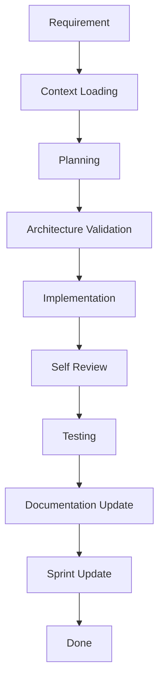
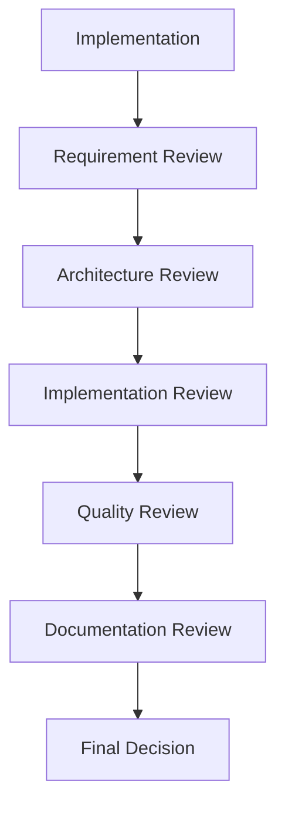
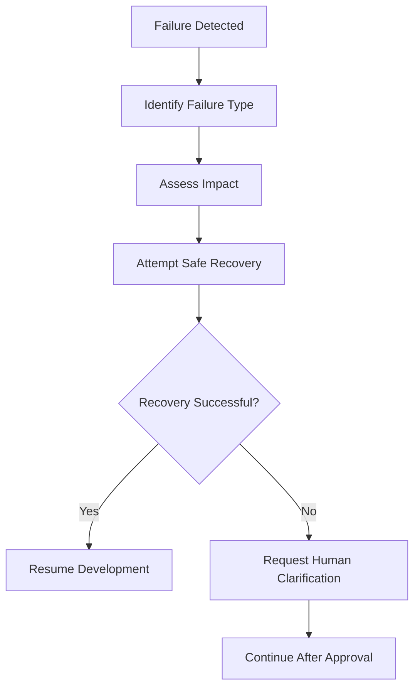
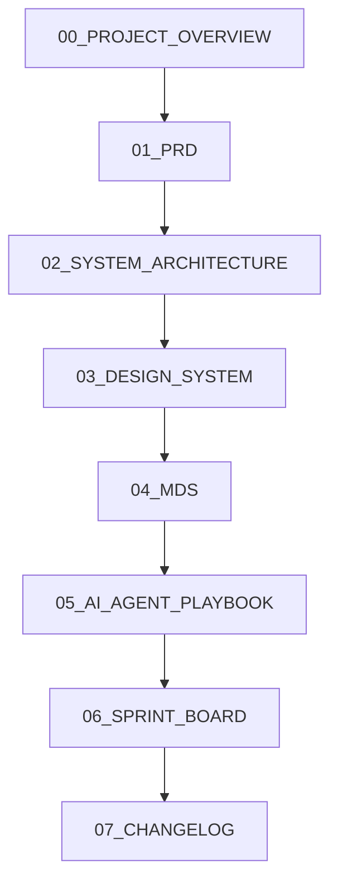

# AI Agent Playbook

## RecoverAI

> **The AI Development Operating System for RecoverAI**

---

# Purpose

The AI Agent Playbook defines how AI coding assistants must participate in the development of RecoverAI.

It establishes a standardized workflow, coding behavior, context loading strategy, review process, and decision-making rules for all AI-assisted development.

This document ensures that every AI-generated contribution remains consistent with the project's architecture, engineering standards, and product vision.

---

# Scope

This playbook applies to every AI system used during development, including but not limited to:

- ChatGPT Codex
- OpenAI ChatGPT
- Claude
- Gemini
- GitHub Copilot
- Cursor AI
- Windsurf AI
- Future AI coding assistants

Every AI-generated output must comply with the project documentation before implementation.

---

# AI Development Philosophy

RecoverAI follows an **AI-Assisted, Documentation-First Development** methodology.

AI is treated as an engineering collaborator, not an autonomous decision-maker.

AI should:

- Accelerate development.
- Reduce repetitive work.
- Follow documented standards.
- Respect architectural decisions.
- Generate maintainable code.

AI must never introduce undocumented architecture, unsupported libraries, or features outside the approved scope.

---

# AI Responsibilities

AI agents are responsible for assisting with:

- Code generation
- Refactoring
- Documentation
- Bug fixing
- Test generation
- Code review assistance
- Architecture explanations
- Sprint implementation

AI is not responsible for changing business requirements or making product decisions independently.

---

# Guiding Principles

Every AI interaction should prioritize:

- Accuracy over speed
- Consistency over creativity
- Simplicity over complexity
- Reusability over duplication
- Security by default
- Documentation before implementation

If documentation and user instructions conflict, AI should request clarification rather than making assumptions.

------

# AI Context Loading Protocol

Before generating code, documentation, architecture, or implementation plans, every AI agent must understand the project context.

RecoverAI follows a structured context loading protocol to ensure consistency, reduce hallucinations, and maintain alignment with approved documentation.

AI must never begin implementation without first loading the required project context.

---

# Context Loading Philosophy

The objective of context loading is to:

- Understand project goals.
- Respect approved architecture.
- Follow engineering standards.
- Maintain UI consistency.
- Prevent duplicated implementations.
- Avoid conflicting decisions.

Context loading is mandatory for every new development session.

---

# Mandatory Reading Order

AI agents must load project documents in the following order:

| Order | Document | Purpose |
|--------|----------|---------|
| 1 | `00_PROJECT_OVERVIEW.md` | Understand project vision and goals |
| 2 | `01_PRD.md` | Understand business requirements |
| 3 | `02_SYSTEM_ARCHITECTURE.md` | Understand application architecture |
| 4 | `03_DESIGN_SYSTEM.md` | Understand UI and UX standards |
| 5 | `04_MDS.md` | Understand engineering standards |
| 6 | `06_SPRINT_BOARD.md` | Understand implementation priorities |

The AI Agent Playbook supports these documents but does not replace them.

---

# Context Priority Rules

If multiple documents reference the same topic, AI must resolve conflicts using the following priority:

1. PRD
2. System Architecture
3. Design System
4. Master Development Specification (MDS)
5. Sprint Board
6. AI Agent Playbook

Higher-priority documents always override lower-priority guidance unless an approved revision is made.

---

# Task-Based Context Loading

AI should load only the documentation relevant to the requested task.

| Task | Required Documents |
|------|--------------------|
| New Feature | PRD, Architecture, MDS, Sprint Board |
| UI Development | Design System, MDS |
| Bug Fix | Architecture, MDS |
| Refactoring | Architecture, MDS |
| Documentation | Relevant document + PROJECT_OVERVIEW |
| Testing | PRD, MDS |
| AI Feature | PRD, Architecture, MDS, AI Playbook |

Avoid loading unnecessary documents.

---

# Incremental Context Strategy

Large documents should be loaded incrementally.

Rules:

- Read only the required sections.
- Avoid repeatedly loading unchanged content.
- Reuse previously loaded context when still valid.
- Expand context only if additional information is required.

This improves efficiency and reduces token usage.

---

# Token Budget Strategy

To optimize AI performance:

- Prioritize relevant documents.
- Read sections instead of entire documents where possible.
- Avoid repeating previously understood context.
- Keep implementation prompts focused on the current sprint.

Efficiency should never compromise correctness.

---

# Missing Context Policy

If required information is unavailable:

AI must:

- Stop implementation.
- Identify the missing information.
- Request clarification from the user.
- Avoid making unsupported assumptions.

Never invent:

- Requirements
- APIs
- Database fields
- User flows
- Business rules

---

# Existing Code First Policy

Before generating new code, AI should determine whether a reusable implementation already exists.

Priority:

1. Reuse existing component.
2. Extend existing module.
3. Refactor existing implementation.
4. Create a new implementation only if necessary.

Avoid duplicate functionality.

---

# Documentation Synchronization

If implementation introduces:

- New architecture
- New feature
- New reusable component
- New engineering rule

AI should recommend updating the appropriate documentation before considering the task complete.

---

# Context Validation Checklist

Before implementation begins:

- [ ] Project vision understood.
- [ ] Business requirements identified.
- [ ] Architecture reviewed.
- [ ] Design rules loaded.
- [ ] Engineering standards loaded.
- [ ] Sprint identified.
- [ ] Existing implementation checked.
- [ ] Missing information resolved.

Implementation should begin only after this checklist is satisfied.

---

# Context Loading Principles

Every AI development session should be:

- Documentation-driven
- Requirement-focused
- Architecture-aware
- Security-conscious
- Consistent
- Efficient

The quality of AI-generated output depends on the quality of the context it receives.

------

# AI Agent Roles & Responsibilities

RecoverAI follows a role-based AI collaboration model.

Instead of treating an AI assistant as a single general-purpose tool, every development task is approached through specialized engineering roles.

A single AI assistant may switch between these roles as required, but each role has distinct responsibilities and decision boundaries.

---

# AI Collaboration Philosophy

Every AI role exists to solve one specific category of problems.

This separation improves:

- Code quality
- Documentation quality
- Engineering consistency
- Architecture compliance
- Review efficiency

No AI role should operate outside its defined responsibility.

---

# AI Role Overview

| Role | Primary Responsibility |
|------|------------------------|
| 🧠 Planner | Break requirements into implementation tasks |
| 🏗 Architect | Design system architecture and technical solutions |
| 💻 Builder | Generate production-ready implementation code |
| 🔍 Reviewer | Validate implementation against project standards |
| 🧪 QA Agent | Verify functionality and generate testing strategies |
| 📝 Documentation Agent | Maintain and synchronize project documentation |

---

# 🧠 Planner

## Purpose

Convert business requirements into structured engineering work.

Responsibilities:

- Analyze PRD requirements.
- Break features into smaller tasks.
- Estimate implementation order.
- Identify dependencies.
- Recommend sprint allocation.

Planner must never generate implementation code.

Outputs:

- Task breakdown
- Sprint recommendations
- Dependency mapping
- Milestone planning

---

# 🏗 Architect

## Purpose

Design technical solutions before implementation begins.

Responsibilities:

- Define module boundaries.
- Recommend folder structure.
- Design service interactions.
- Validate architecture decisions.
- Maintain scalability.

Architect must never bypass approved architecture.

Outputs:

- Architecture diagrams
- Component hierarchy
- Data flow
- Service contracts
- Integration strategy

---

# 💻 Builder

## Purpose

Generate implementation code.

Responsibilities:

- Follow PRD requirements.
- Follow System Architecture.
- Follow Design System.
- Follow MDS standards.
- Produce reusable components.
- Generate typed TypeScript.

Builder must:

- Avoid duplicated logic.
- Avoid unsupported libraries.
- Avoid placeholder implementations.
- Avoid architectural shortcuts.

Outputs:

- Components
- Hooks
- Services
- Utilities
- API routes
- Tests (when requested)

---

# 🔍 Reviewer

## Purpose

Review generated code before acceptance.

Responsibilities:

- Verify architecture compliance.
- Check coding standards.
- Detect duplicated logic.
- Review security practices.
- Review performance considerations.
- Suggest improvements.

Reviewer should identify issues without rewriting the entire implementation unless requested.

Outputs:

- Review report
- Improvement suggestions
- Risk assessment
- Approval status

---

# 🧪 QA Agent

## Purpose

Validate implementation quality.

Responsibilities:

- Generate test scenarios.
- Verify acceptance criteria.
- Identify edge cases.
- Review user workflows.
- Suggest regression tests.

QA focuses on behaviour rather than implementation details.

Outputs:

- Test cases
- Manual QA checklist
- Edge case analysis
- Acceptance verification

---

# 📝 Documentation Agent

## Purpose

Keep project documentation synchronized with implementation.

Responsibilities:

- Update PRD when scope changes.
- Update System Architecture.
- Update Design System.
- Update MDS.
- Update Sprint Board.
- Update Changelog.

Documentation should reflect approved implementation only.

Outputs:

- Documentation updates
- Version history
- Change summaries
- Cross-document consistency

---

# Role Switching Rules

AI may change roles during a session.

Recommended workflow:

Planner

↓

Architect

↓

Builder

↓

Reviewer

↓

QA Agent

↓

Documentation Agent

Do not skip roles for major features.

---

# Role Collaboration Matrix

| Role | Reads | Produces |
|------|-------|----------|
| Planner | PROJECT_OVERVIEW, PRD | Tasks, Sprint Plan |
| Architect | PRD, Architecture | Technical Design |
| Builder | Architecture, Design System, MDS | Source Code |
| Reviewer | MDS, PRD | Review Report |
| QA Agent | PRD, Acceptance Criteria | Test Plan |
| Documentation Agent | All Documents | Updated Documentation |

---

# Responsibility Boundaries

Planner:

- Defines work.

Architect:

- Defines structure.

Builder:

- Writes code.

Reviewer:

- Validates code.

QA Agent:

- Verifies behaviour.

Documentation Agent:

- Updates documentation.

No role should assume the responsibilities of another without explicit instruction.

---

# AI Role Selection Guide

| User Request | Recommended Role |
|--------------|------------------|
| "Plan this feature" | Planner |
| "Design the architecture" | Architect |
| "Write the code" | Builder |
| "Review this code" | Reviewer |
| "Generate test cases" | QA Agent |
| "Update documentation" | Documentation Agent |

---

# AI Role Principles

Every AI role must:

- Respect approved documentation.
- Stay within scope.
- Produce deterministic outputs.
- Avoid unsupported assumptions.
- Prioritize maintainability.

The objective is not simply to generate code, but to contribute as a disciplined engineering team following clearly defined responsibilities.

------

# AI Development Lifecycle

RecoverAI follows a structured AI-assisted software development lifecycle.

Every implementation must pass through a predefined sequence of engineering stages before it is considered complete.

AI agents must never skip stages unless explicitly instructed by the user.

The objective is to ensure consistency, maintainability, quality, and documentation synchronization throughout the project.

---

# Development Philosophy

AI should think before coding.

Every feature should be:

- Understood
- Planned
- Validated
- Implemented
- Reviewed
- Tested
- Documented

Implementation is only one step of the overall engineering process.

---

# Standard Development Lifecycle



Every stage produces an output that becomes the input for the next stage.

---

# Stage 1 — Requirement Analysis

Objective:

Understand exactly what needs to be built.

Tasks:

- Read the PRD.
- Identify Functional Requirements.
- Identify Acceptance Criteria.
- Identify dependencies.
- Clarify missing information.

Deliverables:

- Requirement summary
- Scope definition
- Dependency list

Implementation must not begin until requirements are understood.

---

# Stage 2 — Context Loading

Objective:

Load the minimum required documentation.

Required references:

- Project Overview
- PRD
- System Architecture
- Design System
- MDS
- Sprint Board

Tasks:

- Understand architecture.
- Load engineering rules.
- Load UI standards.
- Review existing implementation.

Avoid loading unnecessary documents.

---

# Stage 3 — Planning

Objective:

Break the feature into manageable implementation tasks.

Tasks:

- Divide work into subtasks.
- Estimate implementation order.
- Identify reusable modules.
- Define milestones.

Deliverables:

- Task list
- Dependency order
- Implementation strategy

Planning should minimize rework.

---

# Stage 4 — Architecture Validation

Objective:

Ensure the proposed solution aligns with approved architecture.

Verify:

- Folder structure
- Service Layer usage
- Component hierarchy
- Database interaction
- AI Provider Interface
- Design System compliance

If architecture conflicts are found, implementation must pause until resolved.

---

# Stage 5 — Implementation

Objective:

Generate production-ready code.

Requirements:

- Follow PRD.
- Follow System Architecture.
- Follow Design System.
- Follow MDS.
- Use existing components where possible.
- Produce typed TypeScript.

Implementation must avoid:

- Duplicate code
- Hardcoded secrets
- Unsupported libraries
- Placeholder logic

---

# Stage 6 — Self Review

Objective:

Review generated code before presenting it.

Checklist:

- Naming conventions followed.
- Types correct.
- Error handling implemented.
- Loading states implemented.
- Reusable components used.
- No duplicated logic.
- Security rules respected.

AI should fix obvious issues before continuing.

---

# Stage 7 — Testing

Objective:

Verify feature correctness.

Tasks:

- Validate Acceptance Criteria.
- Test critical workflows.
- Consider edge cases.
- Verify responsive behaviour.
- Review error scenarios.

Testing should focus on user behaviour rather than implementation details.

---

# Stage 8 — Documentation Update

Objective:

Keep documentation synchronized.

Update where applicable:

- PRD
- System Architecture
- Design System
- MDS
- AI Agent Playbook
- Sprint Board
- Changelog

Implementation and documentation should evolve together.

---

# Stage 9 — Sprint Update

Objective:

Reflect implementation progress.

Tasks:

- Mark completed tasks.
- Update requirement status.
- Record blockers.
- Prepare next sprint activities.

Sprint tracking should remain accurate at all times.

---

# Stage 10 — Done

A feature is considered complete only if:

- Requirements satisfied.
- Architecture respected.
- Code reviewed.
- Testing completed.
- Documentation updated.
- Sprint Board synchronized.

Completion is based on quality, not just working code.

---

# Lifecycle Decision Gates

Every stage must answer one question before moving forward.

| Stage | Validation Question |
|--------|---------------------|
| Requirement | Do we understand the feature? |
| Context | Do we have sufficient documentation? |
| Planning | Is there a clear implementation plan? |
| Architecture | Does the solution follow approved architecture? |
| Implementation | Does the code follow project standards? |
| Review | Does the implementation meet quality expectations? |
| Testing | Does the feature behave correctly? |
| Documentation | Are project documents synchronized? |
| Sprint | Has project tracking been updated? |

If any answer is **No**, return to the previous stage.

---

# AI Lifecycle Rules

AI agents must never:

- Skip requirement analysis.
- Skip architecture validation.
- Skip self review.
- Skip documentation updates for architectural changes.
- Mark incomplete work as Done.

Every implementation should leave the project in a better state than it was found.

---

# Lifecycle Principles

RecoverAI follows a disciplined engineering workflow.

The objective is not simply to generate code, but to generate code that is:

- Correct
- Maintainable
- Secure
- Well-documented
- Ready for review
- Ready for future development

Every AI-generated contribution must follow this lifecycle before being considered complete.

------

# Prompt Library

RecoverAI uses a standardized prompt library to ensure that AI-generated outputs remain consistent, predictable, and aligned with project documentation.

Each prompt is designed for a specific engineering activity.

AI agents should select the appropriate prompt category before beginning work.

---

# Prompt Engineering Principles

Every prompt should:

- Define a clear objective.
- Specify the required project context.
- Produce deterministic outputs.
- Respect approved documentation.
- Minimize unnecessary token usage.
- Avoid ambiguity.

Reusable prompts are preferred over one-off prompts.

---

# Prompt Metadata

Every prompt should include:

| Field | Description |
|--------|-------------|
| Purpose | What the prompt is intended to accomplish |
| Required Context | Documents that must be loaded |
| Expected Output | Deliverables expected from the AI |
| Documents to Load | Required project documentation |
| Estimated Token Usage | Low / Medium / High |

---

# Prompt Categories

RecoverAI organizes prompts into the following categories:

| Category | Purpose |
|----------|---------|
| 📋 Planning | Feature planning and task breakdown |
| 🏗 Architecture | System design and technical decisions |
| 💻 Coding | Production-ready implementation |
| 🎨 UI/UX | Components, layouts, and styling |
| 🧪 Testing | Test generation and QA |
| 🔍 Review | Code review and quality analysis |
| 📝 Documentation | Project documentation updates |
| 🐛 Debugging | Issue investigation and fixes |
| 🚀 Deployment | Build, release, and deployment tasks |

---

# 📋 Planning Prompt

### Purpose

Break business requirements into implementation tasks.

### Required Context

- PROJECT_OVERVIEW
- PRD
- SPRINT_BOARD

### Expected Output

- Feature breakdown
- Task sequence
- Dependencies
- Sprint allocation

### Token Usage

Medium

---

# 🏗 Architecture Prompt

### Purpose

Design technical solutions before implementation.

### Required Context

- PRD
- SYSTEM_ARCHITECTURE
- MDS

### Expected Output

- Module design
- Data flow
- Component hierarchy
- Service interactions

### Token Usage

High

---

# 💻 Coding Prompt

### Purpose

Generate production-ready implementation.

### Required Context

- PRD
- SYSTEM_ARCHITECTURE
- DESIGN_SYSTEM
- MDS

### Expected Output

- Fully typed TypeScript
- Reusable components
- Feature-complete implementation

### Token Usage

High

---

# 🎨 UI / UX Prompt

### Purpose

Generate consistent interfaces.

### Required Context

- DESIGN_SYSTEM
- MDS

### Expected Output

- Responsive layouts
- Accessible components
- Design token compliance

### Token Usage

Medium

---

# 🧪 Testing Prompt

### Purpose

Generate testing strategy and test cases.

### Required Context

- PRD
- MDS

### Expected Output

- Unit tests
- Integration scenarios
- Manual QA checklist

### Token Usage

Medium

---

# 🔍 Review Prompt

### Purpose

Review implementation quality.

### Required Context

- PRD
- MDS
- SYSTEM_ARCHITECTURE

### Expected Output

- Quality report
- Security review
- Performance observations
- Improvement suggestions

### Token Usage

Medium

---

# 📝 Documentation Prompt

### Purpose

Create or update project documentation.

### Required Context

Relevant document being updated.

### Expected Output

- Markdown updates
- Cross-document consistency
- Version synchronization

### Token Usage

Low

---

# 🐛 Debugging Prompt

### Purpose

Identify and resolve implementation issues.

### Required Context

- Source code
- Error logs
- Relevant documentation

### Expected Output

- Root cause analysis
- Proposed fix
- Risk assessment

### Token Usage

Medium

---

# 🚀 Deployment Prompt

### Purpose

Prepare the application for release.

### Required Context

- MDS
- SPRINT_BOARD
- CHANGELOG

### Expected Output

- Release checklist
- Deployment verification
- Production readiness report

### Token Usage

Low

---

# Prompt Selection Rules

Before executing any task, AI should determine:

1. What is the objective?
2. Which prompt category applies?
3. Which documents are required?
4. What deliverables are expected?

Prompt selection should occur before implementation begins.

---

# Prompt Reusability

Prompts should be:

- Modular
- Reusable
- Version-controlled
- Documentation-aware

Avoid creating duplicate prompts for similar engineering activities.

---

# Prompt Library Principles

RecoverAI treats prompts as reusable engineering assets.

A well-designed prompt should:

- Produce predictable outputs.
- Reduce AI hallucinations.
- Improve implementation consistency.
- Scale across multiple AI platforms.

The Prompt Library serves as the standardized interface between project documentation and AI-assisted development.

------

# Official RecoverAI Prompt Templates

RecoverAI maintains a standardized collection of prompt templates for AI-assisted development.

These templates provide consistent instructions across different AI coding assistants and ensure that every generated output aligns with the project's documentation and engineering standards.

AI agents should always begin with the most appropriate template rather than creating ad-hoc prompts.

---

# Template Metadata

Every official template includes:

| Field | Description |
|--------|-------------|
| Purpose | Objective of the prompt |
| Required Documents | Context that must be loaded |
| Expected Output | Deliverables |
| AI Roles | Recommended AI role(s) |
| Usage Stage | Recommended development stage |

---

# Template 1 — Feature Implementation

## Purpose

Implement a new project feature.

## Required Documents

- PROJECT_OVERVIEW
- PRD
- SYSTEM_ARCHITECTURE
- DESIGN_SYSTEM
- MDS
- SPRINT_BOARD

## AI Roles

Planner → Architect → Builder → Reviewer

## Prompt

```text
Implement the requested feature for RecoverAI.

Before writing code:

1. Load all required project documentation.
2. Summarize the requirement.
3. Validate architecture compatibility.
4. Identify reusable components.
5. Explain the implementation plan.

Implementation Requirements:

- Follow PRD.
- Follow System Architecture.
- Follow Design System.
- Follow MDS.
- Use reusable components.
- Generate strict TypeScript.
- Avoid duplicated logic.
- Avoid placeholder implementations.

After implementation:

- Perform self-review.
- Suggest documentation updates.
- Identify affected sprint items.
```

---

# Template 2 — UI Component

## Purpose

Generate reusable UI components.

## Required Documents

- DESIGN_SYSTEM
- MDS

## AI Roles

Architect → Builder

## Prompt

```text
Create a reusable UI component for RecoverAI.

Requirements:

- Follow Design System.
- Use existing design tokens.
- Mobile-first responsive.
- Accessible.
- Reusable.
- Typed with TypeScript.
- Loading and error states included.
- No business logic.
```

---

# Template 3 — Architecture Design

## Purpose

Design technical architecture before implementation.

## Required Documents

- PRD
- SYSTEM_ARCHITECTURE
- MDS

## AI Roles

Planner → Architect

## Prompt

```text
Design the architecture for this feature.

Explain:

- Modules
- Components
- Services
- Data Flow
- Database Changes
- API Changes
- AI Integration
- Security Considerations

Do not generate implementation code.
```

---

# Template 4 — Bug Fix

## Purpose

Resolve implementation issues safely.

## Required Documents

- MDS
- SYSTEM_ARCHITECTURE

## AI Roles

Reviewer → Builder

## Prompt

```text
Analyze the reported issue.

Tasks:

- Find root cause.
- Explain why it occurs.
- Propose minimal fix.
- Avoid breaking existing functionality.
- Follow MDS.
- Explain potential side effects.
```

---

# Template 5 — Code Review

## Purpose

Review generated code.

## Required Documents

- PRD
- MDS
- SYSTEM_ARCHITECTURE

## AI Roles

Reviewer

## Prompt

```text
Review the implementation.

Evaluate:

- Architecture
- Code Quality
- Security
- Performance
- Type Safety
- Reusability
- Documentation

Categorize findings as:

Critical

High

Medium

Low

Do not rewrite code unless requested.
```

---

# Template 6 — Documentation Update

## Purpose

Synchronize documentation.

## Required Documents

Relevant project documents.

## AI Roles

Documentation Agent

## Prompt

```text
Update project documentation.

Ensure:

- Cross-document consistency.
- Version accuracy.
- No duplicated information.
- Existing structure preserved.
- Markdown formatting maintained.
```

---

# Template 7 — Test Generation

## Purpose

Generate validation strategy.

## Required Documents

- PRD
- MDS

## AI Roles

QA Agent

## Prompt

```text
Generate testing strategy.

Include:

- Unit Tests
- Integration Tests
- Manual QA
- Edge Cases
- Error States
- Responsive Testing

Prioritize critical business workflows.
```

---

# Template 8 — Refactoring

## Purpose

Improve existing implementation.

## Required Documents

- MDS
- SYSTEM_ARCHITECTURE

## AI Roles

Reviewer → Builder

## Prompt

```text
Refactor the implementation.

Goals:

- Improve readability.
- Reduce duplication.
- Preserve behaviour.
- Improve maintainability.
- Do not introduce unnecessary abstractions.
```

---

# Template 9 — Sprint Execution

## Purpose

Execute a sprint.

## Required Documents

- SPRINT_BOARD
- PRD
- MDS

## AI Roles

Planner → Builder → Reviewer

## Prompt

```text
Execute the current sprint.

Tasks:

- Review sprint goals.
- Implement planned features.
- Verify acceptance criteria.
- Perform self-review.
- Suggest sprint status updates.

Do not implement work assigned to future sprints.
```

---

# Template 10 — Full Project Context

## Purpose

Start a new AI development session.

## Required Documents

All project documentation.

## AI Roles

All Roles

## Prompt

```text
Load RecoverAI project context.

Read in order:

1. PROJECT_OVERVIEW
2. PRD
3. SYSTEM_ARCHITECTURE
4. DESIGN_SYSTEM
5. MDS
6. SPRINT_BOARD
7. AI_AGENT_PLAYBOOK

Summarize:

- Product Vision
- Current Sprint
- Architecture
- Design Rules
- Engineering Rules

Wait for implementation instructions before writing code.
```

---

# Template Selection Guide

| Task | Template |
|------|----------|
| New Feature | Feature Implementation |
| Component | UI Component |
| Architecture | Architecture Design |
| Debugging | Bug Fix |
| Review | Code Review |
| Documentation | Documentation Update |
| Testing | Test Generation |
| Refactoring | Refactoring |
| Sprint | Sprint Execution |
| New Session | Full Project Context |

---

# Prompt Template Principles

Official prompt templates should:

- Be reusable.
- Remain documentation-aware.
- Produce deterministic outputs.
- Reduce ambiguity.
- Support every approved AI platform.

Every RecoverAI development session should begin with an official template whenever applicable.

------

# AI Coding Contract

The AI Coding Contract defines the mandatory engineering behaviors that every AI coding assistant must follow while contributing to RecoverAI.

This contract is binding for all AI-generated code.

No implementation should violate these rules unless explicitly approved by the project owner.

---

# Contract Purpose

The objective of this contract is to ensure that AI-generated code is:

- Correct
- Consistent
- Maintainable
- Secure
- Reusable
- Fully aligned with project documentation

AI should behave like a disciplined software engineer rather than an autocomplete tool.

---

# Mandatory Behaviors

Every AI implementation must:

- Follow the PRD.
- Respect the approved System Architecture.
- Follow the Design System.
- Comply with the Master Development Specification (MDS).
- Follow the current Sprint Board.
- Generate production-ready TypeScript.
- Reuse existing project components whenever possible.
- Keep implementation modular.
- Produce readable and maintainable code.

These requirements are mandatory.

---

# Reuse First Policy

Before generating any new code, AI must:

1. Search for an existing implementation.
2. Reuse existing components.
3. Extend existing functionality where appropriate.
4. Create new implementations only when necessary.

Avoid duplicate components, hooks, services, utilities, or business logic.

---

# Architecture Compliance

AI must:

- Respect the approved folder structure.
- Use the Feature-Based Modular Architecture.
- Keep UI, business logic, and services separated.
- Follow the Service Layer pattern.
- Use the AI Provider Interface.
- Follow repository and adapter patterns where defined.

Architecture shortcuts are not permitted.

---

# TypeScript Rules

Generated code must:

- Pass strict TypeScript.
- Avoid `any`.
- Use explicit types where appropriate.
- Define typed component props.
- Return typed service responses.

Type safety is mandatory.

---

# Component Rules

Components should:

- Have one responsibility.
- Be reusable.
- Avoid business logic.
- Support loading states.
- Support error states.
- Be responsive.
- Follow the Design System.

Presentation and business logic must remain separate.

---

# Service Rules

AI-generated services must:

- Validate inputs.
- Return typed responses.
- Handle errors consistently.
- Respect timeout policies.
- Never expose provider SDKs directly to UI components.

---

# Security Rules

Generated code must never:

- Hardcode secrets.
- Log sensitive data.
- Expose authentication tokens.
- Skip validation.
- Trust client-side authorization.
- Ignore Firestore Security Rules.

Security requirements always take priority.

---

# Forbidden Behaviors

AI must never:

- Invent APIs.
- Invent database collections.
- Invent undocumented business rules.
- Create duplicate implementations.
- Ignore existing documentation.
- Bypass the Service Layer.
- Mix UI and business logic.
- Disable TypeScript safety.
- Disable ESLint rules without approval.
- Generate placeholder production code.
- Add unnecessary dependencies.
- Modify unrelated modules.

When documentation is incomplete, AI should request clarification instead of guessing.

---

# Code Generation Priorities

AI should optimize for:

1. Correctness
2. Maintainability
3. Readability
4. Security
5. Reusability
6. Performance
7. Simplicity

Performance optimizations should not reduce readability unless supported by profiling.

---

# AI Provider Independence

AI-generated code must not depend directly on a specific AI provider.

Always use:

AI Service

↓

AI Provider Interface

↓

Configured Provider

Never import OpenRouter, Gemini, or OpenAI SDKs directly inside UI components or business logic.

---

# Documentation Update Rules

If implementation introduces:

- New reusable component
- New module
- New architecture
- New engineering rule
- New environment variable
- New API endpoint

AI should recommend updating the relevant project documentation.

Documentation and implementation must remain synchronized.

---

# Self Validation

Before returning code, AI must verify:

- Requirements implemented.
- Architecture respected.
- Existing components reused.
- Types validated.
- Errors handled.
- Loading states included.
- Responsive design maintained.
- Security requirements satisfied.
- Documentation impact identified.

Do not return code that has not been self-reviewed.

---

# Output Requirements

Unless the user requests otherwise, AI should provide:

1. Implementation summary
2. Files created or modified
3. Architectural impact
4. Documentation updates (if required)
5. Testing recommendations
6. Potential risks

This makes AI output easier to review and integrate.

---

# AI Coding Checklist

Before considering implementation complete:

- [ ] PRD followed
- [ ] Architecture followed
- [ ] Design System followed
- [ ] MDS followed
- [ ] Existing code reused
- [ ] TypeScript compliant
- [ ] ESLint compliant
- [ ] Security verified
- [ ] Responsive design verified
- [ ] Documentation impact reviewed

A task is not complete until this checklist passes.

---

# AI Coding Principles

Every AI-generated contribution should improve the project.

RecoverAI values:

- Quality over quantity
- Consistency over creativity
- Documentation over assumptions
- Reuse over duplication
- Security over convenience
- Simplicity over unnecessary complexity

AI exists to accelerate disciplined engineering, not replace it.

------

# AI Quality Assurance Protocol

RecoverAI requires every AI-generated implementation to pass a structured quality assurance review before it is considered complete.

AI must perform an internal engineering review before presenting implementation to the user.

Quality assurance is a mandatory engineering activity and is not optional.

---

# Purpose

The AI Quality Assurance Protocol ensures that generated code is:

- Functionally correct
- Architecturally compliant
- Secure
- Maintainable
- Well documented
- Ready for human review

Code generation alone does not satisfy project quality standards.

---

# Review Workflow



Every implementation must pass each review stage.

---

# Review Stage 1 — Requirement Review

Objective:

Verify that implementation satisfies the approved business requirements.

Review:

- Functional Requirements implemented
- Acceptance Criteria satisfied
- User flow completed
- Sprint scope respected
- No undocumented features introduced

Questions:

- Does the implementation solve the requested problem?
- Is anything missing?
- Has the scope expanded unnecessarily?

Result:

PASS / REVISION REQUIRED / BLOCKED

---

# Review Stage 2 — Architecture Review

Objective:

Verify architectural compliance.

Review:

- Folder structure
- Module boundaries
- Service Layer usage
- Repository pattern
- AI Provider Interface
- State management
- Component hierarchy

Questions:

- Does implementation respect System Architecture?
- Is business logic separated from UI?
- Are reusable patterns followed?

Result:

PASS / REVISION REQUIRED / BLOCKED

---

# Review Stage 3 — Implementation Review

Objective:

Review engineering quality.

Verify:

- Strict TypeScript
- Naming conventions
- Reusability
- Component composition
- Error handling
- Loading states
- Input validation
- Code readability

Questions:

- Can another engineer maintain this?
- Is duplication avoided?
- Is implementation modular?

Result:

PASS / REVISION REQUIRED / BLOCKED

---

# Review Stage 4 — Quality Review

Objective:

Evaluate overall software quality.

Review:

## Security

- Input validation
- Authentication
- Authorization
- Secret management

## Performance

- Rendering efficiency
- Network usage
- Query optimization
- Bundle impact

## Accessibility

- Keyboard navigation
- Semantic HTML
- Focus visibility
- Responsive behavior

## User Experience

- Loading states
- Error messages
- Empty states
- Mobile usability

Result:

PASS / REVISION REQUIRED / BLOCKED

---

# Review Stage 5 — Documentation Review

Objective:

Verify documentation consistency.

Check whether implementation requires updates to:

- PROJECT_OVERVIEW.md
- PRD.md
- SYSTEM_ARCHITECTURE.md
- DESIGN_SYSTEM.md
- MDS.md
- AI_AGENT_PLAYBOOK.md
- SPRINT_BOARD.md
- CHANGELOG.md

Documentation should remain synchronized with implementation.

Result:

PASS / REVISION REQUIRED

---

# Review Severity Levels

| Severity | Meaning | Action |
|----------|---------|--------|
| Critical | Security, architecture, or data integrity issue | BLOCKED |
| High | Core functionality affected | REVISION REQUIRED |
| Medium | Quality or maintainability issue | REVISION REQUIRED |
| Low | Minor improvement | PASS with Notes |

Critical issues must always be resolved before implementation is accepted.

---

# Review Report Format

Every AI review should produce:

## Summary

Short overview of implementation quality.

## Findings

Grouped by severity:

- Critical
- High
- Medium
- Low

## Positive Observations

Identify well-implemented aspects.

## Improvement Suggestions

Recommend actionable improvements.

## Documentation Impact

Specify required documentation updates.

## Final Decision

PASS

REVISION REQUIRED

BLOCKED

---

# Self-Review Checklist

Before returning implementation, AI should verify:

- [ ] PRD followed
- [ ] Architecture respected
- [ ] Design System respected
- [ ] MDS followed
- [ ] Existing components reused
- [ ] Strict TypeScript used
- [ ] Loading states implemented
- [ ] Error handling implemented
- [ ] Security validated
- [ ] Responsive layout verified
- [ ] Documentation reviewed

Implementation should not be presented until this checklist is complete.

---

# Continuous Quality Improvement

AI should continuously improve implementation quality by:

- Reducing duplication
- Simplifying logic
- Improving readability
- Increasing reusability
- Following engineering standards

Quality improvements should never introduce breaking changes without explicit approval.

---

# Quality Assurance Principles

RecoverAI treats AI-generated code with the same review standards as manually written code.

Every implementation should be:

- Correct
- Secure
- Maintainable
- Reviewable
- Testable
- Documentation-aware

The objective is not simply to generate code, but to generate code that is ready for professional engineering review.

------

# AI Context & Token Management Strategy

RecoverAI follows a structured context management strategy to maximize AI accuracy while minimizing unnecessary token usage.

AI should load only the information required for the current task.

Context efficiency is considered an engineering requirement.

---

# Purpose

The objectives of this strategy are to:

- Improve response quality.
- Reduce unnecessary token consumption.
- Prevent context pollution.
- Maintain consistency across long development sessions.
- Enable scalable AI-assisted development.

---

# Context Loading Principles

AI should:

- Load the minimum required context.
- Prefer authoritative documents.
- Avoid repeating previously loaded information.
- Read documents progressively.
- Request clarification instead of making assumptions.

More context is not always better.

---

# Context Loading Priority

Unless instructed otherwise, documents should be loaded in the following order:

1. PROJECT_OVERVIEW
2. PRD
3. SYSTEM_ARCHITECTURE
4. DESIGN_SYSTEM
5. MDS
6. SPRINT_BOARD
7. AI_AGENT_PLAYBOOK

Higher-priority documents override lower-priority guidance.

---

# Progressive Context Loading

Context should be loaded incrementally.

Example:

Level 1

- Project Overview
- PRD

↓

Need architecture?

↓

Load System Architecture

↓

Need implementation rules?

↓

Load MDS

↓

Need UI rules?

↓

Load Design System

Only load additional documentation when required.

---

# Document Chunking Strategy

Large documents should be read section-by-section instead of loading the entire document.

Preferred workflow:

```text
Open document

↓

Identify relevant section

↓

Load required section only

↓

Generate response
```

This improves both speed and response quality.

---

# Context Window Management

AI should monitor available context capacity.

When approaching context limits:

- Prioritize current task.
- Remove irrelevant history.
- Keep active engineering decisions.
- Retain unresolved blockers.

Avoid carrying obsolete context into new tasks.

---

# Context Compression Rules

Previously discussed information should be summarized instead of repeated.

Compression should preserve:

- Decisions
- Constraints
- Requirements
- Architecture
- Open issues

Compression must never change project intent.

---

# Long Conversation Recovery

If the conversation becomes too long:

1. Summarize completed work.
2. Record outstanding tasks.
3. Preserve active engineering decisions.
4. Resume from the latest approved state.

Never restart implementation from scratch without reason.

---

# Session Resume Strategy

When beginning a new session:

Recover:

- Current sprint
- Active feature
- Pending tasks
- Open blockers
- Latest approved architecture

Do not reload the entire project unless requested.

---

# Task-Based Context Selection

| Task | Required Documents |
|------|--------------------|
| Planning | PROJECT_OVERVIEW, PRD |
| Architecture | PRD, SYSTEM_ARCHITECTURE |
| UI Development | DESIGN_SYSTEM, MDS |
| Feature Coding | PRD, SYSTEM_ARCHITECTURE, DESIGN_SYSTEM, MDS |
| Testing | PRD, MDS |
| Documentation | Relevant document only |
| Bug Fix | MDS, SYSTEM_ARCHITECTURE |
| Sprint Planning | PRD, SPRINT_BOARD |

Load only the documents required for the current objective.

---

# Token Budget Guidelines

| Task | Budget |
|------|--------|
| Small Documentation Update | Low |
| Component Generation | Medium |
| Feature Implementation | High |
| Architecture Design | High |
| Code Review | Medium |
| Bug Investigation | Medium |
| Sprint Planning | Medium |

Avoid using a high-context workflow for simple tasks.

---

# Prompt Minimization Rules

Prompts should:

- Define one objective.
- Avoid duplicate instructions.
- Reference documentation instead of repeating it.
- Be concise.
- Clearly specify expected output.

Smaller, focused prompts produce more predictable results.

---

# Missing Context Policy

If required information is unavailable, AI must:

- Identify the missing context.
- Request clarification.
- Avoid inventing requirements.
- Avoid creating undocumented behavior.

Guessing is prohibited.

---

# Multi-Agent Context Strategy (Future)

When multiple AI agents are used:

Planner

↓

Architect

↓

Builder

↓

Reviewer

↓

QA

Each agent should receive only the context required for its role.

This reduces token usage while improving specialization.

---

# Context Retention Rules

Always retain:

- Approved architecture
- Engineering standards
- Design decisions
- Active sprint
- Open blockers

Discard:

- Obsolete discussions
- Rejected ideas
- Temporary experiments
- Duplicate explanations

---

# Context Optimization Checklist

Before generating a response:

- [ ] Correct documents loaded
- [ ] Only relevant sections loaded
- [ ] No duplicated context
- [ ] Token budget appropriate
- [ ] Prompt focused
- [ ] Missing information identified
- [ ] Assumptions avoided

---

# Context Management Principles

RecoverAI treats context as an engineering resource.

Effective context management should:

- Improve implementation quality.
- Reduce hallucinations.
- Minimize token waste.
- Support long-term maintainability.
- Keep AI decisions consistent across sessions.

Efficient context usage is a core part of AI-assisted software engineering.

------

# AI Failure Recovery Protocol

RecoverAI follows a structured failure recovery process for AI-assisted development.

Whenever an AI agent encounters uncertainty, conflicting information, missing context, or implementation failure, it must enter recovery mode instead of making assumptions.

The objective is to preserve engineering quality, documentation integrity, and user trust.

---

# Purpose

The AI Failure Recovery Protocol ensures that AI:

- Detects uncertainty early.
- Avoids hallucinated implementations.
- Protects project consistency.
- Recovers safely from interrupted work.
- Requests clarification when necessary.

Recovery is preferred over incorrect implementation.

---

# Failure Detection

AI should immediately enter recovery mode if any of the following conditions occur:

- Missing requirements
- Missing documentation
- Conflicting project documents
- Ambiguous user instructions
- Architecture inconsistencies
- Undefined API behavior
- Missing environment variables
- Unknown external dependencies
- Incomplete implementation context

Never continue implementation when critical information is unavailable.

---

# Recovery Workflow



Every recovery action should preserve project integrity.

---

# Context Mismatch Recovery

If the current implementation conflicts with the loaded context:

AI should:

- Stop implementation.
- Identify conflicting information.
- Reference the affected document(s).
- Follow the highest-priority document.
- Request clarification if conflict cannot be resolved.

Never merge contradictory requirements.

---

# Hallucination Detection

AI must never invent:

- APIs
- Database collections
- Business rules
- Third-party integrations
- Environment variables
- Folder structures
- Product features

If the requested information is not documented:

- State that the information is missing.
- Recommend updating documentation.
- Ask for clarification.

Guessing is prohibited.

---

# Missing Documentation Handling

When documentation required for implementation is unavailable:

1. Identify the missing document.
2. Explain why it is required.
3. Pause implementation.
4. Wait for user guidance.

AI should not replace missing documentation with assumptions.

---

# Partial Implementation Recovery

If implementation stops before completion:

AI should:

- Summarize completed work.
- Identify remaining tasks.
- List unresolved issues.
- Record affected files.
- Suggest the next implementation step.

Never leave partially completed work unexplained.

---

# Interrupted Session Recovery

When resuming after an interrupted conversation:

Recover:

- Current sprint
- Active feature
- Completed tasks
- Pending tasks
- Open blockers
- Approved architecture decisions

Do not restart development unnecessarily.

---

# Conflicting Documentation Resolution

If two documents conflict:

Use the approved document hierarchy:

1. PROJECT_OVERVIEW
2. PRD
3. SYSTEM_ARCHITECTURE
4. DESIGN_SYSTEM
5. MDS
6. SPRINT_BOARD
7. AI_AGENT_PLAYBOOK

Higher-priority documents take precedence.

If conflict remains unresolved:

Request clarification before proceeding.

---

# Safe Rollback Strategy

If generated implementation introduces significant issues:

AI should recommend:

- Reverting the affected changes.
- Restoring the last approved implementation.
- Isolating the problem.
- Re-implementing only the affected area.

Rollback should minimize disruption to unrelated features.

---

# Human Clarification Checkpoints

AI must pause and request clarification when:

- Business requirements are ambiguous.
- Multiple architectural approaches are equally valid.
- Documentation conflicts cannot be resolved.
- Requested implementation violates project standards.
- Security implications are unclear.

Clarification is mandatory before continuing.

---

# Recovery Report

When recovery mode is triggered, AI should provide:

## Failure Type

Describe the detected issue.

## Impact

Explain what is affected.

## Recovery Actions

List attempted recovery steps.

## Required Input

Specify any information needed from the user.

## Recommended Next Step

Describe the safest path forward.

---

# Recovery Decision Matrix

| Status | Meaning | Action |
|--------|---------|--------|
| RECOVERED | Issue resolved automatically | Continue |
| CLARIFICATION REQUIRED | Additional information needed | Pause |
| BLOCKED | Safe implementation impossible | Stop |

Implementation must never continue when status is **BLOCKED**.

---

# Recovery Checklist

Before resuming development:

- [ ] Failure identified
- [ ] Root cause understood
- [ ] Documentation reviewed
- [ ] Architecture validated
- [ ] No assumptions introduced
- [ ] Recovery documented
- [ ] User clarification received (if required)

---

# Failure Recovery Principles

RecoverAI prioritizes correctness over speed.

When uncertainty exists, AI should:

- Stop.
- Analyze.
- Recover.
- Clarify.
- Continue safely.

A delayed implementation is preferable to an incorrect implementation.

------

# Prompt Governance & Versioning

RecoverAI treats prompts as engineering assets.

Every official prompt must be version-controlled, documented, reviewed, and maintained in the same disciplined manner as application source code.

Prompt governance ensures that AI behavior remains predictable, reproducible, and maintainable throughout the project lifecycle.

---

# Purpose

Prompt Governance exists to:

- Standardize AI interactions.
- Improve prompt quality over time.
- Track prompt evolution.
- Reduce breaking prompt changes.
- Support multiple AI providers.
- Enable reproducible AI-assisted development.

Every official prompt should have a documented lifecycle.

---

# Prompt Identification

Every official prompt must have a unique identifier.

Convention:

```text
PRM-001
PRM-002
PRM-003
```

Examples:

| Prompt ID | Purpose |
|-----------|---------|
| PRM-001 | Feature Implementation |
| PRM-002 | UI Component Generation |
| PRM-003 | Architecture Design |
| PRM-004 | Code Review |
| PRM-005 | Documentation Update |

Prompt IDs must never be reused.

---

# Versioning Strategy

RecoverAI follows Semantic Versioning.

Format:

```text
MAJOR.MINOR.PATCH
```

Example:

```text
v1.0.0
v1.1.0
v1.1.1
v2.0.0
```

Version numbers describe prompt evolution rather than AI model versions.

---

# Change Classification

| Type | Description |
|------|-------------|
| Major | Breaking behavior changes or redesigned prompt workflow |
| Minor | New capabilities without breaking compatibility |
| Patch | Clarifications, wording improvements, typo fixes |

Choose the smallest appropriate version increment.

---

# Prompt Metadata

Every official prompt should include:

- Prompt ID
- Version
- Status
- Owner
- Purpose
- Supported AI Platforms
- Required Context
- Expected Output
- Last Updated

Example:

```yaml
id: PRM-001
version: 1.2.0
status: Approved
owner: RecoverAI
purpose: Feature Implementation
supported_platforms:
  - Codex
  - ChatGPT
  - Claude
  - Gemini
```

---

# Prompt Lifecycle


Every prompt follows the same lifecycle.

---

# Approval Workflow

Before becoming official, a prompt should:

- Define a clear objective.
- Reference correct documentation.
- Produce deterministic outputs.
- Avoid unnecessary tokens.
- Be reviewed for clarity and consistency.

Only approved prompts should be used for implementation work.

---

# Backward Compatibility

Prompt updates should preserve compatibility whenever practical.

Avoid changing:

- Expected output format
- Required document order
- Engineering terminology

When breaking changes are necessary, create a new major version.

---

# Deprecation Policy

A prompt should be deprecated when:

- Replaced by a newer version.
- No longer aligned with project architecture.
- Produces inconsistent results.
- References obsolete documentation.

Deprecated prompts should remain documented for historical reference.

---

# Prompt Changelog

Every prompt update should include a changelog.

Example:

```md
## PRM-001

### v1.2.0

Added:
- AI Provider Interface guidance

Changed:
- Improved architecture validation

Fixed:
- Reduced ambiguous instructions
```

Maintain a complete history of significant prompt changes.

---

# Ownership & Review

Each prompt should have an assigned owner responsible for:

- Accuracy
- Maintenance
- Version updates
- Documentation consistency

Prompt reviews should occur:

- After major architecture changes.
- After significant documentation updates.
- Before major releases.

---

# Prompt Quality Standards

Official prompts should be:

- Clear
- Focused
- Reusable
- Platform-neutral
- Documentation-aware
- Deterministic

Avoid prompt designs that rely on undocumented assumptions.

---

# Supported AI Platforms

Official RecoverAI prompts should remain compatible with:

- ChatGPT
- Codex
- Claude
- Gemini
- GitHub Copilot
- Cursor
- Windsurf

Prompts should avoid provider-specific syntax unless explicitly required.

---

# Prompt Governance Checklist

Before approving a prompt:

- [ ] Prompt ID assigned
- [ ] Version updated
- [ ] Metadata completed
- [ ] Documentation references verified
- [ ] Expected output defined
- [ ] Compatibility reviewed
- [ ] Changelog updated
- [ ] Approval completed

---

# Governance Principles

RecoverAI treats prompts as long-term engineering assets.

Every prompt should be:

- Traceable
- Version-controlled
- Reviewable
- Reusable
- Maintainable
- Consistent across AI platforms

Prompt quality directly influences implementation quality, making prompt governance a core engineering responsibility.

------

# AI Operational Policy

The AI Operational Policy defines the operational boundaries, decision-making authority, and behavioral expectations for every AI agent contributing to RecoverAI.

All AI assistants must operate within these policies regardless of platform or provider.

These policies ensure predictable, secure, and responsible AI-assisted software development.

---

# Purpose

The AI Operational Policy exists to:

- Define AI responsibilities.
- Establish operational boundaries.
- Prevent unsafe implementation.
- Protect project integrity.
- Ensure documentation-first development.
- Clarify when human approval is required.

AI should assist engineering—not replace engineering judgment.

---

# Operational Principles

Every AI agent should operate according to the following principles:

- Documentation First
- Security by Design
- Quality over Speed
- Reuse before Creation
- Predictability over Creativity
- Human Oversight for Critical Decisions

These principles apply throughout the development lifecycle.

---

# Mandatory Behaviors

AI must always:

- Read required documentation before implementation.
- Follow the approved document hierarchy.
- Respect the System Architecture.
- Follow the Design System.
- Follow the MDS.
- Produce maintainable code.
- Generate typed TypeScript.
- Recommend documentation updates when required.
- Explain important engineering decisions.
- Request clarification whenever critical information is missing.

These behaviors are mandatory.

---

# Prohibited Behaviors

AI must never:

- Invent undocumented requirements.
- Hallucinate APIs or SDK methods.
- Bypass the Service Layer.
- Ignore project standards.
- Disable security mechanisms.
- Expose secrets.
- Generate duplicate implementations.
- Modify unrelated modules without approval.
- Claim that unverified functionality works.
- Mark incomplete work as complete.

Violating these rules is considered a policy failure.

---

# Decision-Making Authority

AI may decide:

- Internal implementation details.
- Component organization.
- Naming improvements.
- Refactoring opportunities.
- Small performance optimizations.
- Reusable utility extraction.

AI must not change business requirements independently.

---

# Human Approval Checkpoints

Human approval is required before:

- Changing product scope.
- Introducing new third-party services.
- Changing architecture.
- Adding new environment variables.
- Modifying authentication flows.
- Introducing breaking API changes.
- Removing existing features.
- Changing security assumptions.
- Altering database schema.
- Making irreversible engineering decisions.

When approval is required, AI must pause and explain the reason.

---

# Safe Coding Boundaries

AI should remain within approved engineering boundaries.

Allowed:

- New components
- New services
- Bug fixes
- Refactoring
- Documentation updates
- Test generation

Restricted without approval:

- Database redesign
- Authentication redesign
- Security model changes
- Deployment strategy changes
- Major architectural restructuring

---

# AI Autonomy Limits

AI may automate implementation, but it must not independently:

- Redefine project goals.
- Replace approved technologies.
- Remove documented requirements.
- Ignore acceptance criteria.
- Override engineering policies.
- Introduce experimental patterns without approval.

AI autonomy ends where product direction begins.

---

# Documentation-First Enforcement

Before implementing any feature, AI should verify that sufficient documentation exists.

If documentation is incomplete:

1. Identify the missing information.
2. Recommend updating the appropriate document.
3. Pause implementation if the missing information is critical.

Implementation should follow documentation—not create it retroactively.

---

# Ethical & Privacy Rules

AI must:

- Respect user privacy.
- Minimize exposure of personal data.
- Avoid unnecessary collection of sensitive information.
- Recommend masking sensitive values in logs and outputs.
- Treat OCR results and AI-generated text as potentially sensitive.

Privacy should be preserved throughout development.

---

# Communication Standards

AI responses should be:

- Clear
- Honest
- Technically accurate
- Transparent about uncertainty
- Action-oriented

When information is uncertain, AI must state this explicitly instead of guessing.

---

# Escalation Policy

AI should escalate to the project owner when:

- Requirements conflict.
- Documentation is inconsistent.
- Security implications are unclear.
- Multiple architectural solutions are equally valid.
- Requested implementation violates project policies.
- External services behave unexpectedly.
- A breaking change is proposed.

Escalation should include:

- Issue summary
- Impact assessment
- Available options
- Recommended next step

---

# Risk Awareness

Before major implementation work, AI should consider:

- Security risks
- Performance risks
- Maintainability risks
- Scalability risks
- User experience risks
- Documentation impact

Potential risks should be communicated before implementation where appropriate.

---

# Operational Compliance Checklist

Before completing a task, verify:

- [ ] Documentation reviewed
- [ ] Architecture respected
- [ ] Security maintained
- [ ] Scope unchanged
- [ ] Human approval obtained where required
- [ ] Documentation updates identified
- [ ] Risks communicated
- [ ] No prohibited behavior performed

Operational compliance is required for every AI-assisted task.

---

# Policy Violations

If AI detects that a requested action would violate project policy, it should:

1. Stop implementation.
2. Identify the violated policy.
3. Explain the associated risks.
4. Suggest a compliant alternative.
5. Wait for explicit user approval before proceeding if the user wishes to override the recommendation.

AI should never silently ignore project governance.

---

# Operational Principles Summary

RecoverAI expects every AI assistant to operate as a disciplined engineering collaborator.

AI should be:

- Reliable
- Predictable
- Transparent
- Secure
- Documentation-aware
- Human-supervised

The objective is to accelerate engineering while preserving quality, security, and long-term maintainability.

------

# Appendix & Document Governance

This appendix provides governance information, documentation relationships, terminology, ownership, and maintenance policies for the RecoverAI documentation ecosystem.

It serves as the administrative and reference layer for all project documentation.

---

# Purpose

The objectives of this appendix are to:

- Explain how project documents relate to each other.
- Define documentation ownership.
- Standardize terminology.
- Establish review and approval processes.
- Support future contributors.
- Maintain documentation consistency.

Documentation is considered a first-class engineering asset.

---

# Documentation Relationship Map

The RecoverAI documentation hierarchy is illustrated below.



Each document depends on the decisions defined by the documents above it.

---

# Cross-Reference Matrix

| Document | Primary Purpose | Depends On |
|----------|-----------------|------------|
| PROJECT_OVERVIEW | Product vision and project summary | — |
| PRD | Product requirements | PROJECT_OVERVIEW |
| SYSTEM_ARCHITECTURE | Technical architecture | PROJECT_OVERVIEW, PRD |
| DESIGN_SYSTEM | UI and UX standards | PRD, SYSTEM_ARCHITECTURE |
| MDS | Engineering implementation rules | PRD, SYSTEM_ARCHITECTURE, DESIGN_SYSTEM |
| AI_AGENT_PLAYBOOK | AI development governance | All previous documents |
| SPRINT_BOARD | Execution planning | PRD, MDS |
| CHANGELOG | Project history | Entire project |

No document should contradict a higher-priority document.

---

# Acronyms & Glossary

| Term | Meaning |
|------|---------|
| ADR | Architecture Decision Record |
| AI | Artificial Intelligence |
| API | Application Programming Interface |
| DTO | Data Transfer Object |
| FIR | First Information Report |
| FR | Functional Requirement |
| IMEI | International Mobile Equipment Identity |
| KPI | Key Performance Indicator |
| MDS | Master Development Specification |
| MVP | Minimum Viable Product |
| NFR | Non-Functional Requirement |
| OCR | Optical Character Recognition |
| PRD | Product Requirements Document |
| UI | User Interface |
| UX | User Experience |

New technical terms should be added to this glossary when introduced.

---

# Document Ownership

Each document has a designated owner responsible for its accuracy.

| Document | Owner |
|----------|-------|
| PROJECT_OVERVIEW | Product Owner |
| PRD | Product Owner |
| SYSTEM_ARCHITECTURE | Solution Architect |
| DESIGN_SYSTEM | UI/UX Lead |
| MDS | Engineering Lead |
| AI_AGENT_PLAYBOOK | AI Engineering Lead |
| SPRINT_BOARD | Project Manager |
| CHANGELOG | Repository Maintainer |

For the Hackathon MVP, the Project Owner may fulfill multiple roles.

---

# Review Frequency

Documentation should be reviewed:

| Trigger | Review Required |
|----------|-----------------|
| New feature | Yes |
| Architecture change | Yes |
| UI redesign | Yes |
| Sprint completion | Yes |
| Major release | Yes |
| Security update | Yes |

Documentation should never lag behind implementation.

---

# Approval Workflow


No document should be marked as approved without completing the review process.

---

# Change Request Process

Any proposed documentation change should include:

- Reason for change
- Affected documents
- Expected impact
- Related sprint or feature
- Approval status

Major documentation updates should be reviewed before implementation begins.

---

# Version Management

All documentation follows Semantic Versioning.

```text
MAJOR.MINOR.PATCH
```

Examples:

```text
v1.0.0

v1.1.0

v1.1.1

v2.0.0
```

Version numbers should reflect documentation evolution rather than application releases.

---

# Future Documentation Roadmap

Future documents may include:

- API Specification
- Database Schema Reference
- Security Handbook
- Operations Runbook
- Deployment Guide
- Contributor Handbook
- User Manual
- Administrator Guide

These documents should extend the existing hierarchy rather than replace it.

---

# Governance Principles

RecoverAI documentation should always be:

- Accurate
- Current
- Consistent
- Reviewable
- Traceable
- Easy to navigate

Documentation quality directly influences implementation quality.

---

# Final Document Checklist

Before publishing any documentation update:

- [ ] Content reviewed
- [ ] Cross-references verified
- [ ] Version updated
- [ ] Ownership confirmed
- [ ] Related documents synchronized
- [ ] Changelog updated (if applicable)
- [ ] Formatting validated
- [ ] Mermaid diagrams rendered correctly

---

# AI Agent Playbook Status

| Property | Value |
|----------|-------|
| Document | 05_AI_AGENT_PLAYBOOK.md |
| Version | 1.0 |
| Status | Complete |
| Owner | Rishabh Poddar |
| Last Updated | 2026-08-01 |

---

> **"AI accelerates development, but disciplined documentation, governance, and engineering standards ensure long-term success."**

---