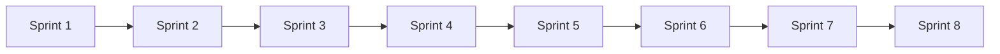
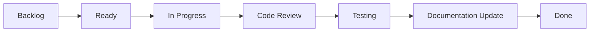
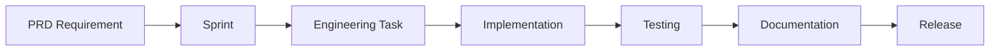
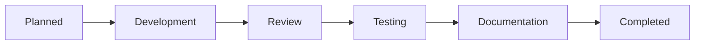
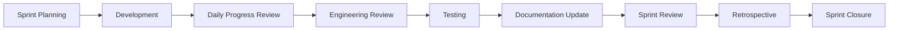

# Sprint Board

## RecoverAI

> **Execution Roadmap for RecoverAI Development**

---

# Purpose

The Sprint Board is the operational execution document for RecoverAI.

It converts documented requirements into structured engineering work, allowing every contributor and AI agent to track implementation progress from planning to release.

Unlike the PRD, which defines **what** to build, the Sprint Board defines **when**, **in what order**, and **under which sprint** each deliverable will be completed.

---

# Objectives

The Sprint Board aims to:

- Break the project into manageable sprints.
- Track implementation progress.
- Align development with PRD requirements.
- Map Functional Requirements (FRs) to execution.
- Support AI-assisted and human development.
- Maintain visibility of blockers and milestones.

---

# Project Information

| Property | Value |
|----------|-------|
| Project | RecoverAI |
| Development Model | Documentation-First Development |
| Methodology | Agile (Sprint-Based) |
| Sprint Length | Flexible (Hackathon Driven) |
| Repository | RecoverAI |
| Status | Planning Phase |

---

# Sprint Goals

Each sprint should deliver a meaningful and demonstrable improvement to the project.

Every sprint must:

- Produce working software.
- Follow approved documentation.
- Pass engineering review.
- Update project documentation.
- End with a review and retrospective.

---

# Team

| Role | Owner |
|------|-------|
| Product Owner | Rishabh Poddar |
| Solution Architect | Rishabh Poddar |
| AI Engineering | ChatGPT / Codex |
| Development | Rishabh Poddar |
| Documentation | ChatGPT + Rishabh |
| QA | Rishabh + AI |

For the Hackathon MVP, multiple responsibilities are performed by the same person with AI assistance.

---

# Working Agreement

All contributors and AI agents agree to:

- Follow the PRD.
- Respect the System Architecture.
- Follow the Design System.
- Comply with the MDS.
- Use the AI Agent Playbook.
- Update documentation alongside implementation.
- Complete review before marking tasks as Done.

---

# Sprint Status Legend

| Status | Meaning |
|---------|---------|
| ⏳ Planned | Work not started |
| 🚧 In Progress | Currently being implemented |
| 👀 Review | Awaiting review |
| ✅ Completed | Finished and approved |
| ⛔ Blocked | Waiting for dependency or clarification |
| ❌ Deferred | Moved to a future sprint |

---

# Success Criteria

The Sprint Board is considered successful when:

- All planned sprints are traceable.
- Every FR maps to a sprint.
- Progress is visible at all times.
- Risks and blockers are documented.
- Documentation remains synchronized with implementation.

------

# Product Roadmap & Sprint Timeline

RecoverAI development follows a phased execution strategy.

Instead of building features randomly, development is organized into progressive phases where each phase builds upon the previous one.

This approach minimizes technical debt, simplifies testing, and ensures every sprint produces measurable progress.

---

# Roadmap Philosophy

RecoverAI follows these execution principles:

- Foundation before features.
- Features before optimization.
- Testing before release.
- Documentation synchronized with development.
- Incremental delivery over large unfinished changes.

Every sprint should produce a stable and demonstrable outcome.

---

# Phase Roadmap

RecoverAI development is divided into four major phases.

| Phase | Focus | Expected Outcome |
|--------|-------|------------------|
| Phase 1 | Foundation | Project setup and core infrastructure |
| Phase 2 | Core Features | Authentication, dashboard, recovery workflow |
| Phase 3 | AI & OCR | OCR extraction, AI assistance, FIR generation |
| Phase 4 | Testing & Demo | Quality assurance, optimization, final presentation |

A phase is considered complete only after all associated sprint goals are approved.

---

# Phase 1 — Foundation

Objectives:

- Initialize project repository.
- Configure Next.js.
- Configure Firebase.
- Configure TypeScript.
- Configure Tailwind CSS.
- Establish folder structure.
- Implement authentication foundation.
- Verify development environment.

Deliverable:

A stable engineering foundation ready for feature development.

---

# Phase 2 — Core Features

Objectives:

- User Authentication
- Dashboard
- Recovery Case Management
- File Upload
- Notifications
- User Profile

Deliverable:

Users can securely create and manage recovery cases.

---

# Phase 3 — AI & OCR

Objectives:

- Invoice Upload
- OCR Processing
- IMEI Extraction
- AI FIR Generation
- AI Assistant
- Recovery Insights

Deliverable:

RecoverAI's intelligent capabilities are fully integrated into the application.

---

# Phase 4 — Testing & Demo

Objectives:

- Bug Fixes
- Performance Optimization
- Responsive Verification
- Accessibility Review
- Documentation Synchronization
- Demo Preparation

Deliverable:

A polished MVP ready for hackathon demonstration.

---

# Sprint Timeline

| Sprint | Phase | Primary Goal | Dependency | Status |
|---------|-------|--------------|------------|--------|
| Sprint 1 | Foundation | Project Setup & Infrastructure | None | ✅ Completed |
| Sprint 2 | Foundation | Authentication Module | Sprint 1 | ✅ Completed |
| Sprint 3 | Core Features | Dashboard & User Profile | Sprint 2 | ⏳ Planned |
| Sprint 4 | Core Features | Recovery Module | Sprint 3 | ⏳ Planned |
| Sprint 5 | Core Features | File Upload & Storage | Sprint 4 | ⏳ Planned |
| Sprint 6 | AI & OCR | OCR Integration | Sprint 5 | ⏳ Planned |
| Sprint 7 | AI & OCR | AI FIR Generator & Assistant | Sprint 6 | ⏳ Planned |
| Sprint 8 | Testing & Demo | QA, Optimization & Demo | Sprint 7 | ⏳ Planned |

Each sprint depends on the successful completion of the previous sprint unless explicitly approved otherwise.

---

# Sprint Dependency Flow



Dependencies should not be bypassed without architectural approval.

---

# Major Milestones

| Milestone | Description | Target Sprint |
|------------|-------------|---------------|
| Foundation Ready | Development environment established | Sprint 2 |
| Core Features Ready | Authentication and recovery workflow operational | Sprint 5 |
| AI Ready | OCR and AI modules integrated | Sprint 7 |
| MVP Ready | Feature-complete hackathon version | Sprint 8 |
| Demo Ready | Final presentation build validated | Sprint 8 |
| Hackathon Submission | Repository and documentation finalized | Sprint 8 |

Milestones provide measurable checkpoints for overall project progress.

---

# Release Roadmap

## MVP Release

Includes:

- Authentication
- Recovery Module
- OCR
- AI FIR Generator
- Dashboard
- Documentation

---

## Post-Hackathon Release

Planned enhancements:

- Official CEIR Integration
- Push Notifications
- Multi-language Support
- Advanced Analytics
- Insurance Integration
- Law Enforcement Portal
- Telecom Provider Integration

These features are outside the approved MVP scope.

---

# Progress Tracking

Progress should be measured at three levels:

| Level | Metric |
|--------|--------|
| Phase | Completed Phases |
| Sprint | Completed Sprint Goals |
| Feature | Functional Requirement Status |

Completion percentages should reflect approved work rather than partially implemented features.

---

# Roadmap Governance

Any roadmap modification must:

- Align with the PRD.
- Respect approved architecture.
- Update the Sprint Board.
- Be reflected in the Changelog if applicable.

Roadmap changes should remain controlled to prevent unnecessary scope expansion.

---

# Roadmap Principles

RecoverAI prioritizes predictable execution over rapid but unstructured development.

Every sprint should:

- Build upon previous work.
- Deliver demonstrable value.
- Maintain documentation consistency.
- Reduce project risk.
- Move the MVP closer to release readiness.

------

# Sprint Breakdown & Feature Allocation Matrix

RecoverAI development is organized into structured sprints.

Each sprint delivers a cohesive set of features that contribute measurable progress toward the MVP.

Every Functional Requirement (FR) is mapped to a sprint to maintain complete traceability between planning, implementation, testing, and documentation.

---

# Sprint Planning Principles

Each sprint should:

- Deliver working software.
- Focus on one major objective.
- Respect dependencies.
- Minimize context switching.
- End with review and documentation updates.

A sprint should never introduce partially completed core features.

---

# Sprint Overview

| Sprint | Phase | Objective | Complexity | Status |
|----------|--------|-----------|------------|--------|
| Sprint 1 | Foundation | Project Setup & Infrastructure | Medium | ✅ Completed |
| Sprint 2 | Foundation | Authentication & User Management | High | ✅ Completed |
| Sprint 3 | Core Features | Dashboard & Profile | Medium | ⏳ Planned |
| Sprint 4 | Core Features | Recovery Case Workflow | High | ⏳ Planned |
| Sprint 5 | Core Features | File Upload & Storage | Medium | ⏳ Planned |
| Sprint 6 | AI & OCR | OCR Processing | High | ⏳ Planned |
| Sprint 7 | AI & OCR | AI FIR Generator & Assistant | High | ⏳ Planned |
| Sprint 8 | Testing | QA, Optimization & Demo | Medium | ⏳ Planned |

---

# Sprint 1 — Project Setup & Infrastructure

## Objective

Establish the engineering foundation for RecoverAI.

### Functional Requirements

- FR-001
- FR-002
- FR-003

### Deliverables

- Repository setup
- Next.js initialization
- Firebase configuration
- TypeScript configuration
- Tailwind CSS
- Folder structure
- CI/CD preparation
- Environment configuration

### Dependencies

None

### Owner

Engineering Team

### Exit Criteria

- Project builds successfully.
- Development environment operational.
- Repository structure approved.
- Documentation synchronized.

Status:

✅ Completed

---

# Sprint 2 — Authentication & User Management

## Objective

Implement secure user authentication.

### Functional Requirements

- FR-004
- FR-005
- FR-006

### Deliverables

- Firebase Authentication
- Login
- Registration
- Password reset
- Protected routes
- Session management
- User profile foundation

### Dependencies

Sprint 1

### Owner

Engineering Team

### Exit Criteria

- Authentication fully functional.
- Protected routes verified.
- User session persistence validated.

Status:

✅ Completed

---

# Sprint 3 — Dashboard & User Profile

## Objective

Provide users with a centralized dashboard.

### Functional Requirements

- FR-007
- FR-008
- FR-009

### Deliverables

- Dashboard
- Profile page
- Navigation
- Sidebar
- Statistics widgets
- Settings foundation

### Dependencies

Sprint 2

### Owner

Engineering Team

### Exit Criteria

- Dashboard operational.
- Navigation verified.
- Responsive layout approved.

Status:

⏳ Planned

---

# Sprint 4 — Recovery Case Workflow

## Objective

Implement the complete recovery case lifecycle.

### Functional Requirements

- FR-010
- FR-011
- FR-012
- FR-013

### Deliverables

- Create recovery case
- Case details
- Status management
- Case history
- Recovery dashboard integration

### Dependencies

Sprint 3

### Owner

Engineering Team

### Exit Criteria

- Recovery workflow operational.
- Firestore integration verified.
- Validation completed.

Status:

⏳ Planned

---

# Sprint 5 — File Upload & Storage

## Objective

Implement secure document management.

### Functional Requirements

- FR-014
- FR-015

### Deliverables

- Invoice upload
- Firebase Storage integration
- File validation
- Upload progress
- Document preview

### Dependencies

Sprint 4

### Owner

Engineering Team

### Exit Criteria

- File uploads working.
- Validation verified.
- Storage integration complete.

Status:

⏳ Planned

---

# Sprint 6 — OCR Processing

## Objective

Extract structured information from uploaded invoices.

### Functional Requirements

- FR-016
- FR-017

### Deliverables

- OCR integration
- IMEI extraction
- Confidence scoring
- Manual correction
- OCR result review

### Dependencies

Sprint 5

### Owner

Engineering Team

### Exit Criteria

- OCR working.
- IMEI extraction verified.
- Error handling implemented.

Status:

⏳ Planned

---

# Sprint 7 — AI FIR Generator & Assistant

## Objective

Integrate AI capabilities into RecoverAI.

### Functional Requirements

- FR-018
- FR-019
- FR-020

### Deliverables

- AI Provider Interface
- OpenRouter integration
- FIR generation
- AI Assistant
- Case summarization

### Dependencies

Sprint 6

### Owner

Engineering Team

### Exit Criteria

- AI responses generated.
- FIR generation verified.
- AI Provider abstraction validated.

Status:

⏳ Planned

---

# Sprint 8 — QA, Optimization & Demo

## Objective

Prepare RecoverAI for hackathon submission.

### Functional Requirements

- FR-021
- FR-022
- FR-023

### Deliverables

- Bug fixes
- Performance optimization
- Accessibility review
- Responsive verification
- Documentation completion
- Demo preparation
- Release candidate

### Dependencies

Sprint 7

### Owner

Engineering Team

### Exit Criteria

- MVP complete.
- Documentation finalized.
- Demo verified.
- Repository release-ready.

Status:

⏳ Planned

---

# Sprint Dependency Matrix

| Sprint | Depends On | Blocks |
|----------|------------|--------|
| Sprint 1 | None | Sprint 2 |
| Sprint 2 | Sprint 1 | Sprint 3 |
| Sprint 3 | Sprint 2 | Sprint 4 |
| Sprint 4 | Sprint 3 | Sprint 5 |
| Sprint 5 | Sprint 4 | Sprint 6 |
| Sprint 6 | Sprint 5 | Sprint 7 |
| Sprint 7 | Sprint 6 | Sprint 8 |
| Sprint 8 | Sprint 7 | Project Release |

---

# Sprint Allocation Principles

Feature allocation should ensure:

- Balanced sprint scope.
- Minimal cross-sprint dependencies.
- Demonstrable progress after each sprint.
- Stable increments suitable for review.

No sprint should introduce unfinished core functionality into the next sprint.

---

# Sprint Completion Rules

A sprint is complete only when:

- All assigned Functional Requirements are implemented.
- Exit criteria are satisfied.
- Engineering review completed.
- Testing completed.
- Documentation synchronized.
- Sprint status updated.

Partial completion is not considered sprint completion.

------

# Execution Management Board

The Execution Management Board is the operational tracking system for RecoverAI.

It provides real-time visibility into feature implementation, engineering progress, blockers, reviews, testing, and completion status.

Every implementation task must be represented on this board.

---

# Purpose

The Execution Management Board helps:

- Track implementation progress.
- Link tasks to Functional Requirements (FRs).
- Identify blockers early.
- Monitor engineering velocity.
- Maintain sprint visibility.
- Keep documentation synchronized with development.

No engineering work should begin without an associated task.

---

# Workflow

Every task follows the same lifecycle.



Tasks should move sequentially through each stage.

Skipping stages is discouraged unless explicitly approved.

---

# Workflow Stages

| Stage | Description |
|--------|-------------|
| Backlog | Planned but not scheduled |
| Ready | Approved and ready for implementation |
| In Progress | Development actively underway |
| Code Review | Awaiting engineering review |
| Testing | Functional and quality verification |
| Documentation Update | Documentation synchronization |
| Done | Fully completed and approved |

---

# Task Status Legend

| Status | Meaning |
|---------|---------|
| ⏳ Planned | Task created but not started |
| 🚧 In Progress | Currently being implemented |
| 👀 Review | Awaiting review |
| 🧪 Testing | Under verification |
| 📝 Documentation | Documentation update pending |
| ✅ Done | Fully completed |
| ⛔ Blocked | Waiting for dependency |
| ❌ Deferred | Moved to future scope |

---

# Task Template

Every engineering task should follow this structure.

| Field | Description |
|--------|-------------|
| Task ID | Unique identifier (TASK-001) |
| Linked FR | Functional Requirement reference |
| Sprint | Assigned sprint |
| Feature | Related module |
| Priority | High / Medium / Low |
| Assignee | Responsible contributor |
| Status | Current workflow stage |
| Blocker | Dependency or issue |
| Estimated Effort | S / M / L |
| Actual Effort | Recorded after completion |
| Completion Date | Final completion date |

---

# Example Task Board

| Task ID | FR | Sprint | Feature | Priority | Status |
|----------|----|---------|----------|----------|--------|
| TASK-001 | FR-001 | Sprint 1 | Project Setup | High | ⏳ Planned |
| TASK-002 | FR-004 | Sprint 2 | Authentication | High | ⏳ Planned |
| TASK-003 | FR-010 | Sprint 4 | Recovery Module | High | ⏳ Planned |
| TASK-004 | FR-016 | Sprint 6 | OCR | High | ⏳ Planned |
| TASK-005 | FR-018 | Sprint 7 | AI Assistant | High | ⏳ Planned |

---

# Priority Matrix

| Priority | Description |
|----------|-------------|
| High | Blocks core MVP functionality |
| Medium | Important but not blocking |
| Low | Enhancement or polish |

High-priority tasks should always be completed before lower-priority work.

---

# Effort Estimation

RecoverAI uses a lightweight sizing model.

| Size | Estimated Effort |
|------|------------------|
| S | Less than 4 hours |
| M | 4–8 hours |
| L | More than 8 hours |

Estimates should be reviewed after task completion to improve future planning.

---

# Blocker Management

A task becomes **Blocked** when:

- Required dependency is incomplete.
- API access is unavailable.
- Documentation is missing.
- Architecture clarification is required.
- External service is unavailable.

Blocked tasks must include a clear reason and next action.

---

# Task Completion Checklist

Before moving a task to **Done**:

- [ ] Implementation complete
- [ ] TypeScript passes
- [ ] ESLint passes
- [ ] Code review approved
- [ ] Testing completed
- [ ] Documentation updated
- [ ] Sprint Board updated
- [ ] No critical issues remain

---

# Engineering Metrics

The Execution Management Board should track:

| Metric | Purpose |
|--------|---------|
| Planned Tasks | Sprint scope |
| Completed Tasks | Delivery progress |
| Blocked Tasks | Risk visibility |
| Review Pending | Engineering workload |
| Testing Pending | Quality status |
| Documentation Pending | Documentation health |

These metrics help evaluate sprint health throughout development.

---

# Governance Rules

Every task must:

- Link to at least one Functional Requirement (FR).
- Belong to exactly one sprint.
- Have one owner.
- Include a defined priority.
- Follow the approved workflow.
- Be updated whenever its status changes.

Tasks without ownership or sprint allocation should not enter development.

---

# Execution Principles

RecoverAI values disciplined execution over rapid but unstructured development.

The Execution Management Board ensures that:

- Progress is measurable.
- Responsibilities are clear.
- Reviews are traceable.
- Documentation stays synchronized.
- Every completed task contributes directly to the MVP.

------

# Functional Requirement Tracking Matrix

The Functional Requirement Tracking Matrix (FRTM) provides complete traceability between business requirements, engineering implementation, testing, documentation, and release readiness.

Every Functional Requirement (FR) defined in the Product Requirements Document (PRD) must be represented exactly once in this matrix.

No feature should be implemented without a corresponding FR entry.

---

# Purpose

The Traceability Matrix helps:

- Track implementation progress.
- Map requirements to sprints.
- Link engineering tasks.
- Verify testing coverage.
- Confirm documentation updates.
- Support project reviews and judging.

This matrix serves as the single source of truth for requirement status.

---

# Traceability Philosophy

RecoverAI maintains end-to-end traceability.

Every Functional Requirement follows this lifecycle:



No stage should be skipped.

---

# Requirement Status Legend

| Status | Meaning |
|---------|---------|
| ⏳ Planned | Requirement approved but not started |
| 🚧 In Progress | Under implementation |
| 👀 Review | Awaiting engineering review |
| 🧪 Testing | Verification in progress |
| ✅ Completed | Fully implemented and approved |
| ❌ Deferred | Moved outside current MVP scope |

---

# Test Status Legend

| Status | Meaning |
|---------|---------|
| Not Started | Testing not initiated |
| In Progress | Test cases executing |
| Passed | Verification successful |
| Failed | Defects identified |

---

# Documentation Status Legend

| Status | Meaning |
|---------|---------|
| Pending | Documentation not updated |
| In Progress | Documentation being revised |
| Updated | Documentation synchronized |

---

# Functional Requirement Tracking Matrix

| FR ID | Requirement | Sprint | Task ID | Priority | Implementation | Testing | Acceptance Criteria | Documentation |
|--------|-------------|---------|----------|----------|----------------|----------|---------------------|---------------|
| FR-001 | Project Initialization | Sprint 1 | TASK-001 | High | ⏳ Planned | Not Started | Pending | Pending |
| FR-002 | Firebase Configuration | Sprint 1 | TASK-002 | High | ⏳ Planned | Not Started | Pending | Pending |
| FR-003 | Environment Configuration | Sprint 1 | TASK-003 | Medium | ⏳ Planned | Not Started | Pending | Pending |
| FR-004 | User Authentication | Sprint 2 | TASK-004 | High | ⏳ Planned | Not Started | Pending | Pending |
| FR-005 | User Registration | Sprint 2 | TASK-005 | High | ⏳ Planned | Not Started | Pending | Pending |
| FR-006 | Password Reset | Sprint 2 | TASK-006 | Medium | ⏳ Planned | Not Started | Pending | Pending |
| FR-007 | Dashboard | Sprint 3 | TASK-007 | High | ⏳ Planned | Not Started | Pending | Pending |
| FR-008 | User Profile | Sprint 3 | TASK-008 | Medium | ⏳ Planned | Not Started | Pending | Pending |
| FR-009 | Navigation System | Sprint 3 | TASK-009 | Medium | ⏳ Planned | Not Started | Pending | Pending |
| FR-010 | Recovery Case Creation | Sprint 4 | TASK-010 | High | ⏳ Planned | Not Started | Pending | Pending |
| FR-011 | Recovery Case Management | Sprint 4 | TASK-011 | High | ⏳ Planned | Not Started | Pending | Pending |
| FR-012 | Recovery Status Tracking | Sprint 4 | TASK-012 | Medium | ⏳ Planned | Not Started | Pending | Pending |
| FR-013 | Recovery Timeline | Sprint 4 | TASK-013 | Medium | ⏳ Planned | Not Started | Pending | Pending |
| FR-014 | Invoice Upload | Sprint 5 | TASK-014 | High | ⏳ Planned | Not Started | Pending | Pending |
| FR-015 | Secure File Storage | Sprint 5 | TASK-015 | High | ⏳ Planned | Not Started | Pending | Pending |
| FR-016 | OCR Processing | Sprint 6 | TASK-016 | High | ⏳ Planned | Not Started | Pending | Pending |
| FR-017 | IMEI Extraction | Sprint 6 | TASK-017 | High | ⏳ Planned | Not Started | Pending | Pending |
| FR-018 | AI FIR Generator | Sprint 7 | TASK-018 | High | ⏳ Planned | Not Started | Pending | Pending |
| FR-019 | AI Assistant | Sprint 7 | TASK-019 | High | ⏳ Planned | Not Started | Pending | Pending |
| FR-020 | Case Summarization | Sprint 7 | TASK-020 | Medium | ⏳ Planned | Not Started | Pending | Pending |
| FR-021 | QA & Validation | Sprint 8 | TASK-021 | High | ⏳ Planned | Not Started | Pending | Pending |
| FR-022 | Performance Optimization | Sprint 8 | TASK-022 | Medium | ⏳ Planned | Not Started | Pending | Pending |
| FR-023 | Demo Preparation | Sprint 8 | TASK-023 | High | ⏳ Planned | Not Started | Pending | Pending |

---

# Traceability Rules

Every Functional Requirement must:

- Have one unique FR ID.
- Belong to one sprint.
- Link to one or more engineering tasks.
- Have measurable acceptance criteria.
- Be tested before completion.
- Have synchronized documentation.

Requirements without complete traceability cannot be marked as complete.

---

# Requirement Lifecycle

Every Functional Requirement progresses through the following lifecycle:



Each stage must be approved before progressing to the next.

---

# Governance Rules

The Traceability Matrix must be updated whenever:

- A new Functional Requirement is approved.
- A sprint assignment changes.
- Task status changes.
- Testing is completed.
- Documentation is updated.
- A requirement is deferred or removed.

This matrix should always reflect the current implementation status.

---

# Success Criteria

The Functional Requirement Tracking Matrix is considered complete when:

- Every PRD Functional Requirement is represented.
- Every requirement maps to a sprint.
- Every requirement links to engineering work.
- Testing status is visible.
- Documentation status is synchronized.
- Progress can be reviewed without consulting multiple documents.

The Traceability Matrix provides complete visibility from requirement approval to final delivery.

------

# Risk, Blocker & Dependency Register

RecoverAI follows a proactive risk management approach.

Potential risks, implementation blockers, and project dependencies are identified before development begins and are continuously reviewed throughout the project lifecycle.

The objective is to reduce uncertainty, improve planning accuracy, and maintain predictable sprint execution.

---

# Purpose

The Risk Register helps:

- Identify technical and project risks early.
- Track implementation blockers.
- Define mitigation strategies.
- Improve sprint predictability.
- Reduce delivery delays.
- Support engineering decision-making.

Every significant risk should have a documented mitigation strategy.

---

# Risk Management Philosophy

RecoverAI follows these principles:

- Identify risks early.
- Prioritize high-impact risks.
- Monitor continuously.
- Mitigate before escalation.
- Document decisions.

Risk management is an ongoing engineering activity rather than a one-time planning exercise.

---

# Risk Categories

| Category | Description |
|----------|-------------|
| Technical | Framework, architecture, infrastructure, integration |
| Product | Scope changes, feature ambiguity |
| AI | Model availability, hallucinations, API limits |
| Security | Authentication, authorization, sensitive data |
| External | Third-party APIs, hosting services |
| Performance | Slow responses, optimization issues |
| Schedule | Time constraints, sprint delays |
| Documentation | Missing or outdated documentation |

---

# Probability Scale

| Level | Meaning |
|--------|---------|
| Low | Unlikely |
| Medium | Possible |
| High | Likely |

---

# Impact Scale

| Level | Meaning |
|--------|---------|
| Low | Minor inconvenience |
| Medium | Partial feature impact |
| High | Major functionality affected |
| Critical | MVP or demo blocked |

---

# Risk Register

| Risk ID | Category | Description | Probability | Impact | Mitigation Strategy | Contingency Plan | Owner | Status |
|----------|----------|-------------|-------------|--------|---------------------|------------------|-------|--------|
| RISK-001 | AI | OpenRouter free model unavailable or rate limited | Medium | High | Provider abstraction with configurable AI provider | Switch to Gemini/OpenAI by changing `.env` | Engineering | 🟢 Mitigated |
| RISK-002 | OCR | OCR fails to extract IMEI accurately | High | Medium | Validate image quality and confidence score | Manual IMEI entry fallback | Engineering | 🟡 Monitoring |
| RISK-003 | Firebase | Free-tier quota exceeded | Low | High | Optimize Firestore queries and Storage usage | Upgrade plan if required | Engineering | 🟢 Mitigated |
| RISK-004 | Schedule | Sprint delays due to scope expansion | Medium | High | Strict MVP scope control | Move non-essential features to Post-MVP | Product Owner | 🟡 Monitoring |
| RISK-005 | Documentation | Documentation and implementation become unsynchronized | Medium | Medium | Documentation-first workflow | Review before every sprint completion | Documentation | 🟢 Mitigated |
| RISK-006 | Security | Improper Firestore rules expose user data | Low | Critical | Security review and rule validation | Disable affected functionality until fixed | Engineering | 🟡 Monitoring |
| RISK-007 | Performance | Large AI/OCR libraries increase bundle size | Medium | Medium | Dynamic imports and lazy loading | Optimize bundle before release | Engineering | 🟡 Monitoring |
| RISK-008 | Demo | Critical issue discovered during final demonstration | Low | Critical | Final QA sprint and demo rehearsal | Use stable release tag for presentation | Team | 🟢 Mitigated |

---

# Blocker Register

Current implementation blockers should be tracked separately from risks.

| Blocker ID | Description | Affected Sprint | Owner | Resolution Status |
|-------------|-------------|-----------------|-------|-------------------|
| BLK-001 | Pending API credentials (if applicable) | Sprint 6 | Engineering | ⏳ Pending |
| BLK-002 | Official CEIR API unavailable for MVP | Sprint 7 | Product | ✅ Accepted (Out of Scope) |

Blockers should be resolved or formally accepted before sprint closure.

---

# Dependency Register

Major project dependencies are listed below.

| Dependency | Required For | Status |
|------------|--------------|--------|
| Next.js | Frontend Framework | ✅ Available |
| Firebase Authentication | User Login | ✅ Available |
| Firestore | Database | ✅ Available |
| Firebase Storage | File Upload | ✅ Available |
| OpenRouter API | AI Features | ⏳ Planned |
| Tesseract.js | OCR Processing | ⏳ Planned |
| Vercel | Deployment | ⏳ Planned |

Dependencies should be verified before the associated sprint begins.

---

# Risk Review Process

Risk review should occur:

- Before every sprint.
- After completing major milestones.
- Before demo preparation.
- Before project submission.
- Whenever a significant architectural change is introduced.

Risk reviews should update probability, impact, and mitigation status where necessary.

---

# Escalation Rules

Immediate escalation is required when:

- A Critical risk becomes active.
- A blocker prevents sprint completion.
- Security vulnerabilities are discovered.
- External services become unavailable.
- MVP scope is threatened.

Critical issues take precedence over feature development.

---

# Risk Status Legend

| Status | Meaning |
|---------|---------|
| 🟢 Mitigated | Risk controlled |
| 🟡 Monitoring | Being actively monitored |
| 🔴 Active | Immediate attention required |
| ⚫ Closed | No longer applicable |

---

# Risk Governance Checklist

Before closing a sprint:

- [ ] New risks identified.
- [ ] Existing risks reviewed.
- [ ] Blockers updated.
- [ ] Dependencies verified.
- [ ] Mitigation strategies validated.
- [ ] Contingency plans reviewed.

---

# Risk Management Principles

RecoverAI treats risk management as an essential engineering practice.

The objective is not to eliminate every risk, but to ensure that every meaningful risk is:

- Identified
- Understood
- Owned
- Monitored
- Managed

A predictable project is built through proactive planning rather than reactive problem solving.

------

# Project Progress Dashboard & Engineering Metrics

The Project Progress Dashboard provides a high-level view of RecoverAI's engineering health, implementation progress, documentation status, quality metrics, and release readiness.

It serves as the project's primary operational dashboard throughout development.

---

# Purpose

The dashboard helps:

- Monitor sprint progress.
- Measure engineering velocity.
- Track Functional Requirement completion.
- Monitor quality metrics.
- Evaluate release readiness.
- Support project reviews and hackathon demonstrations.

All metrics should reflect the latest approved project state.

---

# Dashboard Philosophy

RecoverAI measures progress through objective engineering metrics rather than subjective estimates.

Every metric should be:

- Measurable
- Transparent
- Continuously updated
- Easy to understand
- Actionable

---

# Executive Project Summary

| Metric | Value | Status |
|----------|-------|--------|
| Overall MVP Progress | 0% | ⏳ Planning |
| Sprint Completion | 0 / 8 | ⏳ Planning |
| Functional Requirements Completed | 0 / 23 | ⏳ Planning |
| Engineering Tasks Completed | 0 / 23 | ⏳ Planning |
| Documentation Completion | 6 / 8 Documents | 🟡 In Progress |
| Critical Risks | 0 Active | 🟢 Healthy |
| Release Readiness | 0% | ⏳ Not Ready |

Update these values after every sprint review.

---

# Sprint Progress Dashboard

| Sprint | Goal | Progress | Status |
|----------|------|----------|--------|
| Sprint 1 | Foundation | 0% | ⏳ Planned |
| Sprint 2 | Authentication | 0% | ⏳ Planned |
| Sprint 3 | Dashboard | 0% | ⏳ Planned |
| Sprint 4 | Recovery Module | 0% | ⏳ Planned |
| Sprint 5 | File Upload | 0% | ⏳ Planned |
| Sprint 6 | OCR | 0% | ⏳ Planned |
| Sprint 7 | AI Features | 0% | ⏳ Planned |
| Sprint 8 | QA & Demo | 0% | ⏳ Planned |

Sprint progress should be updated only after review approval.

---

# Functional Requirement Progress

| Status | Count |
|----------|-------|
| Planned | 23 |
| In Progress | 0 |
| Review | 0 |
| Testing | 0 |
| Completed | 0 |
| Deferred | 0 |

This section should always match the Functional Requirement Tracking Matrix.

---

# Engineering Task Metrics

| Metric | Value |
|----------|-------|
| Total Tasks | 23 |
| Completed | 0 |
| In Progress | 0 |
| Blocked | 0 |
| Pending Review | 0 |
| Testing | 0 |

Task metrics should remain synchronized with the Execution Management Board.

---

# Bug Summary

Track confirmed issues by severity.

| Severity | Count |
|----------|-------|
| Critical | 0 |
| High | 0 |
| Medium | 0 |
| Low | 0 |

Critical issues must always be resolved before release.

---

# Documentation Metrics

| Document | Status |
|----------|--------|
| PROJECT_OVERVIEW | ✅ Complete |
| PRD | ✅ Complete |
| SYSTEM_ARCHITECTURE | ✅ Complete |
| DESIGN_SYSTEM | ✅ Complete |
| MDS | ✅ Complete |
| AI_AGENT_PLAYBOOK | ✅ Complete |
| SPRINT_BOARD | 🚧 In Progress |
| CHANGELOG | ⏳ Planned |

Documentation should remain synchronized with implementation.

---

# Testing Metrics

| Metric | Status |
|----------|--------|
| TypeScript | ⏳ Pending |
| ESLint | ⏳ Pending |
| Unit Tests | ⏳ Pending |
| Integration Tests | ⏳ Pending |
| Manual QA | ⏳ Pending |
| Responsive Testing | ⏳ Pending |

Testing metrics should be updated after each sprint.

---

# Code Quality Metrics

| Check | Status |
|---------|--------|
| TypeScript Strict Mode | ⏳ Pending |
| ESLint | ⏳ Pending |
| Build Success | ⏳ Pending |
| Dependency Audit | ⏳ Pending |
| Security Review | ⏳ Pending |
| Performance Review | ⏳ Pending |

Every release candidate should pass all quality checks.

---

# Risk Health Dashboard

| Metric | Value |
|----------|-------|
| Active Risks | 0 |
| Monitoring | 3 |
| Mitigated | 5 |
| Critical Risks | 0 |

Risk Health should reference the Risk Register.

---

# Release Readiness Score

Evaluate readiness using the following categories.

| Area | Weight | Progress |
|------|--------|----------|
| Documentation | 20% | 75% |
| Engineering | 25% | 0% |
| Testing | 20% | 0% |
| Quality Review | 15% | 0% |
| Security | 10% | 0% |
| Demo Preparation | 10% | 0% |

Overall Release Readiness:

```text
0%
```

The release score should only increase after verified progress.

---

# MVP Completion Checklist

| Area | Status |
|--------|--------|
| Authentication | ⏳ |
| Recovery Workflow | ⏳ |
| Dashboard | ⏳ |
| File Upload | ⏳ |
| OCR | ⏳ |
| AI FIR Generator | ⏳ |
| Documentation | 🚧 |
| QA | ⏳ |
| Demo | ⏳ |

The MVP is considered complete only when all items are approved.

---

# Progress Review Frequency

The dashboard should be reviewed:

- At sprint planning.
- During sprint execution.
- At sprint review.
- Before major milestones.
- Before demo preparation.
- Before hackathon submission.

---

# Dashboard Governance

Every metric must:

- Be measurable.
- Reflect verified progress.
- Reference supporting documentation.
- Be updated after significant project events.

Metrics should never be estimated without supporting evidence.

---

# Engineering Principles

The Project Progress Dashboard exists to provide a transparent view of RecoverAI's execution health.

A project is considered healthy when:

- Sprints are progressing predictably.
- Risks remain controlled.
- Documentation is current.
- Quality metrics are improving.
- Release readiness increases steadily.

The dashboard should enable informed engineering decisions rather than simply reporting activity.

------

# Sprint Governance & Definition of Sprint Done

RecoverAI follows a structured sprint governance model to ensure predictable execution, measurable progress, and high-quality deliverables.

Every sprint must follow the same planning, execution, review, and closure process.

A sprint is not considered complete until it satisfies all defined quality gates.

---

# Purpose

Sprint Governance establishes:

- Consistent sprint execution.
- Clear approval checkpoints.
- Objective sprint completion criteria.
- Continuous process improvement.
- Alignment between engineering, documentation, and product goals.

---

# Sprint Lifecycle

Every sprint follows the lifecycle below.



Each stage must be completed before moving to the next.

---

# Sprint Planning Checklist

Before starting a sprint, verify:

- [ ] Sprint goal defined.
- [ ] Functional Requirements assigned.
- [ ] Tasks created.
- [ ] Dependencies verified.
- [ ] Risks reviewed.
- [ ] Team responsibilities assigned.
- [ ] Required documentation available.
- [ ] Success criteria agreed upon.

Planning should eliminate ambiguity before implementation begins.

---

# Daily Progress Review

During active development:

- Review task status.
- Identify blockers.
- Verify sprint progress.
- Update engineering metrics.
- Monitor risks.
- Synchronize documentation if required.

Daily reviews should focus on progress and impediments rather than detailed technical discussions.

---

# Sprint Review Process

At sprint completion, verify:

- Sprint objectives achieved.
- Functional Requirements implemented.
- Acceptance Criteria satisfied.
- Engineering Review completed.
- Testing completed.
- Documentation synchronized.

Every completed feature should be demonstrated during the review.

---

# Sprint Retrospective

After each sprint, document:

## What Went Well

Examples:

- Smooth implementation
- Clear documentation
- Strong collaboration

---

## What Can Improve

Examples:

- Reduce technical debt
- Improve estimation accuracy
- Increase test coverage

---

## Action Items

Each retrospective should produce measurable improvements for the next sprint.

Examples:

- Simplify feature scope.
- Improve documentation workflow.
- Refine AI prompts.
- Optimize development process.

---

# Sprint Acceptance Criteria

A sprint may be accepted only if:

- All planned Functional Requirements are completed.
- No Critical severity defects remain.
- No High severity defects remain.
- Documentation updated.
- Sprint Board synchronized.
- Engineering review approved.

---

# Definition of Sprint Done (Sprint DoD)

A sprint is **Done** only when all of the following conditions are satisfied.

### Business

- [ ] Sprint objective achieved.
- [ ] Planned Functional Requirements completed.
- [ ] Acceptance Criteria satisfied.

---

### Engineering

- [ ] Architecture followed.
- [ ] Design System respected.
- [ ] MDS compliance verified.
- [ ] TypeScript passes.
- [ ] ESLint passes.

---

### Quality

- [ ] Manual QA completed.
- [ ] Integration verified.
- [ ] Error handling tested.
- [ ] Responsive layouts validated.

---

### Documentation

- [ ] Sprint Board updated.
- [ ] Related documentation synchronized.
- [ ] Changelog updated (if applicable).

---

### Release Readiness

- [ ] Stable build available.
- [ ] No blocking issues remain.
- [ ] Demo flow verified (where applicable).

A sprint is considered complete only after all five categories are approved.

---

# Carry Forward Rules

If planned work cannot be completed:

- Move unfinished work to the Backlog.
- Re-estimate remaining effort.
- Update dependencies.
- Document the reason.
- Avoid carrying incomplete work without visibility.

Only Product Owner approval may change sprint scope.

---

# Continuous Improvement

Every sprint should improve at least one area of the development process.

Examples:

- Faster reviews.
- Better AI prompts.
- Cleaner architecture.
- Improved testing.
- More accurate estimates.
- Better documentation quality.

Small, continuous improvements are preferred over disruptive process changes.

---

# Sprint Closure Checklist

Before closing a sprint:

- [ ] All planned tasks completed.
- [ ] Review completed.
- [ ] Testing completed.
- [ ] Documentation synchronized.
- [ ] Risks updated.
- [ ] Metrics updated.
- [ ] Sprint status marked Complete.
- [ ] Next sprint prepared.

Sprint closure formally ends the execution cycle.

---

# Governance Principles

RecoverAI sprint governance is based on:

- Predictable execution
- Documentation-first development
- Continuous improvement
- Objective quality gates
- Transparent progress tracking
- Shared accountability

Governance ensures that every sprint contributes measurable value toward the successful completion of the RecoverAI MVP.

---

# Sprint Board Status

| Property | Value |
|----------|-------|
| Document | 06_SPRINT_BOARD.md |
| Version | 1.0 |
| Status | Complete |
| Owner | Rishabh Poddar |
| Last Updated | 2026-08-01 |

---

> **"A sprint is complete not when the code is written, but when the feature is implemented, verified, documented, reviewed, and ready for demonstration."**

---